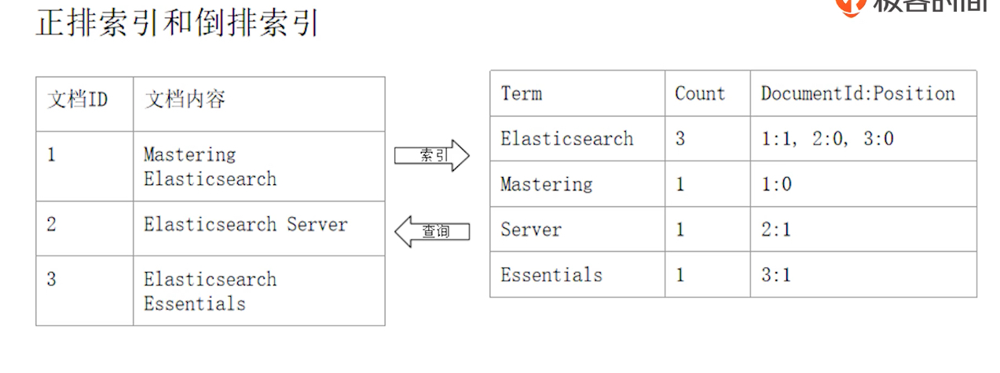
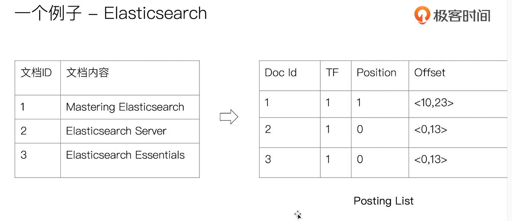
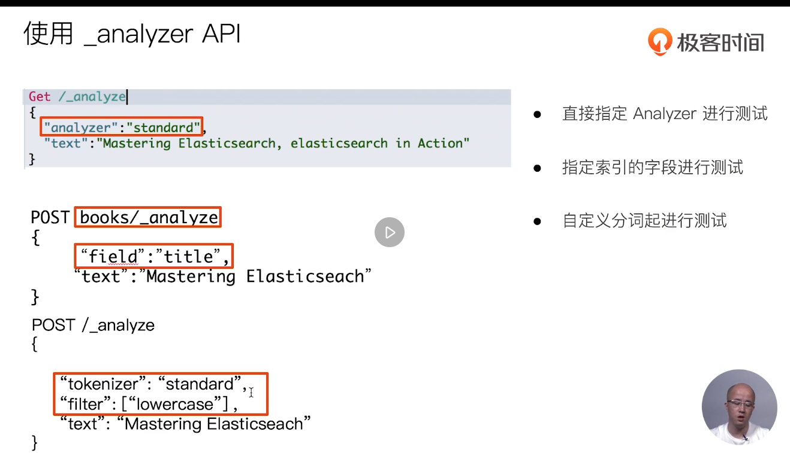

# 倒排索引

## 正排索引和倒排索引



### 倒排索引的核心组成

- 倒排索引保函两个部分
  - 单词词典（`Term Dictionary`），记录所有文档的单词，记录单词到倒排列表的关联关系
    - 单词词典一般比较大，可以通过 `B+` 树或哈希拉链法实现，以满足高性能的插入与查询
  - 倒排列表（`Posting List`），记录了单词对应的文档结合，由倒排索引项组成
    - 倒排索引项（`Posting`）
      - 文档 `ID`
      - 词频 `TF`，该单词在文档中出现的次数，用于相关性评分
      - 位置（`Position`），单词在文档中分词的位置。用于语句搜索（`phrase query`）
      - 偏移（`Offset`），记录单词的开始结束位置，实现高亮显示



### Elasticsearch 的倒排索引

- `Elasticsearch` 的 `JSON` 文档中的每个字段，都有自己的倒排索引
- 可以在 `Mapping` 文件中指定对某些字段不做索引
  - 优点：节省存储空间
  - 缺点：字段无法被搜索

## 通过 Analyzer 进行分词

### Analysis 与 Analyzer

- `Analysis`：文本分析是把全文本转换一系列单词（`term / token`）的过程，也叫分词
- `Analysis` 是通过 `Analyzer` 来实现的
  - 可使用 `ES` 内置的分析器或者按需定制化分析器
- 除了在数据写入时转换词条，匹配 `Query` 语句时也需要用相同的分析器对查询语句进行分析

### Analyzer 的组成

- 分词器是专门处理分词的组件，Analyzer 由三部分组成
  - `Character Filters`：针对原始文本处理，例如去除 `html`
  - `Tokenizer`：按照规则切分为单词
  - `Token Filter`：将切分的单词进行加工，小写，删除 `stopwords`，增加同义词
- `ES` 的内置分词器
  - `Standard Analyzer`：默认分词器，按词切分，小写处理
  - `Simple Analyzer`：按照非字母切分（符号被过滤），小写处理
  - `Stop Analyzer`：小写处理，停用词过滤（`the、a、is`）
  - `Whitespace Analyzer`：按照空格切分，不转小写
  - `Keyword Analyzer`：不分词，直接将输入当作输出
  - `Pattern Analyzer`：正则表达式，默认 `\W+`（非字符分隔）
  - `Language`：提供了 30 多种常见语言的分词器
  - `Customer Analyzer`：自定义分词器
- 中文分词的难点
  - 中文句子，切分成一个一个词（不是一个个字）
  - 英文中，单词有自然的空格作为分隔
  - 一句中文，在不同的上下文，有不同的理解
    - 这个苹果，不大好吃 / 这个苹果，不大，好吃！
  - 一些例子
    - 她说的确实在理 / 这事的确定不下来
- 中文分词
  - `ICU Analyzer`
    - 需要安装插件：`Elasticsearch-plugin install analysis-icu`
    - 提供了 `Unicode` 的支持，更好的支持亚洲语言
  - `IK`
    - 支持自定义词库，支持热更新分词字典
    - https://github.com/medcl/elasticsearch-analysis-ik
  - `THULAC`
    - `THU Lexucal Analyzer for Chinese`，清华大学自然语言处理和社会人文计算实验室的一套中文分词器
    - https://github.com/microbun/elasticsearch-thulac-plugin

#### 使用 _analyzer API



```es
#查看不同的analyzer的效果
#standard
GET _analyze
{
  "analyzer": "standard",
  "text": "2 running Quick brown-foxes leap over lazy dogs in the summer evening."
}

#simpe
GET _analyze
{
  "analyzer": "simple",
  "text": "2 running Quick brown-foxes leap over lazy dogs in the summer evening."
}

#stop
GET _analyze
{
  "analyzer": "stop",
  "text": "2 running Quick brown-foxes leap over lazy dogs in the summer evening."
}


#whitespace
GET _analyze
{
  "analyzer": "whitespace",
  "text": "2 running Quick brown-foxes leap over lazy dogs in the summer evening."
}

#keyword
GET _analyze
{
  "analyzer": "keyword",
  "text": "2 running Quick brown-foxes leap over lazy dogs in the summer evening."
}

GET _analyze
{
  "analyzer": "pattern",
  "text": "2 running Quick brown-foxes leap over lazy dogs in the summer evening."
}


#english
GET _analyze
{
  "analyzer": "english",
  "text": "2 running Quick brown-foxes leap over lazy dogs in the summer evening."
}


POST _analyze
{
  "analyzer": "icu_analyzer",
  "text": "他说的确实在理”"
}


POST _analyze
{
  "analyzer": "standard",
  "text": "他说的确实在理”"
}


POST _analyze
{
  "analyzer": "icu_analyzer",
  "text": "这个苹果不大好吃"
}

```
