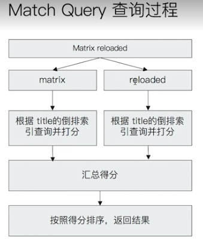

# ES 基于词项和基于全文的搜索

## 基于 Term 的查询

- `Term` 的重要性
  - `Term` 是表达语义的最小单位。搜索和利用统计语言模型进行自然语言处理都需要处理 `Term`
- 特点
  - `Term Level Query：Term Query / Range Query / Exists Query / Prefix Query / Wildcard Query`
  - 在 `ES` 中，`Term` 查询，对输入不做分词。会将输入作为一个整体，在倒排索引中查找准确的词项，并且使用相关度算分公示为每个包含该词项的文档进行相关度算分
  - 可以通过 `Constant Score` 将查询转换成一个 `Filtering`，避免算分，并利用缓存，提高性能
    - 将 `Query` 转成 `Filter`，忽略 `TF-IDF` 计算，避免相关性算分的开销
    - `Filter` 可以有效利用缓存
  
```curl

DELETE products
PUT products
{
  "settings": {
    "number_of_shards": 1
  }
}

POST /products/_bulk
{ "index": { "_id": 1 }}
{ "productID" : "XHDK-A-1293-#fJ3","desc":"iPhone" }
{ "index": { "_id": 2 }}
{ "productID" : "KDKE-B-9947-#kL5","desc":"iPad" }
{ "index": { "_id": 3 }}
{ "productID" : "JODL-X-1937-#pV7","desc":"MBP" }

GET /products
GET /products/_search

# term 查询对输入不做分词
# es 对 text 类型建立索引时会进行分词处理
# 所以在搜 iPhone 时搜不到，因为 iPhone 已经被分词处理了
# 可以将 text 转为 keyword 类型，这样 es 在建立索引时就不会进行分词
POST /products/_search
{
  "query": {
    "term": {
      "desc": {
        //"value": "iPhone"
        "value":"iphone"
      }
    }
  }
}

# 精准匹配需要 keyword
POST /products/_search
{
  "query": {
    "term": {
      "desc.keyword": {
        "value": "iPhone"
        //"value":"iphone"
      }
    }
  }
}


POST /products/_search
{
  "query": {
    "term": {
      "productID": {
        "value": "XHDK-A-1293-#fJ3"
      }
    }
  }
}

POST /products/_search
{
  "explain": true,
  "query": {
    "term": {
      "productID.keyword": {
        "value": "XHDK-A-1293-#fJ3"
      }
    }
  }
}

POST /products/_search
{
  "explain": true,
  "query": {
    "term": {
      "productID.keyword": {
        "value": "XHDK-A-1293-#fJ3"
      }
    }
  }
}

# constant_score 调过相关性算分
POST /products/_search
{
  "explain": true,
  "query": {
    "constant_score": {
      "filter": {
        "term": {
          "productID.keyword": "XHDK-A-1293-#fJ3"
        }
      }

    }
  }
}

```

## 基于全文的查询

- 基于全文本的查找
  -`Match Query / Match Phrase Query / Query String Query`
- 特点
  - 索引和搜索时都会进行分词，查询字符串先传递到一个合适的分词器，然后生成一个供查询的词项列表
  - 查询时候，先会对输入的查询进行分词，然后每个词项逐个进行底层的查询，最终结果进行合并。并为每个文档生成一个算分。例如查 “`Matrix reloaded`”，会查到包括 `Matrix` 或者 `reloaded` 的所有结果。

 

 ```curl
 #设置 position_increment_gap
DELETE groups
PUT groups
{
  "mappings": {
    "properties": {
      "names":{
        "type": "text",
        "position_increment_gap": 0
      }
    }
  }
}

GET groups/_mapping

POST groups/_doc
{
  "names": [ "John Water", "Water Smith"]
}

GET groups/_search
POST groups/_search
{
  "query": {
    "match_phrase": {
      "names": {
        "query": "Water Water",
        "slop": 100
      }
    }
  }
}

POST groups/_search
{
  "query": {
    "match_phrase": {
      "names": "Water Smith"
    }
  }
}
```

## 相关阅读

<https://www.elastic.co/guide/en/elasticsearch/reference/7.1/term-level-queries.html>

<https://www.elastic.co/guide/en/elasticsearch/reference/7.1/full-text-queries.html>

<https://www.elastic.co/guide/en/elasticsearch/reference/current/position-increment-gap.html>