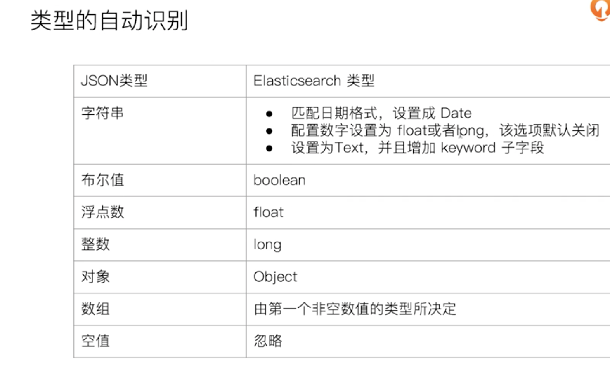

# ES 复杂查询

## Query String Query

- 类似于 `URI Query`

```curl
PUT /users/_doc/1
{
  "name":"Allen Zhang",
  "about":"java, golang, node, swift, elasticsearch"
}

PUT /users/_doc/2
{
  "name":"Hope Zhang",
  "about":"Hadoop"
}

POST users/_search
{
  "query": {
    "query_string": {
      "default_field": "name",
      "query": "Allen AND Zhang"
    }
  }
}


POST users/_search
{
  "query": {
    "query_string": {
      "fields":["name","about"],
      "query": "(Allen AND Zhang) OR (Java AND Elasticsearch)"
    }
  }
}

```

## Simple Query String Query

- 类似 `Query String`，但是会忽略错误的语法，同时只支持部分查询语法
- 不支持 `AND OR NOT`，会当作字符串处理
- `Term` 之间默认的关系是 `OR`，可以指定 `Operator(default_operator)`
- 支持部分逻辑
  - `+` 替代 `AND`
  - `|` 替代 `OR`
  - `-` 替代 `NOT`

```curl
#Simple Query 默认的operator是 Or
POST users/_search
{
  "query": {
    "simple_query_string": {
      "query": "Allen AND Zhang",
      "fields": ["name"]
    }
  }
}

POST users/_search
{
  "query": {
    "simple_query_string": {
      "query": "Allen Zhang",
      "fields": ["name"],
      "default_operator": "AND"
    }
  }
}

# 多fields
GET /movies/_search
{
    "profile": true,
    "query":{
        "query_string":{
            "fields":[
            "title",
                "year"
            ],
            "query": "2012"
        }
    }
}

GET /movies/_search
{
    "profile":true,
    "query":{
        "simple_query_string":{
            "query":"Beautiful+mind",
            "fields":["title"]
        }
    }
}

```

## Dynamic Mapping 和常见字段类型

### 什么是 Mapping

- `Mappping` 类似数据库中的 `schema` 的定义，作用如下
  - 定义索引中字段的名称
  - 定义字段的数据类型，例如字符串，数字，布尔...
  - 字段，倒排索引的相关配置（`Analyzed or Not Analyzed, Analyzer`）
- `Mapping` 会把 `JSON` 文档映射成 `Lucene` 所需要的扁平格式
- 一个 `Mapping` 属于一个索引的 `Type`
  - 每个文档都属于一个 `Type`
  - 一个 `Type` 有一个 `Mapping` 定义
  - `7.0` 开始，不需要在 `Mapping` 定义中指定 `Type` 信息

### 字段的数据类型

- 简单类型
  - `Text / Keyword`
  - `Date`
  - `Integer / Floating`
  - `Boolean`
  - `IPv4 & IPv6`
- 复杂类型：对象和嵌套对象
  - 对象类型 / 嵌套类型
- 特殊类型
  - `geo_point & geo_shape / percolator`

### 什么是 Dynamic Mapping

- 在写入文档时候，如果索引不存在，会自动创建索引
- `Dynamic Mapping` 的机制，使得我们无需手动定义 `Mappings`。`Elasticsearch` 会自动根据文档信息，推算出字段的类型
- 但是有时候推算的不对，例如地理位置信息
- 当类型如果设置不对时，会导致一些功能无法正常运行，例如 `Range` 查询



```curl
#写入文档，查看 Mapping
PUT mapping_test/_doc/1
{
  "firstName":"Chan",
  "lastName": "Jackie",
  "loginDate":"2018-07-24T10:29:48.103Z"
}

#查看 Mapping文件
GET mapping_test/_mapping


#Delete index
DELETE mapping_test

#dynamic mapping，推断字段的类型
PUT mapping_test/_doc/1
{
    "uid" : "123",
    "isVip" : false,
    "isAdmin": "true",
    "age":19,
    "heigh":180
}

#查看 Dynamic
GET mapping_test/_mapping
```

### 能否更改 Mapping 的字段类型

- 两种情况
  - 新增加字段
    - `Dynamic` 设为 `True` 时，一旦有新增字段的文档写入， `Mapping` 也同时被更新
    - `Dynamic` 设为 `False`，`Mapping` 不会被更新，新增字段的数据无法索引，但是信息会出现在 `_source` 中
  - 对已有字段，一旦已经有数据写入，就不再支持修改字段定义
    - `Lucene` 实现的倒排索引，一旦生成后，就不允许修改
  - 如果希望改编字段类型，必须 `Reindex API`，重建索引
- 原因
  - 如果修改了字段的数据类型，会导致已被索引的属于无法被搜索
  - 但是如果是增加新的字段，就不会有这样的影响

```curl
# 设置逻辑演示代码
#默认Mapping支持dynamic，写入的文档中加入新的字段
PUT dynamic_mapping_test/_doc/1
{
  "newField":"someValue"
}

#该字段可以被搜索，数据也在_source中出现
POST dynamic_mapping_test/_search
{
  "query":{
    "match":{
      "newField":"someValue"
    }
  }
}

#修改为dynamic false
PUT dynamic_mapping_test/_mapping
{
  "dynamic": false
}

#新增 anotherField
PUT dynamic_mapping_test/_doc/10
{
  "anotherField":"someValue"
}

#该字段不可以被搜索，因为dynamic已经被设置为false
POST dynamic_mapping_test/_search
{
  "query":{
    "match":{
      "anotherField":"someValue"
    }
  }
}
# ID 可以查到
GET dynamic_mapping_test/_doc/10

#修改为strict
PUT dynamic_mapping_test/_mapping
{
  "dynamic": "strict"
}

#写入数据出错，HTTP Code 400
PUT dynamic_mapping_test/_doc/12
{
  "lastField":"value"
}

DELETE dynamic_mapping_test
```

### 相关阅读：dynamic-mapping

<https://www.elastic.co/guide/en/elasticsearch/reference/7.1/dynamic-mapping.html>

## 显示 Mapping 与常见参数介绍

### 自定义 Mapping 的一些建议

- 可以参考 `API` 手册，纯手写
- 为了减少输入的工作量，减少出错概率，可以依照一下步骤
  - 创建一个临时的 `index`，写入一些样本数据
  - 通过访问 `Mapping API` 获得该临时文件的动态 `Mapping` 定义
  - 修改后用，使用该配置创建你的索引
  - 删除临时索引

### Index 控制当前字段是否被索引

```curl
# 默认为 true，如果设置成 false，该字段不可被搜索
#设置 index 为 false
DELETE users
PUT users
{
    "mappings" : {
      "properties" : {
        "firstName" : {
          "type" : "text"
        },
        "lastName" : {
          "type" : "text"
        },
        "mobile" : {
          "type" : "text",
          "index": false
          # "index_options": "offsets"
        }
      }
    }
}

PUT users/_doc/1
{
  "firstName":"Ruan",
  "lastName": "Yiming",
  "mobile": "12345678"
}

POST /users/_search
{
  "query": {
    "match": {
      "mobile":"12345678"
    }
  }
}

```

- 四种不同级别的 `Index Options` 配置，可以控制倒排索引记录的内容
  - `docs： doc id`
  - `freqs：doc id / term frequencies`
  - `positions：doc id / term frequencies / term position`
  - `offsets： doc id / term frequencies / term position / character offsets`
- `Text` 类型默认记录 `postions`，其他默认为 `docs`
- 记录内容越多，占用存储空间越大

### null_value

- 需要对 `Null` 实现搜索
- 只有 `Keyword` 类型支持设置 `Null_value`

```curl
#设定Null_value

DELETE users
PUT users
{
    "mappings" : {
      "properties" : {
        "firstName" : {
          "type" : "text"
        },
        "lastName" : {
          "type" : "text"
        },
        "mobile" : {
          "type" : "keyword",
          "null_value": "NULL"
        }

      }
    }
}

PUT users/_doc/1
{
  "firstName":"Zhang",
  "lastName": "Allen",
  "mobile": null
}

PUT users/_doc/2
{
  "firstName":"Zhang22",
  "lastName": "Allen22"

}

GET users/_search
{
  "query": {
    "match": {
      "mobile":"NULL"
    }
  }

}

GET users/_doc/1
GET users/_doc/2
```

### copy_to 设置

- `_all` 在 `7` 中被 `copy_to` 所替代
- 满足一些特定搜索需求
- `copy_to` 将字段的数值拷贝到目标字段，实现类似 `_all` 的作用
- `copy_to` 的目标字段不出现在 `_source` 中

```curl
#设置 Copy to
DELETE users
PUT users
{
  "mappings": {
    "properties": {
      "firstName":{
        "type": "text",
        "copy_to": "fullName"
      },
      "lastName":{
        "type": "text",
        "copy_to": "fullName"
      }
    }
  }
}
PUT users/_doc/1
{
  "firstName":"Allen",
  "lastName": "Zhang"
}

GET users/_search?q=fullName:(Allen Zhang)

POST users/_search
{
  "query": {
    "match": {
       "fullName":{
        "query": "Allen Zhang",
        "operator": "and"
      }
    }
  }
}
```

### 数组类型

- `ES` 中不提供专门的数组类型，但是任何字段，都可以包含多个相同类型的数值

```curl
DELETE users
#数组类型
PUT users/_doc/1
{
  "name":"onebird",
  "interests":"reading"
}

POST users/_search
{
  "query": {
    "match_all": {}
  }
}

PUT users/_doc/1
{
  "name":"twobirds",
  "interests":["reading","music"]
}

POST users/_search
{
  "query": {
    "match_all": {}
  }
}

GET users/_mapping
```

### 相关阅读：mapping-params

<https://www.elastic.co/guide/en/elasticsearch/reference/7.1/mapping-params.html>

## 多字段特性及 Mapping 中配置自定义 Analyzer

### 多字段特性

- 名字要实现精确匹配
  - 增加一个 `keyword` 字段
- 使用不同的 `analyzer`
  - 不同语言
  - `pinyin` 字段的搜索
  - 还支持为搜索和索引指定不同的 `analyzer`
  
### Exact Values vs Full Text

- `Exact Values`：包括数字、日期、具体一个字符串
  - `ES` 中的 `keyword`
  - `ES` 为每一个字段创建一个倒排索引
  - `Exact Value` 在索引时，不需要做特殊的分词处理

- 全文本，非结构化的文本数据。`ES` 中的 `text`

### 自定义分词

当 `ES` 自带的分词器无法满足时，可以自定义分词器。通过自组合不同的组件实现

#### Character Filters

- 在 `Tokenizer` 之前对文本进行处理，例如增加删除及替换字符。可以配置多个 `Character Filters`。会影响 `Tokenizer` 的 `position` 和 `offset` 信息
- 一些自带的 `Character Filters`
  - `HTML strip`：去除 `html` 标签
  - `Mapping`：字符串替换
  - `Pattern replace`：正则匹配替换

#### Tokenizer

- 将原始的文本按照一定的规则，切分为词（`term or token`）
- `ES` 内置的 `Toeknizers`
  - `whitespace / standard / uax_url_email / pattern / keyword / path hierarchy`
  - 可以用 `Java` 开发插件，实现自己的 `Tokenizer`

#### Token Filters

- 将 `Tokenizer` 输出的单词（`term`），进行增加、修改、删除
- 自带的 `Token Filters`
  - `Lowercase` / `stop` / `synonym （添加近义词)`

```
PUT logs/_doc/1
{"level":"DEBUG"}

GET /logs/_mapping

# 剥离 html 标签
POST _analyze
{
  "tokenizer":"keyword",
  "char_filter":["html_strip"],
  "text": "<b>hello world</b>"
}

# 切分目录
POST _analyze
{
  "tokenizer":"path_hierarchy",
  "text":"/user/ymruan/a/b/c/d/e"
}

#使用char filter进行替换
POST _analyze
{
  "tokenizer": "standard",
  "char_filter": [
      {
        "type" : "mapping",
        "mappings" : [ "- => _"]
      }
    ],
  "text": "123-456, I-test! test-990 650-555-1234"
}

#char filter 替换表情符号
POST _analyze
{
  "tokenizer": "standard",
  "char_filter": [
      {
        "type" : "mapping",
        "mappings" : [ ":) => happy", ":( => sad"]
      }
    ],
    "text": ["I am felling :)", "Feeling :( today"]
}

# white space and snowball
GET _analyze
{
  "tokenizer": "whitespace",
  "filter": ["stop","snowball"],
  "text": ["The gilrs in China are playing this game!"]
}

# whitespace与stop
GET _analyze
{
  "tokenizer": "whitespace",
  "filter": ["stop","snowball"],
  "text": ["The rain in Spain falls mainly on the plain."]
}

#remove 加入lowercase后，The 被当成 stopword 删除
GET _analyze
{
  "tokenizer": "whitespace",
  "filter": ["lowercase","stop","snowball"],
  "text": ["The gilrs in China are playing this game!"]
}

#正则表达式
GET _analyze
{
  "tokenizer": "standard",
  "char_filter": [
      {
        "type" : "pattern_replace",
        "pattern" : "http://(.*)",
        "replacement" : "$1"
      }
    ],
    "text" : "http://www.elastic.co"
}

```

## Index Template 和 Dynamic Template

### Index Template

- 帮助你设定 `Mappings` 和 `Settings`，并按照一定的规则，自动匹配到新创建的索引之上
  - 模板仅在一个索引被创建时，才会产生作用。修改模板不会影响已创建的索引。
  - 可以设定多个索引模板，这些设置会被 `“merge”` 在一起
  - 可以指定 `“order”` 的数值，控制 `“merging”` 的过程

- `Index Template` 的工作方式，当一个索引被创建时
  - 应用 `ES` 默认的 `settings` 和 `mappings`
  - 应用 `order` 数值低的 `Index Template` 中的设定
  - 应用 `order` 高的 `Index Template` 中的设定，之前的设定会被覆盖
  - 应用创建索引时，用户所指定的 `Settings` 和 `Mappings`，并覆盖之前模板中的设定

```curl
#数字字符串被映射成text，日期字符串被映射成日期
PUT ttemplate/_doc/1
{
  "someNumber":"1",
  "someDate":"2019/01/01"
}
GET ttemplate/_mapping


#Create a default template
PUT _template/template_default
{
  "index_patterns": ["*"],
  "order" : 0,
  "version": 1,
  "settings": {
    "number_of_shards": 1,
    "number_of_replicas":1
  }
}

PUT /_template/template_test
{
    "index_patterns" : ["test*"],
    "order" : 1,
    "settings" : {
      "number_of_shards": 1,
        "number_of_replicas" : 2
    },
    "mappings" : {
      "date_detection": false,
      "numeric_detection": true
    }
}

#查看template信息
GET /_template/template_default
GET /_template/temp*


#写入新的数据，index以test开头
PUT testtemplate/_doc/1
{
  "someNumber":"1",
  "someDate":"2019/01/01"
}
GET testtemplate/_mapping
GET testtemplate/_settings

# 重新设置，打开 date_detection，更改order
PUT /_template/template_test_two
{
    "index_patterns" : ["test*"],
    "order" : 2,
    "settings" : {
      "number_of_shards": 1,
        "number_of_replicas" : 2
    },
    "mappings" : {
      "date_detection": true,
      "numeric_detection": true
    }
}
PUT testtemplatetwo/_doc/1
{
  "someNumber":"1",
  "someDate":"2019/01/01"
}
GET testtemplatetwo/_mapping


PUT testmy
{
  "settings":{
    "number_of_replicas":5
  }
}

PUT testmy/_doc/1
{
  "key":"value"
}

GET testmy/_settings
DELETE testmy
DELETE testtemplate
DELETE testtemplatetwo
DELETE /_template/template_default
DELETE /_template/template_test
DELETE /_template/template_test_two
```

### Dynamic Template

- 根据 `ES` 识别的数据类型，结合字段名称，来动态设定字段类型
  - 所有的字符串类型都设定成 `keyword`，或者关闭 `keyword` 字段
  - `is` 开头的字段都设置成 `boolean`
  - `long_` 开头的都设置成 `long` 类型

- `Dynamic Template` 是定义在某个索引的 `Mapping` 中
- `Template` 有一个名称
- 匹配规则是一个数组
- 为匹配到字段设置 `Mapping`

```curl
#Dynaminc Mapping 根据类型和字段名
DELETE my_index

PUT my_index/_doc/1
{
  "firstName":"Ruan",
  "isVIP":"true"
}

GET my_index/_mapping
DELETE my_index
PUT my_index
{
  "mappings": {
    "dynamic_templates": [
            {
        "strings_as_boolean": {
          "match_mapping_type":   "string",
          "match":"is*",
          "mapping": {
            "type": "boolean"
          }
        }
      },
      {
        "strings_as_keywords": {
          "match_mapping_type":   "string",
          "mapping": {
            "type": "keyword"
          }
        }
      }
    ]
  }
}
PUT my_index/_doc/1
{
  "firstName":"Ruan",
  "isVIP":"true"
}

GET my_index/_mapping
DELETE my_index


DELETE my_index
#结合路径
PUT my_index
{
  "mappings": {
    "dynamic_templates": [
      {
        "full_name": {
          "path_match":   "name.*",
          "path_unmatch": "*.middle",
          "mapping": {
            "type":       "text",
            "copy_to":    "full_name"
          }
        }
      }
    ]
  }
}
GET my_index/_mapping

PUT my_index/_doc/1
{
  "name": {
    "first":  "John",
    "middle": "Winston",
    "last":   "Lennon"
  }
}

GET my_index/_search?q=full_name:John
GET my_index/_search?q=full_name:Winston
GET my_index/_search?q=full_name:Lennon
```

## ES 聚合分析简介

### 什么是聚合（Aggregation）

- `ES` 除搜索以外，提供的针对 `ES` 数据进行统计分析的功能
  - 实时性高
  - `Hadoop (T+1)`
- 通过聚合，我们会得到一个数据的概览，是分析和总结全套的数据，而不是寻找单个文档
- 高性能，只需要一个语句，就可以从 `ES` 得到分析结果
  - 无需在客户端自己去实现分析逻辑

### 集合的分类

- `Bucket Aggregation`：一些列满足特定条件的文档的集合
  - 一组满足条件的文档，类似于 `SQL` 的 `Group By`
- `Metric Aggregation`：一些数据运算，可以对文档进行统计分析
  - 一些系列的统计方法，类似于 `SQL` 的 `Count`
- `Pipeline Aggregation`：对其他的聚合结果进行二次聚合
- `Matrix Aggregation`：支持对多个字段的操作并提供一个结果矩阵

```curl
#按照目的地进行分桶统计
GET kibana_sample_data_flights/_search
{
    "size": 0,
    "aggs":{
    "flight_dest":{
        "terms":{
            "field":"DestCountry"
        }
    }
}
}

#查看航班目的地的统计信息，增加平均，最高最低价格
GET kibana_sample_data_flights/_search
{
    "size": 0,
    "aggs":{
    "flight_dest":{
        "terms":{
            "field":"DestCountry"
        },
        "aggs":{
            "avg_price":{
                "avg":{
                    "field":"AvgTicketPrice"
                }
            },
            "max_price":{
                "max":{
                    "field":"AvgTicketPrice"
                }
            },
            "min_price":{
                "min":{
                    "field":"AvgTicketPrice"
                }
            }
        }
    }
}
}

#价格统计信息+天气信息
GET kibana_sample_data_flights/_search
{
    "size": 0,
    "aggs":{
    "flight_dest":{
        "terms":{
            "field":"DestCountry"
        },
        "aggs":{
            "stats_price":{
                "stats":{
                    "field":"AvgTicketPrice"
                }
            },
            "wather":{
                "terms": {
                    "field": "DestWeather",
                        "size": 5
                }
            }

        }
    }
}
}
```
