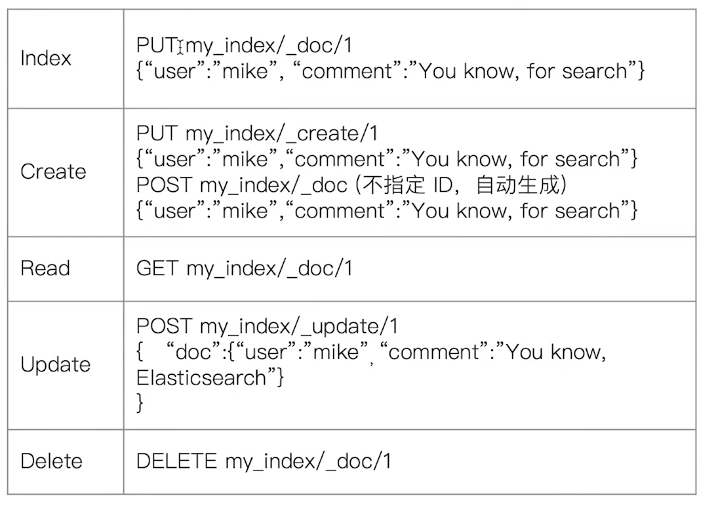
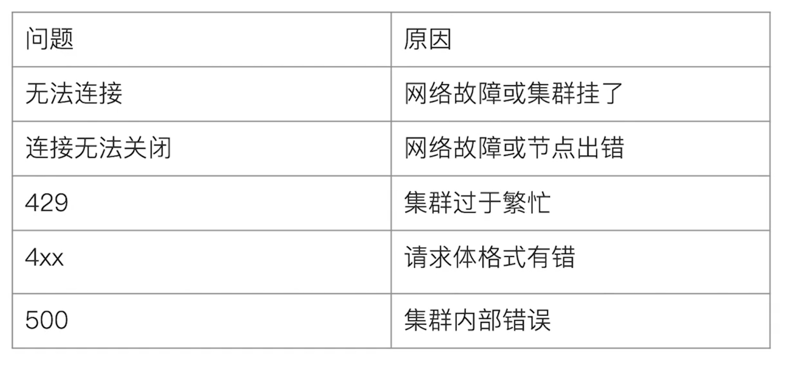

# 文档的 CRUD

- `Type` 名，约定都用 `_doc`
- `Create`：如果 `ID` 已经存在，会失败
- `Index`：如果 `ID` 不存在，创建新的文档。否则，先删除现有的文档，再创建新的文档，版本会增加
- `Update`：文档必须已经存在，更新只会对对相应字段做`增量`修改



## Create 一个文档

- 文档自动生成文档 `ID` 和指定文档 `ID` 两种方式
  - 通过调用 `post /users/_doc` 系统会自动生成 `document id`
  - 使用 `HTTP PUT user/_create/1` 创建时，`URI` 中显示指定 `_create`，此时如果该 `id` 的文档已经存在，操作失败

## Get 一个文档

- 找到文档，返回 `HTTP 200`
  - 文档元信息
    - `_index` / `_type` /
    - 版本信息，同一个 `ID` 的文档，即使被删除，`Version` 号也会不断增加
    - _source 中默认包含了文档的所有原始信息
- 找不到文档，返回 `HTTP 404`

## Index 文档

- `Index` 和 `Create` 不一样的地方：如果文档不存在，就索引新的文档。否则现有文档会被删除，新的文档被索引。版本信息会 `+1`

## Update 文档

- `Update` 方法不会删除原来的文档，而是实现真正的数据更新
- `Post` 方法 / `Payload` 需要包含在 `doc` 中

## Bulk API

- 支持在一次 `API` 调用中，对不同的索引进行操作
- 支持四种类型操作
  - `Index`
  - `Create`
  - `Update`
  - `Delete`
- 可以再 `URI` 中指定 `Index`，也可以在请求的 `Payload` 中进行
- 操作中单条操作失败，并不会影响其它操作
- 返回结果包括了每一条操作执行的结果

```apl
# ES CRUD
############Create Document############
#create document. 自动生成 _id
POST users/_doc
{
    "user" : "Mike",
    "post_date" : "2019-04-15T14:12:12",
    "message" : "trying out Kibana"
}

#create document. 指定Id。如果id已经存在，报错
PUT users/_doc/1?op_type=create
{
    "user" : "Jack",
    "post_date" : "2019-05-15T14:12:12",
    "message" : "trying out Elasticsearch"
}

#create document. 指定 ID 如果已经存在，就报错
PUT users/_create/1
{
     "user" : "Jack",
    "post_date" : "2019-05-15T14:12:12",
    "message" : "trying out Elasticsearch"
}

### Get Document by ID
#Get the document by ID
GET users/_doc/1


###  Index & Update
#Update 指定 ID  (先删除，在写入)
GET users/_doc/1

PUT users/_doc/1
{
    "user" : "Mike"
}


#GET users/_doc/1
#在原文档上增加字段
POST users/_update/1/
{
    "doc":{
        "post_date" : "2019-05-15T14:12:12",
        "message" : "trying out Elasticsearch"
    }
}


### Delete by Id
# 删除文档
DELETE users/_doc/1


### Bulk 操作
#执行两次，查看每次的结果

#执行第1次
POST _bulk
{ "index" : { "_index" : "test", "_id" : "1" } }
{ "field1" : "value1" }
{ "delete" : { "_index" : "test", "_id" : "2" } }
{ "create" : { "_index" : "test2", "_id" : "3" } }
{ "field1" : "value3" }
{ "update" : {"_id" : "1", "_index" : "test"} }
{ "doc" : {"field2" : "value2"} }
GET test/_doc/1


#执行第2次
POST _bulk
{ "index" : { "_index" : "test", "_id" : "1" } }
{ "field1" : "value1" }
{ "delete" : { "_index" : "test", "_id" : "2" } }
{ "create" : { "_index" : "test2", "_id" : "3" } }
{ "field1" : "value3" }
{ "update" : {"_id" : "1", "_index" : "test"} }
{ "doc" : {"field2" : "value2"} }
GET test/_doc/1
GET test2/_doc/

### mget 操作
GET /_mget
{
    "docs" : [
        {
            "_index" : "test",
            "_id" : "1"
        },
        {
            "_index" : "test",
            "_id" : "2"
        },
        {
            "_index" : "test2",
            "_id" : "3"
        }
    ]
}


#URI中指定index
GET /test/_mget
{
    "docs" : [
        {

            "_id" : "1"
        },
        {

            "_id" : "2"
        }
    ]
}


GET /_mget
{
    "docs" : [
        {
            "_index" : "test",
            "_id" : "1",
            "_source" :  ["field1", "field2"]
        },
        {
            "_index" : "test",
            "_id" : "2",
            "_source" : ["field3", "field4"]
        },
        {
            "_index" : "test",
            "_id" : "1",
            "_source" : {
                "include": ["field1"],
                "exclude": ["field2"]
            }
        }
    ]
}

### msearch 操作
POST kibana_sample_data_ecommerce/_msearch
{}
{"query" : {"match_all" : {}},"size":1}
{"index" : "kibana_sample_data_flights"}
{"query" : {"match_all" : {}},"size":2}


### 清除测试数据
#清除数据
DELETE users
DELETE test
DELETE test2
```

# 常见的错误返回

