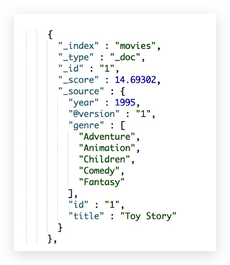
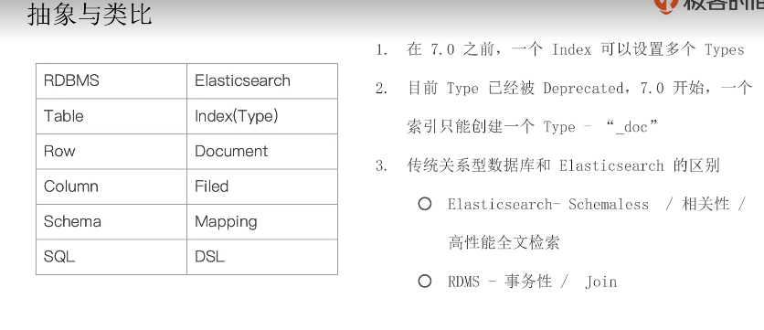

# ES 索引文档和 REST API

## 文档（Document）

- `ES` 是面向文档的，文档是所有可搜索数据的最小单位
  - 日志文件中的日志项
  - 一本电影的具体信息 / 一张唱片的详细信息
  - `MP3` 播放器中的一首歌 / 一篇 `PDF` 文档中的具体内容
- 文档会被序列化成 `JSON` 格式，保存在 `ES` 中
  - `JSON` 对象由字段组成
  - 每个字段都有对应的字段类型（字符串、数值、布尔、日期、二进制、范围类型）
  - 一篇文档包含了一系列的字段，类似数据库表中一条记录
  - `JSON` 文档，格式灵活，不需要预先定义格式
    - 字段类型可以指定或者通过 `ES` 自动推算
    - 支持数组、支持嵌套
- 每个文档独有一个 `Unique ID`
  - 你可以自己指定 `ID`
  - 或者通过 `ES` 自动生成
  
## 文档元数据



- 元数据，用于标注文档的相关信息
  - `_index`：文档所属的索引名
  - `_type`：文档所属的类型名
  - `_id`：文档唯一 `ID`
  - `_source`：文档的原始 `JSON` 数据
  - `_all`：整合所有字段内容到该字段，已被废除
  - `_version`：文档的版本信息
  - `_score`：相关性打分

### 索引

- `Index` 索引是文档的容器，是一类文档的结合
  - `Index` 体现了逻辑空间的概念：每个索引都有自己的 `Mapping` 定义，用于定义包含的文档的字段名和字段类型
  - `Shard` 体现了物理空间的概念：索引中的数据分散在 `Shard` 中
- 索引的 `Mapping` 与 `Settings`
  - `Mapping` 定义文档字段的类型
  - `Settings` 定义不同的数据分布
- 索引的不同语义
  - 名词：一个 `ES` 集群中，可以创建很多不同的索引
  - 动词：保存一个文档到 `ES` 的过程也叫索引 (`indexing`)
- 名词：一个 `B` 树索引，一个倒排索引

### Type

- 在 `7.0` 之前，一个 `Index` 可以设置多个 `Types`，可以说 `Index` 是 `db type` 是不同的`tables`，现在，一个 `Index` 只能有一个 `Type`
- `6.0` 开始，Type 已经被 `Deprecated`。`7.0` 开始，一个索引只能创建一个 `Type - "_doc"`

参考原因：<https://www.elastic.co/guide/en/elasticsearch/reference/7.0/removal-of-types.html>  

### ES 与 RDBMS 抽象与类比



### REST API - 很容易被各种语言调用

`kibana` 安装官方提供的测试数据（`Index`：`kibana_sample_data_ecommerce`）

```elasticsearch
#查看索引相关信息
GET kibana_sample_data_ecommerce

#查看索引的文档总数
GET kibana_sample_data_ecommerce/_count

#查看前10条文档，了解文档格式
POST kibana_sample_data_ecommerce/_search
{
}

#_cat indices API
#查看indices
GET /_cat/indices/kibana*?v&s=index

#查看状态为绿的索引
GET /_cat/indices?v&health=green

#按照文档个数排序
GET /_cat/indices?v&s=docs.count:desc

#查看具体的字段
GET /_cat/indices/kibana*?pri&v&h=health,index,pri,rep,docs.count,mt

#How much memory is used per index?
GET /_cat/indices?v&h=i,tm&s=tm:desc

```
