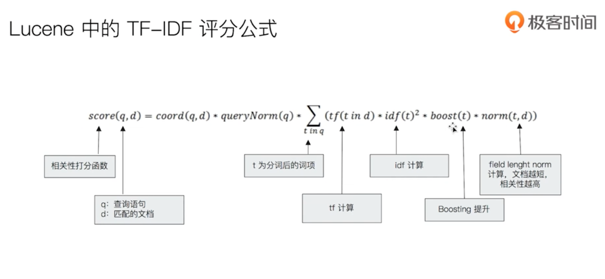
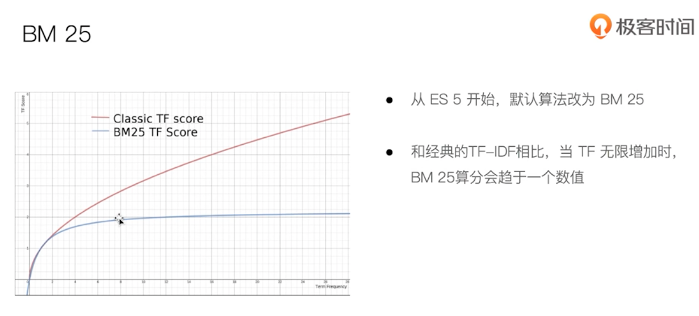
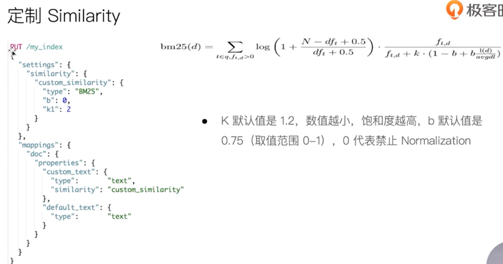

# ES结构化搜索及搜索相关性算分

## ES结构化搜索

### 结构化数据

- 结构化搜索（Structured search）是指对结构化数据的搜索
  - 日期，布尔类型和数字也都是结构化的
- 文本也可以是结构化的
  - 颜色：红黄蓝
  - 博客标签：分布、搜索
  - 商品唯一标识码

### ES 中的结构化搜索

- 布尔，时间，日期和数字这类结构化数据：有精确的格式，我们可以对这些格式进行逻辑操作。包括比较数字或时间的范围，或判定两个值的大小。
- 结构化的文本可以做精确匹配或者部分匹配
  - `Term` 查询 / `Prefix` 前缀查询
- 结构化结果只有 “是” 或 “否” 两个值
  - 根据场景需要，可以决定结构化搜索是否需要打分

```curl
#结构化搜索，精确匹配
DELETE products
POST /products/_bulk
{ "index": { "_id": 1 }}
{ "price" : 10,"avaliable":true,"date":"2018-01-01", "productID" : "XHDK-A-1293-#fJ3" }
{ "index": { "_id": 2 }}
{ "price" : 20,"avaliable":true,"date":"2019-01-01", "productID" : "KDKE-B-9947-#kL5" }
{ "index": { "_id": 3 }}
{ "price" : 30,"avaliable":true, "productID" : "JODL-X-1937-#pV7" }
{ "index": { "_id": 4 }}
{ "price" : 30,"avaliable":false, "productID" : "QQPX-R-3956-#aD8" }

GET products/_mapping
GET products/_search

#对布尔值 match 查询，有算分
POST products/_search
{
  "profile": "true",
  "explain": true,
  "query": {
    "term": {
      "avaliable": true
    }
  }
}

#对布尔值，通过constant score 转成 filtering，没有算分
POST products/_search
{
  "profile": "true",
  "explain": true,
  "query": {
    "constant_score": {
      "filter": {
        "term": {
          "avaliable": true
        }
      }
    }
  }
}

#数字类型 Term
POST products/_search
{
  "profile": "true",
  "explain": true,
  "query": {
    "term": {
      "price": 30
    }
  }
}

#数字类型 terms
POST products/_search
{
  "explain": true,
  "query": {
    "constant_score": {
      "filter": {
        "terms": {
          "price": [
            "20",
            "30"
          ]
        }
      }
    }
  }
}

#数字 Range 查询
GET products/_search
{
    "query" : {
        "constant_score" : {
            "filter" : {
                "range" : {
                    "price" : {
                        "gte" : 20,
                        "lte"  : 30
                    }
                }
            }
        }
    }
}

# 日期 range
POST products/_search
{
    "query" : {
        "constant_score" : {
            "filter" : {
                "range" : {
                    "date" : {
                      "gte" : "now-4y"
                    }
                }
            }
        }
    }
}

#exists查询
POST products/_search
{
  "query": {
    "constant_score": {
      "filter": {
        "exists": {
          "field": "date"
        }
      }
    }
  }
}

#处理多值字段
POST /movies_test/_bulk
{ "index": { "_id": 1 }}
{ "title" : "Father of the Bridge Part II","year":1995, "genre":"Comedy"}
{ "index": { "_id": 2 }}
{ "title" : "Dave","year":1993,"genre":["Comedy","Romance"] }


#处理多值字段，term 查询是包含，而不是等于
POST movies_test/_search
{
  "query": {
    "constant_score": {
      "filter": {
        "term": {
          "genre.keyword": "Comedy"
        }
      }
    }
  }
}

#字符类型 terms
POST products/_search
{
  "query": {
    "constant_score": {
      "filter": {
        "terms": {
          "productID.keyword": [
            "QQPX-R-3956-#aD8",
            "JODL-X-1937-#pV7"
          ]
        }
      }
    }
  }
}

```

## 搜索的相关性算分

### 相关性和相关性算分

- 搜索的相关性算分，描述了一个文档和查询语句匹配的成都。 `ES` 会对每个查询条件的结果进行算分 `_score` 。
- 打分的本质是排序，需要把最符合用户需求的文档排在前面。`ES5` 之前，默认的相关性算分采用 `TF-IDE`，现在采用 `BM25`

### 词频 TF

- `Term Frequency`：检索词在一篇文档中出现的概率
  - 检索词出现的次数除以文档的总字数
- 度量一条查询和结果文档相关性的简单方法：简单将搜索中每一个词的 `TF` 进行相加
  - `TF(区块链) + TF(的) + TF(应用)`
- `Stop Word`
  - "的" 在文档中出现了很多次，但是对贡献相关度几乎没有用处，不应该考虑他们的 `TF`

### 逆文档频率 IDF

- `IDF`：检索词在所有文档出现的频率
  - "区块链" 在相对比较少的文档中出现
  - "应用" 在相对比较多的文档中出现
  - “`Stop Word`” 在大量的文档中出现
- `Inverse Document Frequency`：简单说 = `log(全部文档数/检索词出现过的文档总数)`
- `TF-IDF` 本质上就是将 `TF` 求和变成了加权求和

### TF-IDF 的概念

- `TF-IDF` 被公认为是信息检索领域最重要的发明
- 除了在信息检索，在文献分类和其它相关领域有着非常广泛的应用
- `IDF` 的概念，最早是剑桥大学的“斯巴克·琼斯”提出
- `1970，1980` 年代萨尔顿和罗宾逊，进行了进一步的证明和研究，并用香农信息论做了证明
- 现代搜索引擎，对 `TF—IDF` 进行了大量细微的优化







### Boosting Relevance

- Boosting 是控制相关度的一种手段
  - 索引，字段 或查询子条件
- 参数 boost 的含义
  - 当 boost > 1 时，打分的相关度相对性提升
  - 当 0 < boost < 1 时，打分的权重相对性降低
  - 当 boost < 0，贡献负分

```curl
PUT testscore/_bulk
{ "index": { "_id": 1 }}
{ "content":"we use Elasticsearch to power the search" }
{ "index": { "_id": 2 }}
{ "content":"we like elasticsearch" }
{ "index": { "_id": 3 }}
{ "content":"The scoring of documents is caculated by the scoring formula" }
{ "index": { "_id": 4 }}
{ "content":"you know, for search" }

# 通过 Explain API 查看 TF-IDF
POST /testscore/_search
{
  "explain": true,
  "query": {
    "match": {
      //"content":"you"
      "content": "elasticsearch"
      //"content":"the"
      //"content": "the elasticsearch"
    }
  }
}

POST testscore/_search
{
    "query": {
        "boosting" : {
            "positive" : {
                "term" : {
                    "content" : "elasticsearch"
                }
            },
            "negative" : {
                 "term" : {
                     "content" : "like"
                }
            },
            "negative_boost" : 0.2
        }
    }
}
```
