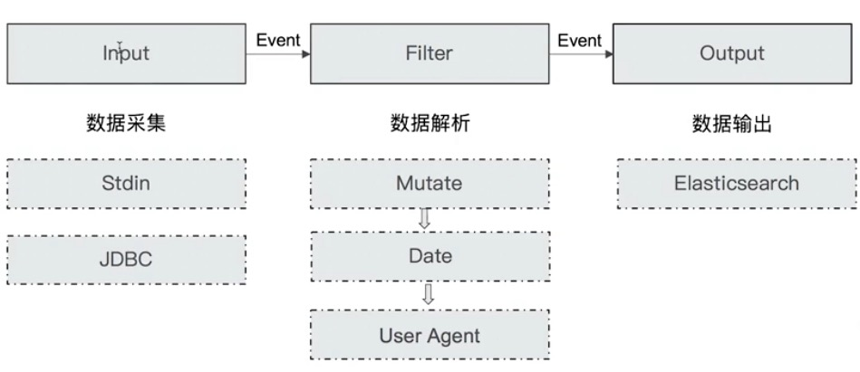

# Logstash

## Logstash Concepts

- Pipeline
  - 包含了 `input-filter-output` 三个阶段的处理流程
  - 插件生命周期管理
  - 队列管理
- Logstash Event
  - 数据在内部流转时的具体表现形式。数据在 `input` 阶段被转换为 `Event`，在 `output` 被转化成目标格式数据
  - `Event` 其实是一个 `Java Object`，在配置文件中，对 `Event` 的属性进行增删改查

## Logstash 架构简介

`Codec(Code/Decode)`：将原始数据 `decode` 成 `Event`；将 `Event encode` 成目标数据。

## Input Plugins

- 一个 `Pipeline` 可以有多个 `input` 插件
  - `Stdin / File`
  - `Beats / Log4J / Elasticsearch / JDBC / Kafaka / Rabbitmq / Redis`
  - `JMX / HTTMP / Websocket / UDP / TCP`
  - `Google Cloud Storage / S3`
  - `Github / Twitter`

## Output Plugins

- 将 `Event` 发送到特定的目的地，是 `Pipeline` 的最后一个阶段
- 常见的 `Output Plugins`
  - `Elasticsearch`
  - `Email / Pageduty`
  - `Influxdb / Kafka / Mongodb / Opentsdb / Zabbix`
  - `Http / TCP / Websocket`

## Codec Plugins

- 将原始数据 `decode` 成 `Event`； 将 `Event encode` 成目标数据
- 内置 `Codec Plugins`
  - `Line / Multiline`
  - `JSON / Avro / Cef`
  - `Dots / Rubydebug`

## Filter Plugins

- 处理 `Event`
- 内置的 `Filter Plugins`
  - `Mutate`：操作 `Event` 的字段
  - `Metrics`：`Aggregate metrics`
  - `Ruby`：执行 `Ruby` 代码

## Logstash Queue

- `In Memory Queue`
  - 进程 `Crash`，机器宕机，都会引起数据丢失
- `Persistent Queue`
  - `Queue.type.persisted` (默认是 `memory`)
    - `Queue.max_bytes:4gb`
  - 机器宕机，数据也不会丢失；数据保证会被消费；可以替代 `Kafka` 等消息队列缓冲区的作用

## 同步数据库数据到 Elaticsearch

- 需求：将数据库中的数据同步到 `ES`，借助 `ES` 的全文搜索，提高搜索速度
  - 需要把新增用户信息同步到 `ES` 中
  - 用户信息 `Update` 后，需要能被更新到 `ES`
  - 支持增量更新
  - 用户注销后，不能被 `ES` 搜索到

### JDBC Input Plugin & 设计实现思路

- 支持通过 `JDBC Input Plugin` 将数据从数据库读到 `Logstash`
  - 需要自己提供所需的 `JDBC Driver`
- `Scheduling`
  - 语法来自 `Rufus-scheduler`
  - 扩展了 `Cron`，支持时区
- `State`
  - `Tracking_column / sql_laste_value`