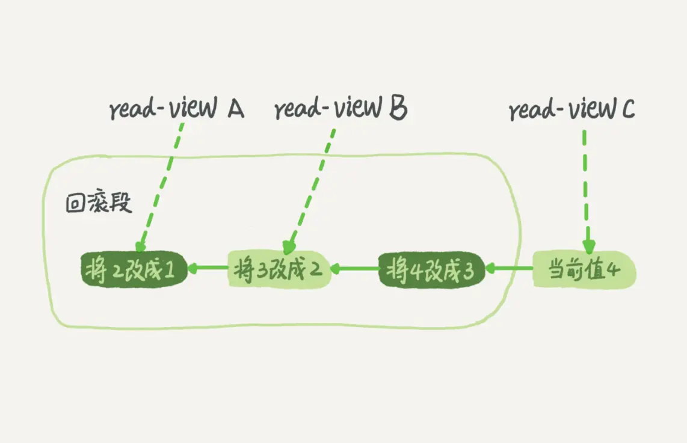

### 事务

事务就是要保证一组数据库操作，要么全部成功，要么全部失败。

在 `MySQL` 中，事务支持是在引擎层实现的。

#### 隔离性与隔离级别

`ACID`（`Atomicity`、`Consistency`、`Isolation`、`Durability`，即原子性、一致性、隔离性、持久性）。

当数据库上有多个事务同时执行的时候，就可能出现脏读（`dirty read`）、不可重复读（`non-repeatable read`）、幻读（`phantom read`）的问题，为了解决这些问题，就有了“隔离级别”的概念。

在谈隔离级别之前，你首先要知道，你隔离得越严实，效率就会越低。

`SQL` 标准的事务隔离级别包括：读未提交（`read uncommitted`）、读提交（`read committed`）、可重复读（`repeatable read`）和串行化（`serializable` ）。

- 读未提交是指，一个事务还没提交时，它做的变更就能被别的事务看到。
- 读提交是指，一个事务提交之后，它做的变更才会被其他事务看到。
- 可重复读是指，一个事务执行过程中看到的数据，总是跟这个事务在启动时看到的数据是一致的。当然在可重复读隔离级别下，未提交变更对其他事务也是不可见的。`MySQL` 默认级别。
- 串行化，顾名思义是对于同一行记录，“写”会加“写锁”，“读”会加“读锁”。当出现读写锁冲突的时候，后访问的事务必须等前一个事务执行完成，才能继续执行。

##### 视图概念
在实现上，数据库里面会创建一个视图，访问的时候以视图的逻辑结果为准。

- 在“可重复读”隔离级别下，这个视图是在事务启动时创建的，整个事务存在期间都用这个视图。
- 在“读提交”隔离级别下，这个视图是在每个 `SQL` 语句开始执行的时候创建的。
- “读未提交”隔离级别下直接返回记录上的最新值，没有视图概念。
- “串行化”隔离级别下直接用加锁的方式来避免并行访问。


不同的隔离级别下，数据库行为是有所不同的。

`Oracle` 数据库的默认隔离级别其实就是“读提交”，因此对于一些从 `Oracle` 迁移到 `MySQL` 的应用，为保证数据库隔离级别的一致，你一定要记得将 `MySQL` 的隔离级别设置为“`读提交`”。

```
配置的方式是，将启动参数 transaction-isolation 的值设置成 READ-COMMITTED。你可以用 show variables 来查看当前的值。

show variables like 'transaction_isolation';
```

总结来说，存在即合理，每种隔离级别都有自己的使用场景。


#### 事务隔离的实现

在 `MySQL` 中，实际上每条记录在更新的时候都会同时记录一条回滚操作。记录上的最新值，通过回滚操作，都可以得到前一个状态的值。

假设一个值从 `1` 被按顺序改成了 `2、3、4`，在回滚日志里面就会有类似下面的记录。



当前值是 `4`，但是在查询这条记录的时候，不同时刻启动的事务会有不同的 `read-view`。如图中看到的，在视图 `A、B、C` 里面，这一个记录的值分别是 `1、2、4`，同一条记录在系统中可以存在多个版本，就是数据库的多版本并发控制（`MVCC`）。对于 `read-view A`，要得到 `1`，就必须将当前值依次执行图中所有的回滚操作得到。

回滚日志，系统会判断，当没有事务再需要用到这些回滚日志时，回滚日志会被删除。

##### 尽量不要使用长事务

长事务意味着系统里面会存在很老的事务视图。由于这些事务随时可能访问数据库里面的任何数据，所以这个事务提交之前，数据库里面它可能用到的回滚记录都必须保留，这就会导致大量占用存储空间。

在 `MySQL 5.5` 及以前的版本，回滚日志是跟数据字典一起放在 `ibdata` 文件里的，即使长事务最终提交，回滚段被清理，文件也不会变小。我见过数据只有 `20GB`，而回滚段有 `200GB` 的库。最终只好为了清理回滚段，重建整个库。

除了对回滚段的影响，长事务还占用锁资源，也可能拖垮整个库。

#### 事务的启动方式

`MySQL` 的事务启动方式有以下几种：
- 显式启动事务语句， `begin` 或 `start transaction`。配套的提交语句是 `commit`，回滚语句是 `rollback`。
- `set autocommit=0`，这个命令会将这个线程的自动提交关掉。意味着如果你只执行一个 `select` 语句，这个事务就启动了，而且并不会自动提交。这个事务持续存在直到你主动执行 `commit` 或 `rollback` 语句，或者断开连接。

有些客户端连接框架会默认连接成功后先执行一个 `set autocommit=0` 的命令。这就导致接下来的查询都在事务中，如果是长连接，就导致了意外的长事务。

建议你总是使用 `set autocommit=1`, 通过显式语句的方式来启动事务。

```
在 information_schema 库的 innodb_trx 这个表中查询长事务，比如下面这个语句，用于查找持续时间超过 60s 的事务。

select * from information_schema.innodb_trx where TIME_TO_SEC(timediff(now(),trx_started))>60
```