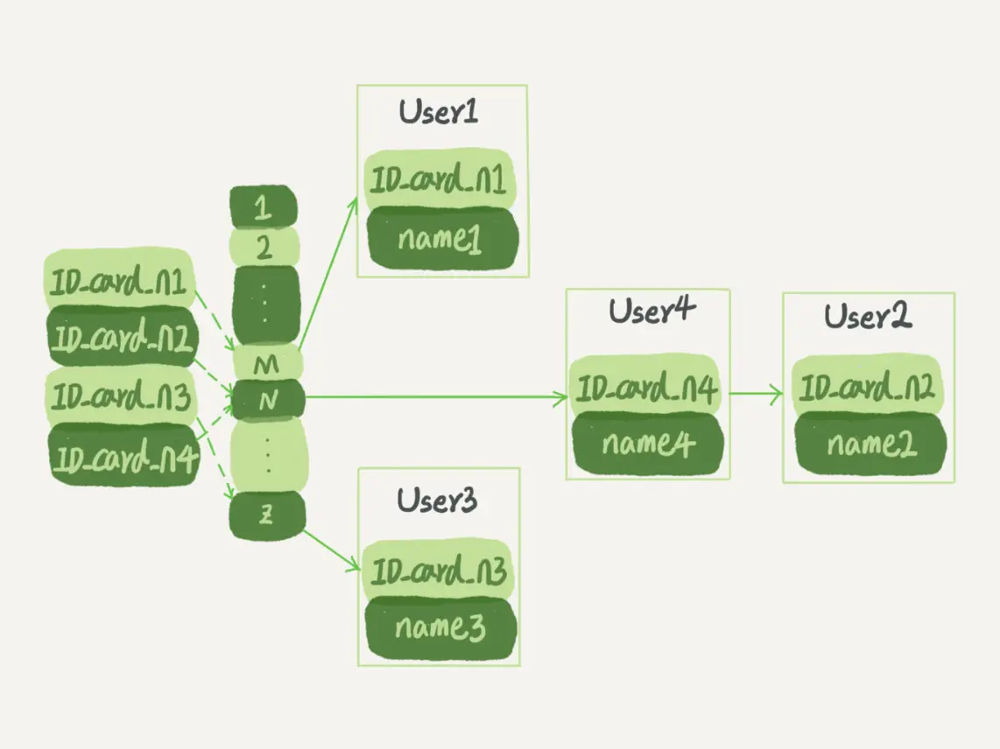
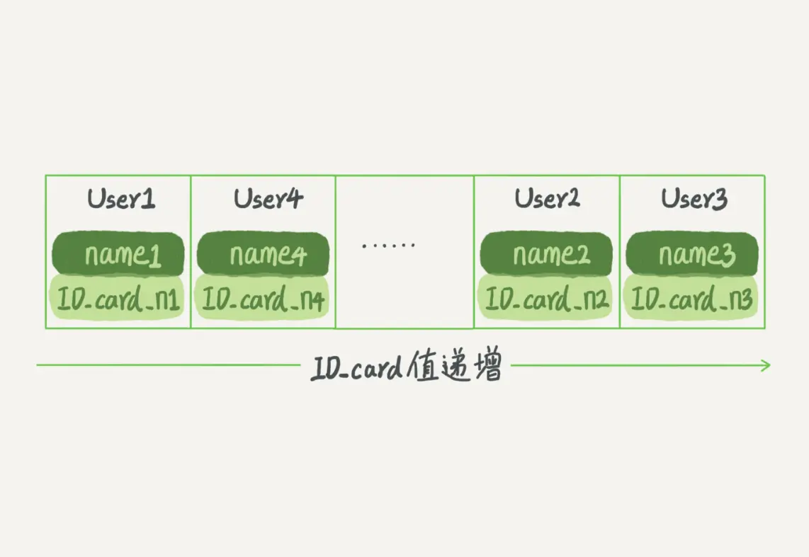
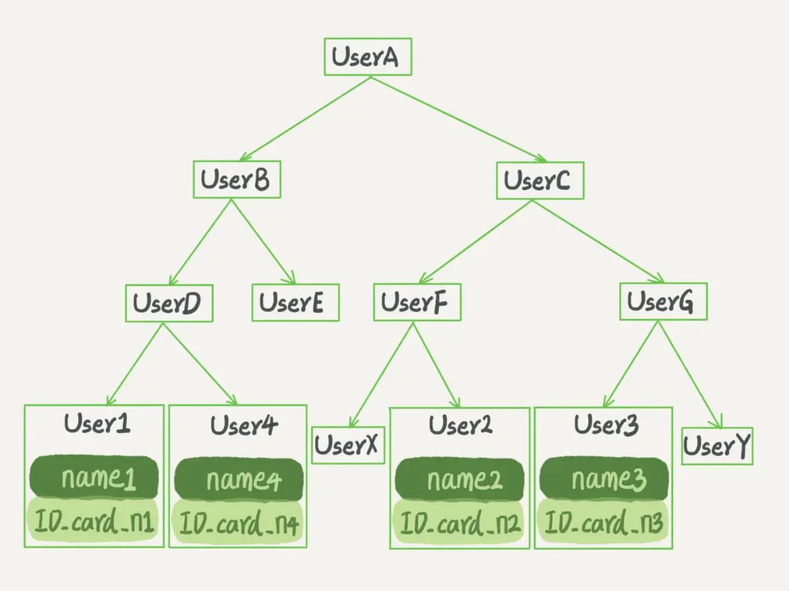
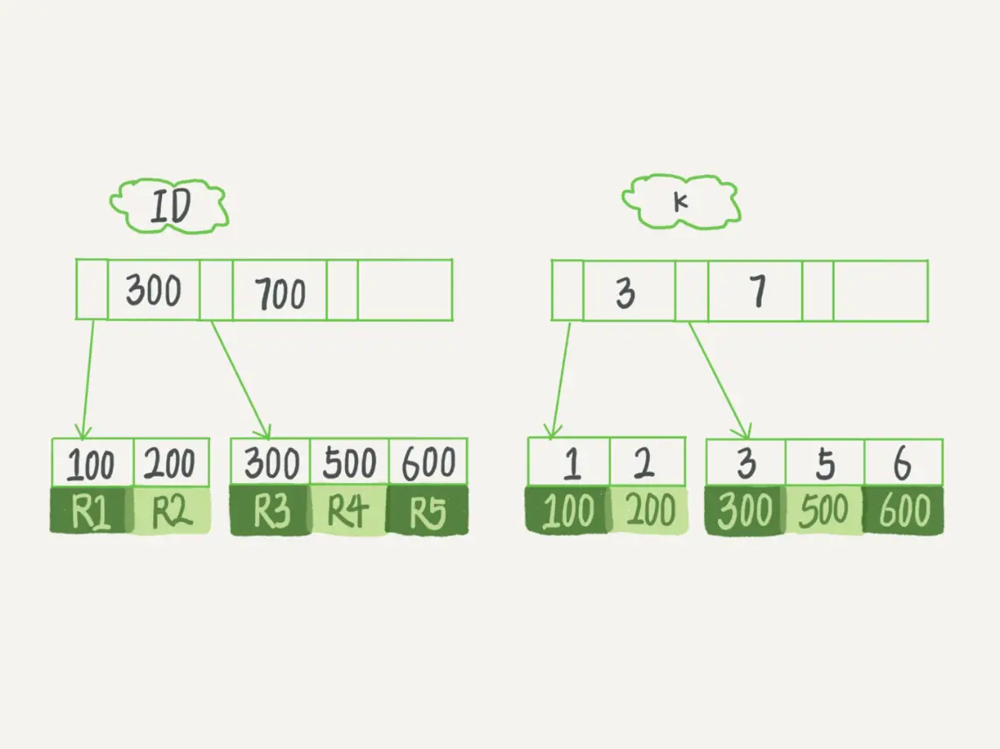

### 什么是索引

一句话简单来说，索引的出现其实就是为了提高数据查询的效率，就像书的目录一样。一本 `500` 页的书，如果你想快速找到其中的某一个知识点，在不借助目录的情况下，那估计你可得找一会儿。同样，对于数据库的表而言，索引其实就是它的“目录”。

### 索引的常见模型

索引的出现是为了提高查询效率，但是实现索引的方式却有很多种，所以这里也就引入了索引模型的概念。

可以用于提高读写效率的数据结构很多，主要的数据结构有三种，它们分别是哈希表、有序数组和搜索树。

#### 三种模型的区别

##### 哈希表



哈希表是一种以键 - 值（`key-value`）存储数据的结构，我们只要输入待查找的键即 `key`，就可以找到其对应的值即 `Value`。哈希的思路很简单，把值放在数组里，用一个哈希函数把 `key` 换算成一个确定的位置，然后把 `value` 放在数组的这个位置。

不可避免地，多个 `key` 值经过哈希函数的换算，会出现同一个值的情况。处理这种情况的一种方法是，拉出一个链表。

哈希表缺点是，因为不是有序的，所以哈希索引做区间查询的速度是很慢的。

哈希表这种结构适用于只有等值查询的场景，比如 `Memcached` 及其他一些 `NoSQL` 引擎。

##### 有序数组



有序数组在等值查询和范围查询场景中的性能就都非常优秀。

有序数组用二分法就可以快速查询，这个时间复杂度是 `O(log(N))`。同时在范围内支持二分法查找。

如果仅仅看查询效率，有序数组就是最好的数据结构了。但是，在需要更新数据的时候就麻烦了，你往中间插入一个记录就必须得挪动后面所有的记录，成本太高。

有序数组索引只适用于静态存储引擎，比如你要保存的是 `2017` 年某个城市的所有人口信息，这类不会再修改的数据。

##### 二叉搜索树



二叉搜索树的特点是：父节点左子树所有结点的值小于父节点的值，右子树所有结点的值大于父节点的值。这样如果你要查 `ID_card_n2` 的话，按照图中的搜索顺序就是按照 `UserA -> UserC -> UserF -> User2` 这个路径得到。这个时间复杂度是 `O(log(N))`。

当然为了维持 `O(log(N))` 的查询复杂度，你就需要保持这棵树是平衡二叉树。为了做这个保证，更新的时间复杂度也是 `O(log(N))`。

树可以有二叉，也可以有多叉。多叉树就是每个节点有多个儿子，儿子之间的大小保证从左到右递增。

二叉树是搜索效率最高的，但是实际上大多数的数据库存储却并不使用二叉树。其原因是，索引不止存在内存中，还要写到磁盘上。

可以想象一下一棵 `100` 万节点的平衡二叉树，树高 `20`。一次查询可能需要访问 `20` 个数据块。在机械硬盘时代，从磁盘随机读一个数据块需要 `10 ms` 左右的寻址时间。也就是说，对于一个 `100` 万行的表，如果使用二叉树来存储，单独访问一个行可能需要 `20` 个 `10 ms` 的时间，这个查询可真够慢的。

为了让一个查询尽量少地读磁盘，就必须让查询过程访问尽量少的数据块。那么，我们就不应该使用二叉树，而是要使用`N 叉树`。这里，`N叉树`中的`“N”`取决于数据块的大小。

以 `InnoDB` 的一个整数字段索引为例，这个 `N` 差不多是 `1200`。这棵树高是 `4` 的时候，就可以存 `1200` 的 `3` 次方个值，这已经 `17` 亿了。考虑到树根的数据块总是在内存中的，一个 `10` 亿行的表上一个整数字段的索引，查找一个值最多只需要访问 `3` 次磁盘。其实，树的第二层也有很大概率在内存中，那么访问磁盘的平均次数就更少了。

`N 叉树`由于在读写上的性能优点，以及适配磁盘的访问模式，已经被广泛应用在数据库引擎中了。

不管是哈希还是有序数组，或者 `N 叉树`，它们都是不断迭代、不断优化的产物或者解决方案。数据库技术发展到今天，跳表、`LSM` 树等数据结构也被用于引擎设计中。

有个概念，数据库底层存储的核心就是基于这些数据模型的。每碰到一个新数据库，我们需要先关注它的数据模型，这样才能从理论上分析出这个数据库的适用场景。

在 `MySQL` 中，索引是在存储引擎层实现的，所以并没有统一的索引标准，即不同存储引擎的索引的工作方式并不一样。而即使多个存储引擎支持同一种类型的索引，其底层的实现也可能不同。

#### InnoDB 的索引模型

在 `InnoDB` 中，表都是根据主键顺序以索引的形式存放的，这种存储方式的表称为索引组织表。又因为前面我们提到的，`InnoDB` 使用了 `B+` 树索引模型，所以数据都是存储在 `B+` 树中的。

每一个索引在 `InnoDB` 里面对应一棵 `B+` 树。

```
假设，我们有一个主键列为 ID 的表，表中有字段 k，并且在 k 上有索引。


mysql> create table T(
id int primary key, 
k int not null, 
name varchar(16),
index (k))engine=InnoDB;

表中 R1~R5 的 (ID,k) 值分别为 (100,1)、(200,2)、(300,3)、(500,5) 和 (600,6)，两棵树的示例示意图如下。
```



从图中不难看出，根据叶子节点的内容，索引类型分为主键索引和非主键索引。

主键索引的叶子节点存的是整行数据。在 `InnoDB` 里，主键索引也被称为聚簇索引（`clustered index`）。

非主键索引的叶子节点内容是主键的值。在 `InnoDB` 里，非主键索引也被称为二级索引（`secondary index`）。

##### 基于主键索引和普通索引的查询有什么区别？

- 如果语句是 `select * from T where ID=500`，即主键查询方式，则只需要搜索 `ID` 这棵 `B+` 树；
- 如果语句是 `select * from T where k=5`，即普通索引查询方式，则需要先搜索 `k` 索引树，得到 `ID` 的值为 `500`，再到 `ID` 索引树搜索一次。这个过程称为回表。
  
也就是说，基于非主键索引的查询需要多扫描一棵索引树。因此，我们在应用中应该尽量使用主键查询。

#### 索引维护

##### 页分裂
`B+` 树为了维护索引有序性，在插入新值的时候需要做必要的维护。以上面这个图为例，如果插入新的行 `ID` 值为 `700`，则只需要在 `R5` 的记录后面插入一个新记录。如果新插入的 `ID` 值为 `400`，就相对麻烦了，需要逻辑上挪动后面的数据，空出位置。

而更糟的情况是，如果 `R5` 所在的数据页已经满了，根据 `B+` 树的算法，这时候需要申请一个新的数据页，然后挪动部分数据过去。这个过程称为页分裂。在这种情况下，性能自然会受影响。

除了性能外，页分裂操作还影响数据页的利用率。原本放在一个页的数据，现在分到两个页中，整体空间利用率降低大约 `50%`。

当然有分裂就有合并。当相邻两个页由于删除了数据，利用率很低之后，会将数据页做合并。合并的过程，可以认为是分裂过程的逆过程。

##### 自增主键
关于自增主键的插入数据模式，符合了递增插入的场景。每次插入一条新记录，都是追加操作，都不涉及到挪动其他记录，也不会触发叶子节点的分裂。

有业务逻辑的字段做主键，则往往不容易保证有序插入，这样写数据成本相对较高。

假设你的表中确实有一个唯一字段，比如字符串类型的身份证号，那应该用身份证号做主键，还是用自增字段做主键呢？

由于每个非主键索引的叶子节点上都是主键的值。如果用身份证号做主键，那么每个二级索引的叶子节点占用约 `20` 个字节，而如果用整型做主键，则只要 `4` 个字节，如果是长整型（`bigint`）则是 `8` 个字节。

显然，主键长度越小，普通索引的叶子节点就越小，普通索引占用的空间也就越小。

所以，从性能和存储空间方面考量，自增主键往往是更合理的选择。

##### 什么场景适合用业务字段直接做主键
典型的 `KV` 场景

- 只有一个索引；
- 该索引必须是唯一索引。

由于没有其他索引，所以也就不用考虑其他索引的叶子节点大小的问题。


#### 覆盖索引

如果执行的语句是 `select ID from T where k between 3 and 5`，这时只需要查 `ID` 的值，而 `ID` 的值已经在 `k` 索引树上了，因此可以直接提供查询结果，不需要回表。也就是说，在这个查询里面，索引 `k` 已经“覆盖了”我们的查询需求，我们称为覆盖索引。

由于覆盖索引可以减少树的搜索次数，显著提升查询性能，所以使用覆盖索引是一个常用的性能优化手段。

需要注意的是，在引擎内部使用覆盖索引在索引 `k` 上其实读了三个记录，`R3~R5`（对应的索引 `k` 上的记录项），但是对于 `MySQL` 的 `Server` 层来说，它就是找引擎拿到了两条记录，因此 `MySQL` 认为扫描行数是 `2`。

问题：在一个市民信息表上，是否有必要将身份证号和名字建立联合索引？

如果现在有一个高频请求，要根据市民的身份证号查询他的姓名，这个联合索引就有意义了。它可以在这个高频请求上用到覆盖索引，不再需要回表查整行记录，减少语句的执行时间。


#### 最左前缀原则

`B+` 树这种索引结构，可以利用索引的“最左前缀”，来定位记录。

索引项是按照索引定义里面出现的字段顺序排序的。

不只是索引的全部定义，只要满足最左前缀，就可以利用索引来加速检索。这个最左前缀可以是联合索引的最左 `N` 个字段，也可以是字符串索引的最左 `M` 个字符。

在建立联合索引的时候，如何安排索引内的字段顺序：
- 第一原则是，通过调整顺序，少维护一个索引。（支持 `a、b、ab` 三种查询，使用联合 `ab` 和 `b` 索引就能实现）
- 第二原则是，占用空间选择。(`a` 字段值明显大于 `b` 时，建立 `ab` 外，单独建立 `b` 索引)