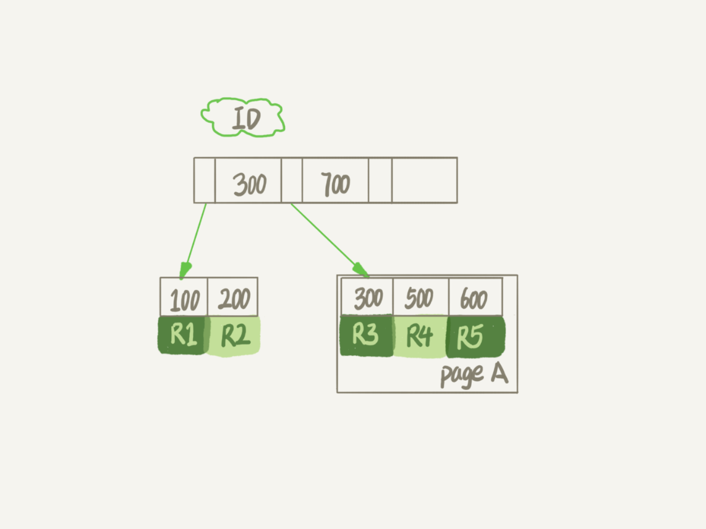
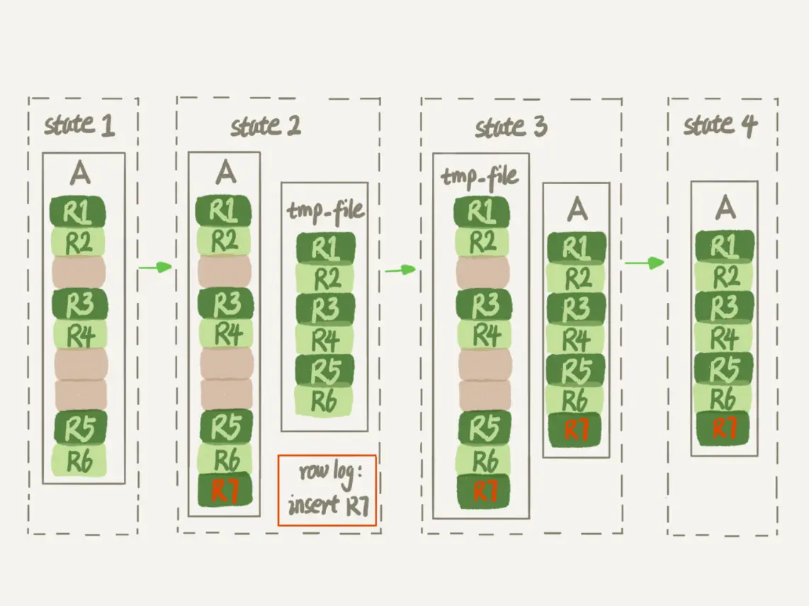

### 数据表存储

一个 `InnoDB` 表包含两部分，即：表结构定义和数据。

在 `MySQL 8.0` 版本以前，表结构是存在以 `.frm` 为后缀的文件里。而 `MySQL 8.0` 版本，则已经允许把表结构定义放在系统数据表中了。

#### 表数据参数 innodb_file_per_table

表数据既可以存在共享表空间里，也可以是单独的文件。这个行为是由参数 `innodb_file_per_table` 控制的：
- 这个参数设置为 `OFF` 表示的是，表的数据放在系统共享表空间，也就是跟数据字典放在一起；
- 这个参数设置为 `ON` 表示的是，每个 `InnoDB` 表数据存储在一个以 `.ibd` 为后缀的文件中。

从 `MySQL 5.6.6` 版本开始，它的默认值就是 `ON` 了。

不论哪个版本，都建议设置未 `ON` 。

因为，一个表单独存储为一个文件更容易管理，而且在你不需要这个表的时候，通过 `drop table` 命令，系统就会直接删除这个文件。而如果是放在共享表空间中，即使表删掉了，空间也是不会回收的。

所以，将 `innodb_file_per_table` 设置为 `ON`，是推荐做法。

在删除整个表的时候，可以使用 `drop table` 命令回收表空间。但是删除某些行时却不会释放表空间。

### 数据删除流程

`InnoDB` 里的数据都是用 `B+` 树的结构组织的。



要删掉 `R4` 这个记录，`InnoDB` 引擎只会把 `R4` 这个记录标记为删除。如果之后要再插入一个 `ID` 在 `300` 和 `600` 之间的记录时，可能会复用这个位置。但是，磁盘文件的大小并不会缩小。

如果我们删掉了一个数据页上的所有记录，整个数据页就可以被复用了。

数据页的复用跟记录的复用是不同的。

记录的复用，只限于符合范围条件的数据。比如上面的这个例子，`R4` 这条记录被删除后，如果插入一个 `ID` 是 `400` 的行，可以直接复用这个空间。但如果插入的是一个 `ID` 是 `800` 的行，就不能复用这个位置了。

而当整个页从 `B+` 树里面摘掉以后，可以复用到任何位置。

如果相邻的两个数据页利用率都很小，系统就会把这两个页上的数据合到其中一个页上，另外一个数据页就被标记为可复用。

如果我们用 `delete` 命令把整个表的数据删除呢？结果就是，所有的数据页都会被标记为可复用。但是磁盘上，文件不会变小。

`delete` 命令其实只是把记录的位置，或者数据页标记为了“可复用”，但磁盘文件的大小是不会变的。也就是说，通过 `delete` 命令是不能回收表空间的。这些可以复用，而没有被使用的空间，看起来就像是“空洞”。

实际上，不止是删除数据会造成空洞，插入数据也会。

如果数据是按照索引递增顺序插入的，那么索引是紧凑的。但如果数据是随机插入的，就可能造成索引的数据页分裂。

更新索引上的值，可以理解为删除一个旧的值，再插入一个新值。不难理解，这也是会造成空洞的。

经过大量增删改的表，都是可能是存在空洞的。所以，如果能够把这些空洞去掉，就能达到收缩表空间的目的。

而重建表，就可以达到这样的目的。

### 重建表

`alter table A engine=InnoDB` 命令来重建表。

`MySQL 5.5` 版本之前，这条命令，`MySQL` 会创建临时表自动完成转存数据、交换表名、删除旧表的操作。而此过程要锁表，不然数据表有新数据插入会造成数据丢失。


`MySQL 5.6` 版本开始引入的 `Online DDL`，对这个操作流程做了优化。
引入了 `Online DDL` 之后，重建表的流程：



```
1. 建立一个临时文件，扫描表 A 主键的所有数据页；
2. 用数据页中表 A 的记录生成 B+ 树，存储到临时文件中；
3. 生成临时文件的过程中，将所有对 A 的操作记录在一个日志文件（row log）中，对应的是图中 state2 的状态；
4. 临时文件生成后，将日志文件中的操作应用到临时文件，得到一个逻辑数据上与表 A 相同的数据文件，对应的就是图中 state3 的状态；
5. 用临时文件替换表 A 的数据文件。
```

由于日志文件记录和重放操作这个功能的存在，这个方案在重建表的过程中，允许对表 `A` 做增删改操作。这也就是 `Online DDL` 名字的来源。

对于一个大表来说，`Online DDL` 最耗时的过程就是拷贝数据到临时表的过程，这个步骤的执行期间可以接受增删改操作。所以，相对于整个 `DDL` 过程来说，锁的时间非常短。对业务来说，就可以认为是 `Online` 的。

上述的这些重建方法都会扫描原表数据和构建临时文件。对于很大的表来说，这个操作是很消耗 `IO` 和 `CPU` 资源的。因此，如果是线上服务，你要很小心地控制操作时间。

#### optimize table、analyze table 和 alter table 这三种方式重建表的区别

- 从 `MySQL 5.6` 版本开始，`alter table t engine = InnoDB`（也就是 `recreate`）默认的就是上面的流程了；
- `analyze table t` 其实不是重建表，只是对表的索引信息做重新统计，没有修改数据，这个过程中加了 `MDL` 读锁；
- `optimize table t` 等于 `recreate+analyze`。


`Online DDL` 的方式是可以考虑在业务低峰期使用的，而` MySQL 5.5` 及之前的版本，这个命令是会阻塞 `DML` 的，这个你需要特别小心。