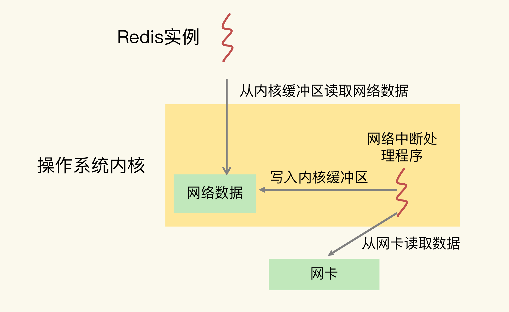

### 主流的 CPU 架构

一个 `CPU` 处理器中一般有多个运行核心，我们把一个运行核心称为一个物理核，每个物理核都可以运行应用程序。每个物理核都拥有**私有**的一级缓存（`Level 1 cache`，简称 `L1 cache`），包括一级指令缓存和一级数据缓存，以及**私有**的二级缓存（`Level 2 cache`，简称 `L2 cache`）。

物理核的私有缓存：其实是指缓存空间只能被当前的这个物理核使用，其他的物理核无法对这个核的缓存空间进行数据存取。

CPU物理核的架构


因为 `L1` 和 `L2` 缓存是每个物理核私有的，所以，当数据或指令保存在 `L1`、`L2` 缓存时，物理核访问它们的延迟不超过 `10` 纳秒，速度非常快。

但是，这些 `L1` 和 `L2` 缓存的大小受限于处理器的制造技术，一般只有 `KB` 级别，存不下太多的数据。如果 `L1`、`L2` 缓存中没有所需的数据，应用程序就需要访问内存来获取数据。而应用程序的访存延迟一般在百纳秒级别，是访问 `L1`、`L2` 缓存的延迟的近 `10` 倍，不可避免地会对性能造成影响。

所以，不同的物理核还会共享一个共同的三级缓存（`Level 3 cache`，简称为 `L3 cache`）。`L3` 缓存能够使用的存储资源比较多，所以一般比较大，能达到 `几 MB 到几十 MB`，这就能让应用程序缓存更多的数据。当 `L1`、`L2` 缓存中没有数据缓存时，可以访问 `L3`，**尽可能避免访问内存**。

现在主流的 `CPU` 处理器中，每个物理核通常都会运行两个超线程，也叫作逻辑核。同一个物理核的逻辑核会共享使用 `L1`、`L2` 缓存。

`CPU`物理核和逻辑核及一二级缓存


在主流的服务器上，一个 `CPU` 处理器会有 `10` 到 `20` 多个物理核。同时，为了提升服务器的处理能力，服务器上通常还会有多个 `CPU` 处理器（也称为`多 CPU Socket`），每个处理器有自己的物理核（包括 `L1`、`L2` 缓存），`L3` 缓存，以及连接的内存，同时，不同处理器间通过总线连接。

多 `CPU Socket` 的架构


在多 `CPU` 架构上，应用程序可以在不同的处理器上运行。在上图中，`Redis` 可以先在 `Socket 1` 上运行一段时间，然后再被调度到 `Socket 2` 上运行。

如果应用程序先在一个 `Socket` 上运行，并且把数据保存到了内存，然后被调度到另一个 `Socket` 上运行，此时，应用程序再进行内存访问时，就需要访问之前 `Socket` 上连接的内存，这种访问属于**远端内存访问**。和访问 `Socket` 直接连接的内存相比，远端内存访问会增加应用程序的延迟。

在多 `CPU` 架构下，一个应用程序访问所在 `Socket` 的本地内存和访问远端内存的延迟并不一致，所以，我们也把这个架构称为非统一内存访问架构（`Non-Uniform Memory Access，NUMA 架构`）。

`CPU` 架构对应用程序运行的影响
- `L1`、`L2` 缓存中的指令和数据的访问速度很快，所以，充分利用 `L1`、`L2` 缓存，可以有效缩短应用程序的执行时间；
- 在 `NUMA` 架构下，如果应用程序从一个 `Socket` 上调度到另一个 `Socket` 上，就可能会出现远端内存访问的情况，这会直接增加应用程序的执行时间。

### CPU 多核对 Redis 性能的影响

在一个 `CPU` 核上运行时，应用程序需要记录自身使用的软硬件资源信息（例如栈指针、`CPU` 核的寄存器值等），我们把这些信息称为运行时信息。同时，应用程序访问最频繁的指令和数据还会被缓存到 `L1`、`L2` 缓存上，以便提升执行速度。

在多核 `CPU` 的场景下，一旦应用程序需要在一个新的 `CPU` 核上运行，那么，运行时信息就需要重新加载到新的 `CPU` 核上。而且，新的 `CPU` 核的 `L1`、`L2` 缓存也需要重新加载数据和指令，这会导致程序的运行时间增加。

尾延迟：`99%` 的请求延迟小于的值就是 `99%` 尾延迟。

事例： 在一台有 `24` 个 `CPU` 核的服务器上运行 `Redis` 实例，`GET` 和 `PUT` 的 `99%` 尾延迟分别是 `504` 微秒和 `1175` 微秒，明显大于设定的目标。
检测了 `Redis` 实例运行时的服务器 `CPU` 的状态指标值，这才发现，`CPU` 的 `context switch` 次数比较多。

`context switch` 是指线程的上下文切换，这里的上下文就是线程的运行时信息。在 `CPU` 多核的环境中，一个线程先在一个 `CPU` 核上运行，之后又切换到另一个 `CPU` 核上运行，这时就会发生 `context switch`。

当 `context switch` 发生后，`Redis` 主线程的运行时信息需要被重新加载到另一个 `CPU` 核上，而且，此时，另一个 `CPU` 核上的 `L1`、`L2` 缓存中，并没有 `Redis` 实例之前运行时频繁访问的指令和数据，所以，这些指令和数据都需要重新从 `L3` 缓存，甚至是内存中加载。这个重新加载的过程是需要花费一定时间的。而且，`Redis` 实例需要等待这个重新加载的过程完成后，才能开始处理请求，所以，这也会导致一些请求的处理时间增加。

如果在 `CPU` 多核场景下，`Redis` 实例被频繁调度到不同 `CPU` 核上运行的话，那么，对 `Redis` 实例的请求处理时间影响就更大了。**每调度一次，一些请求就会受到运行时信息、指令和数据重新加载过程的影响，这就会导致某些请求的延迟明显高于其他请求。**

要避免 `Redis` 总是在不同 `CPU` 核上来回调度执行，可以使用 `taskset` 命令把一个程序绑定在一个核上运行。
```
// Redis 实例绑在了 0 号核上，其中，“-c”选项用于设置要绑定的核编号
taskset -c 0 ./redis-server
```

绑核前后的 `Redis` 的 `99%` 尾延迟


在 `CPU` 多核的环境下，通过绑定 `Redis` 实例和 `CPU` 核，可以有效降低 `Redis` 的尾延迟。当然，绑核不仅对降低尾延迟有好处，同样也能降低平均延迟、提升吞吐率，进而提升 `Redis` 性能。

### CPU 的 NUMA 架构对 Redis 性能的影响

当网卡接收到数据后，会触发网卡中断，用来通知操作系统内核进行数据处理。因此，操作系统内核中用来处理网卡中断事件，把数据从内核的缓冲区拷贝到应用程序缓冲区的程序就是指**网卡中断处理程序**。


在 `CPU` 的 `NUMA` 架构下，当网络中断处理程序、`Redis` 实例分别和 `CPU` 核绑定后，就会有一个潜在的风险：如果网络中断处理程序和 `Redis` 实例各自所绑的 `CPU` 核不在同一个 `CPU Socket` 上，那么，`Redis` 实例读取网络数据时，就需要跨 `CPU Socket` 访问内存，这个过程会花费较多时间。


为了避免 `Redis` 跨 `CPU Socket` 访问网络数据，我们最好把网络中断程序和 Redis 实例绑在同一个 `CPU Socket` 上，这样一来，`Redis` 实例就可以直接从本地内存读取网络数据了，如下图所示：


在 `CPU` 的 `NUMA` 架构下，对 `CPU` 核的编号规则，并不是先把一个 `CPU Socket` 中的所有逻辑核编完，再对下一个 `CPU Socket` 中的逻辑核编码，而是先给每个 `CPU Socket` 中每个物理核的第一个逻辑核依次编号，再给每个 `CPU Socket` 中的物理核的第二个逻辑核依次编号。

在多 `CPU` 的 `NUMA` 架构下，如果你对网络中断程序做了绑核操作，建议你同时把 `Redis` 实例和网络中断程序绑在同一个 `CPU Socket` 的不同核上，这样可以避免 `Redis` 跨 `Socket` 访问内存中的网络数据的时间开销。

### 绑核的风险和解决方案

当我们把 `Redis` 实例绑到一个 `CPU` 逻辑核上时，就会导致子进程、后台线程和 `Redis` 主线程竞争 `CPU` 资源，一旦子进程或后台线程占用 `CPU` 时，主线程就会被阻塞，导致 `Redis` 请求延迟增加。


#### 方案一：一个 Redis 实例对应绑一个物理核

在给 `Redis` 实例绑核时，我们不要把一个实例和一个逻辑核绑定，而要和一个物理核绑定，也就是说，把一个物理核的 `2` 个逻辑核都用上。

和只绑一个逻辑核相比，把 `Redis` 实例和物理核绑定，可以让主线程、子进程、后台线程共享使用 `2` 个逻辑核，可以在一定程度上缓解 `CPU` 资源竞争。但是，因为只用了 `2` 个逻辑核，它们相互之间的 `CPU` 竞争仍然还会存在。

#### 方案二：优化 Redis 源码

通过修改 `Redis` 源码，把子进程和后台线程绑到不同的 `CPU` 核上，这样可以避免对主线程的 `CPU` 资源竞争。`Redis 6.0` 出来后，可以支持 `CPU` 核绑定的配置操作了。
