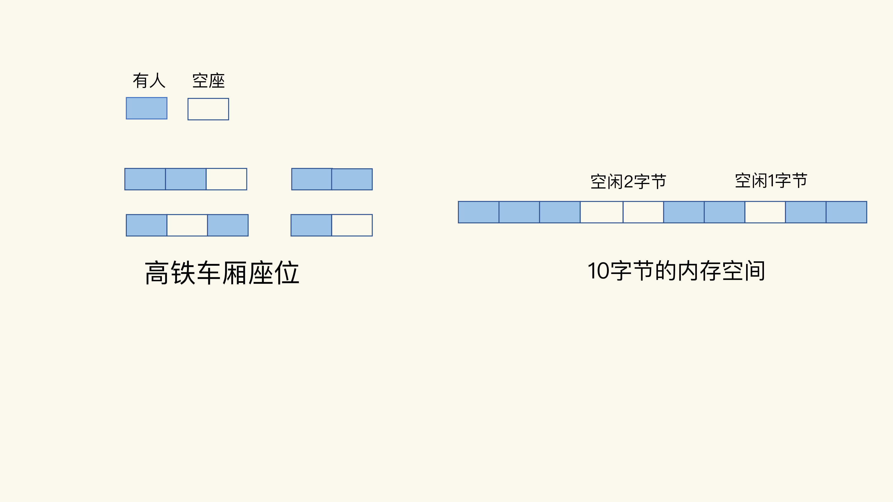

#### 什么是内存碎片？

删除数据后，内存占用率还是很高的主因：内存碎片。

通常情况下，内存空间闲置，往往是因为操作系统发生了较为严重的内存碎片。

虽然操作系统的剩余内存空间总量足够，但是，应用申请的是一块连续地址空间的 `N` 字节，但在剩余的内存空间中，没有大小为 `N` 字节的连续空间了，那么，这些剩余空间就是内存碎片（比如上图中的“空闲 `2` 字节”和“空闲 `1` 字节”，就是这样的碎片）。

#### 内存碎片是如何形成的？

内存碎片的形成有内因和外因两个层面的原因。简单来说，内因是操作系统的内存分配机制，外因是 `Redis` 的负载特征。

##### 内因：内存分配器的分配策略

内存分配器的分配策略就决定了操作系统无法做到“按需分配”。这是因为，内存分配器一般是按固定大小来分配内存，而不是完全按照应用程序申请的内存空间大小给程序分配。

`Redis` 可以使用 `libc`、`jemalloc`、`tcmalloc` 多种内存分配器来分配内存，默认使用 `jemalloc`。

`jemalloc` 的分配策略之一，是按照一系列固定的大小划分内存空间，例如 `8 字节、16 字节、32 字节、48 字节，…, 2KB、4KB、8KB` 等。当程序申请的内存最接近某个固定值时，`jemalloc` 会给它分配相应大小的空间。

这样的分配方式本身是为了减少分配次数。例如，`Redis` 申请一个 `20` 字节的空间保存数据，`jemalloc` 就会分配 `32` 字节，此时，如果应用还要写入 `10` 字节的数据，`Redis` 就不用再向操作系统申请空间了，因为刚才分配的 `32` 字节已经够用了，这就避免了一次分配操作。

如果 `Redis` 每次向分配器申请的内存空间大小不一样，这种分配方式就会有形成碎片的风险，而这正好来源于 `Redis` 的外因了。

##### 外因：键值对大小不一样和删改操作

`Redis` 通常作为共用的缓存系统或键值数据库对外提供服务，所以，不同业务应用的数据都可能保存在 `Redis` 中，这就会带来不同大小的键值对。这样一来，`Redis` 申请内存空间分配时，本身就会有大小不一的空间需求。这是第一个外因。

内存分配器只能按固定大小分配内存，所以，分配的内存空间一般都会比申请的空间大一些，不会完全一致，这本身就会造成一定的碎片，降低内存空间存储效率。