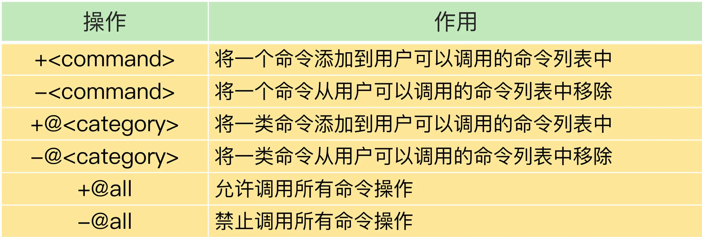

### Redis 6.0 

`Redis 6.0` 中的几个关键新特性，分别是`面向网络处理的多 IO 线程`、`客户端缓存`、`细粒度的权限控制`，以及 `RESP 3 协议的使用`。

其中，面向网络处理的多 `IO` 线程可以提高网络请求处理的速度，而客户端缓存可以让应用直接在客户端本地读取数据，这两个特性可以提升 `Redis` 的性能。除此之外，细粒度权限控制让 `Redis` 可以按照命令粒度控制不同用户的访问权限，加强了 `Redis` 的安全保护。`RESP 3` 协议则增强客户端的功能，可以让应用更加方便地使用 `Redis` 的不同数据类型。

#### 从单线程处理网络请求到多线程处理

在 `Redis 6.0` 中，非常受关注的第一个新特性就是多线程。这是因为，`Redis` 一直被大家熟知的就是它的单线程架构，虽然有些命令操作可以用后台线程或子进程执行（比如数据删除、快照生成、`AOF` 重写），但是，从网络 `IO` 处理到实际的读写命令处理，都是由单个线程完成的。

随着网络硬件的性能提升，`Redis` 的性能瓶颈有时会出现在网络 `IO` 的处理上，也就是说，单个主线程处理网络请求的速度跟不上底层网络硬件的速度。

`Redis 6.0` 采用多个 `IO` 线程来处理网络请求，提高网络请求处理的并行度。

`Redis` 的多 `IO` 线程只是用来处理网络请求的，对于读写命令，`Redis` 仍然使用单线程来处理。这是因为，`Redis` 处理请求时，网络处理经常是瓶颈，通过多个 `IO` 线程并行处理网络操作，可以提升实例的整体处理性能。而继续使用单线程执行命令操作，就不用为了保证 `Lua` 脚本、事务的原子性，额外开发多线程互斥机制了。这样一来，`Redis` 线程模型实现就简单了。

主线程和多 `IO` 线程的协作分成四个阶段。

##### 阶段一：服务端和客户端建立 Socket 连接，并分配处理线程

首先，主线程负责接收建立连接请求。当有客户端请求和实例建立 `Socket` 连接时，主线程会创建和客户端的连接，并把 `Socket` 放入全局等待队列中。紧接着，主线程通过轮询方法把 `Socket` 连接分配给 `IO` 线程。


##### 阶段二：IO 线程读取并解析请求

主线程一旦把 `Socket` 分配给 `IO` 线程，就会进入阻塞状态，等待 `IO` 线程完成客户端请求读取和解析。因为有多个 `IO` 线程在并行处理，所以，这个过程很快就可以完成。

##### 阶段三：主线程执行请求操作

等到 `IO` 线程解析完请求，主线程还是会以单线程的方式执行这些命令操作。


##### 阶段四：IO 线程回写 Socket 和主线程清空全局队列

当主线程执行完请求操作后，会把需要返回的结果写入缓冲区，然后，主线程会阻塞等待 `IO` 线程把这些结果回写到 `Socket` 中，并返回给客户端。

和 `IO` 线程读取和解析请求一样，`IO` 线程回写 `Socket` 时，也是有多个线程在并发执行，所以回写 `Socket` 的速度也很快。等到 `IO` 线程回写 `Socket` 完毕，主线程会清空全局队列，等待客户端的后续请求。


在 `Redis 6.0` 中，多线程机制默认是关闭的，如果需要使用多线程功能，需要在 `redis.conf` 中完成两个设置。

```
1. 设置 io-thread-do-reads 配置项为 yes，表示启用多线程。
    io-threads-do-reads yes

2. 设置线程个数。一般来说，线程个数要小于 Redis 实例所在机器的 CPU 核个数，例如，对于一个 8 核的机器来说，Redis 官方建议配置 6 个 IO 线程。
    io-threads  6
```

如果你在实际应用中，发现 `Redis` 实例的 `CPU` 开销不大，吞吐量却没有提升，可以考虑使用 `Redis 6.0` 的多线程机制，加速网络处理，进而提升实例的吞吐量。

#### 实现服务端协助的客户端缓存

`Redis 6.0` 新增了一个重要的特性，就是实现了服务端协助的客户端缓存功能，也称为跟踪（`Tracking`）功能。有了这个功能，业务应用中的 `Redis` 客户端就可以把读取的数据缓存在业务应用本地了，应用就可以直接在本地快速读取数据了。

如果数据被修改了或是失效了，如何通知客户端对缓存的数据做失效处理？`6.0` 实现的 `Tracking` 功能实现了两种模式，来解决这个问题。

##### 第一种模式是普通模式

在这个模式下，实例会在服务端记录客户端读取过的 `key`，并监测 `key` 是否有修改。一旦 `key` 的值发生变化，服务端会给客户端发送 `invalidate` 消息，通知客户端缓存失效了。

在使用普通模式时，有一点你需要注意一下，服务端对于记录的 `key` 只会报告一次 `invalidate` 消息，也就是说，服务端在给客户端发送过一次 `invalidate` 消息后，如果 `key` 再被修改，此时，服务端就不会再次给客户端发送 `invalidate` 消息。

只有当客户端再次执行读命令时，服务端才会再次监测被读取的 `key`，并在 `key` 修改时发送 `invalidate` 消息。这样设计的考虑是节省有限的内存空间。毕竟，如果客户端不再访问这个 `key` 了，而服务端仍然记录 `key` 的修改情况，就会浪费内存资源。

打开或关闭普通模式下的 `Tracking` 功能：`CLIENT TRACKING ON|OFF`

##### 第二种模式是广播模式

在这个模式下，服务端会给客户端广播所有 `key` 的失效情况，不过，这样做了之后，如果 `key` 被频繁修改，服务端会发送大量的失效广播消息，这就会消耗大量的网络带宽资源。

所以，在实际应用时，我们会让客户端注册希望跟踪的 `key` 的前缀，当带有注册前缀的 `key` 被修改时，服务端会把失效消息广播给所有注册的客户端。

和普通模式不同，在广播模式下，即使客户端还没有读取过 `key`，但只要它注册了要跟踪的 `key`，服务端都会把 `key` 失效消息通知给这个客户端。

举个例子，看一下客户端如何使用广播模式接收 `key` 失效消息。当我们在客户端执行下面的命令后，如果服务端更新了 `user:id:1003` 这个 `key`，那么，客户端就会收到 `invalidate` 消息。
```
CLIENT TRACKING ON BCAST PREFIX user
```

这种监测带有前缀的 `key` 的广播模式，和我们对 `key` 的命名规范非常匹配。我们在实际应用时，会给同一业务下的 `key` 设置相同的业务名前缀，所以，我们就可以非常方便地使用广播模式。

普通模式和广播模式，需要客户端使用 `RESP 3` 协议，`RESP 3` 协议是 `6.0` 新启用的通信协议。

#### 从简单的基于密码访问到细粒度的权限控制

在 `Redis 6.0` 版本之前，要想实现实例的安全访问，只能通过设置密码来控制，例如，客户端连接实例前需要输入密码。

此外，对于一些高风险的命令（例如 `KEYS、FLUSHDB、FLUSHALL` 等），在 `Redis 6.0` 之前，我们也只能通过 `rename-command` 来重新命名这些命令，避免客户端直接调用。

`Redis 6.0` 提供了更加细粒度的访问权限控制，这主要有两方面的体现。

##### 6.0 版本支持创建不同用户来使用 Redis

在 `6.0` 版本前，所有客户端可以使用同一个密码进行登录使用，但是没有用户的概念，而在 `6.0` 中，我们可以使用 `ACL SETUSER` 命令创建用户。例如，我们可以执行下面的命令，创建并启用一个用户 `normaluser`，把它的密码设置为“`abc`”：
```
ACL SETUSER normaluser on > abc
```

##### 6.0 版本还支持以用户为粒度设置命令操作的访问权限

如图：加号（+）和减号（-）就分别表示给用户赋予或撤销命令的调用权限。


假设我们要设置用户 `normaluser` 只能调用 `Hash` 类型的命令操作，而不能调用 `String` 类型的命令操作，我们可以执行如下命令：
```
ACL SETUSER normaluser +@hash -@string
```

除了设置某个命令或某类命令的访问控制权限，`6.0` 版本还支持以 `key` 为粒度设置访问权限。

具体的做法是使用波浪号`“~”和 key 的前缀`来表示控制访问的 `key`。例如，我们执行下面命令，就可以设置用户 `normaluser` 只能对以“`user:`”为前缀的 `key` 进行命令操作：
```
ACL SETUSER normaluser ~user:* +@all
```

`Redis 6.0` 可以设置不同用户来访问实例，而且可以基于用户和 `key` 的粒度，设置某个用户对某些 `key` 允许或禁止执行的命令操作。

#### 启用 RESP 3 协议

`Redis 6.0` 实现了 `RESP 3` 通信协议，而之前都是使用的 `RESP 2`。在 `RESP 2` 中，客户端和服务器端的通信内容都是以字节数组形式进行编码的，客户端需要根据操作的命令或是数据类型自行对传输的数据进行解码，增加了客户端开发复杂度。

而 `RESP 3` 直接支持多种数据类型的区分编码，包括空值、浮点数、布尔值、有序的字典集合、无序的集合等。

所谓区分编码，就是指直接通过不同的开头字符，区分不同的数据类型，这样一来，客户端就可以直接通过判断传递消息的开头字符，来实现数据转换操作了，提升了客户端的效率。除此之外，`RESP 3` 协议还可以支持客户端以普通模式和广播模式实现客户端缓存。


### 总结


