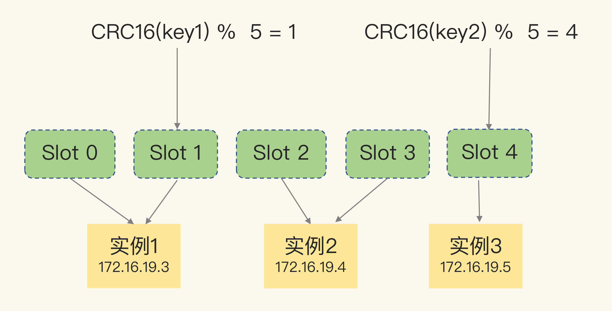
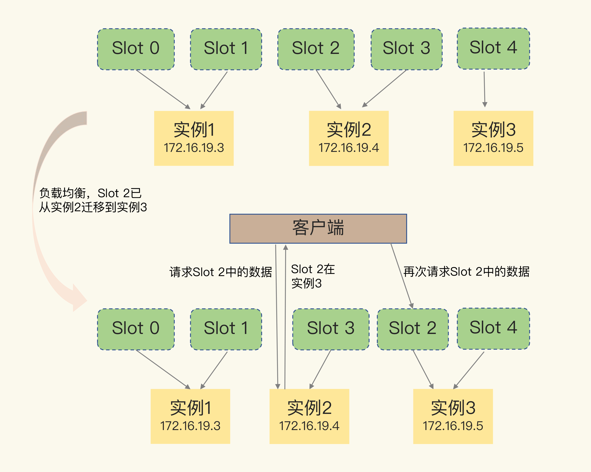

### Redis 应对数据量增多的两种方案
- 纵向扩展：升级单个 `Redis` 实例的资源配置，包括增加内存容量、增加磁盘容量、使用更高配置的 `CPU`。就像下图中，原来的实例内存是 `8GB`，硬盘是 `50GB`，纵向扩展后，内存增加到 `24GB`，磁盘增加到 `150GB`。
- 横向扩展：横向增加当前 `Redis` 实例的个数，就像下图中，原来使用 `1` 个 `8GB` 内存、`50GB` 磁盘的实例，现在使用三个相同配置的实例。


#### 纵向扩展
优势：实施起来简单、直接。
问题：
- 当使用 `RDB` 对数据进行持久化时，如果数据量增加，需要的内存也会增加，主线程 `fork` 子进程时就可能会阻塞。
- 会受到硬件和成本的限制

#### 横向扩展
优势：扩展性更好。在面向百万、千万级别的用户规模时，横向扩展的 `Redis` 切片集群会是一个非常好的选择。
问题：
- 数据切片后，在多个实例之间如何分布？
- 客户端怎么确定想要访问的数据在哪个实例上？

`Redis3.0` 开始官方提供的集群方案 `Redis Cluster` 。`Redis Cluster` 方案中就规定了数据和实例的对应规则。

### Redis Cluster 进行切片集群

`Redis Cluster` 方案采用 `哈希槽（Hash Slot）`，来处理数据和实例之间的映射关系。在 `Redis Cluster` 方案中，一个切片集群共有 `16384` 个哈希槽，这些哈希槽类似于数据分区，每个键值对都会根据它的 `key`，被映射到一个哈希槽中。

具体的映射过程分为两大步：首先根据键值对的 `key`，按照 `CRC16` 算法计算一个 `16 bit` 的值；然后，再用这个 `16bit` 值对 `16384` 取模，得到 `0~16383` 范围内的模数，每个模数代表一个相应编号的哈希槽。

在部署 `Redis Cluster` 方案时，可以使用 `cluster create` 命令创建集群，此时，`Redis` 会自动把这些槽平均分布在集群实例上。例如，如果集群中有 `N` 个实例，那么，每个实例上的槽个数为 `16384/N` 个。也可以使用 `cluster meet` 命令手动建立实例间的连接，形成集群，再使用 `cluster addslots` 命令，指定每个实例上的哈希槽个数。


示意图中的切片集群一共有 `3` 个实例，同时假设有 `5` 个哈希槽，我们首先可以通过下面的命令手动分配哈希槽：实例 `1` 保存哈希槽 `0` 和 `1`，实例 `2` 保存哈希槽 `2` 和 `3`，实例 `3` 保存哈希槽 `4`。

注意：手动分配哈希槽时，需要把 `16384` 个槽都分配完，否则 `Redis` 集群无法正常工作。

#### 客户端如何定位数据？

`Redis` 实例会把自己的哈希槽信息发给和它相连接的其它实例，来完成哈希槽分配信息的扩散。当实例之间相互连接后，每个实例就有所有哈希槽的映射关系了。

客户端收到哈希槽信息后，会把哈希槽信息缓存在本地。当客户端请求键值对时，会先计算键所对应的哈希槽，然后就可以给相应的实例发送请求了。

在集群中，实例和哈希槽的对应关系并不是一成不变的，最常见的变化有两个：
- 在集群中，实例有新增或删除，`Redis` 需要重新分配哈希槽；
- 为了负载均衡，`Redis` 需要把哈希槽在所有实例上重新分布一遍。

`Redis Cluster` 方案提供了一种重定向机制，所谓的“重定向”，就是指，客户端给一个实例发送数据读写操作时，这个实例上并没有相应的数据，客户端要再给一个新实例发送操作命令。

当客户端把一个键值对的操作请求发给一个实例时，如果这个实例上并没有这个键值对映射的哈希槽，那么，这个实例就会给客户端返回下面的 `MOVED` 命令响应结果，这个结果中就包含了新实例的访问地址。
```
GET hello:key
(error) MOVED 13320 172.16.19.5:6379

其中，MOVED 命令表示，客户端请求的键值对所在的哈希槽 13320，实际是在 172.16.19.5 这个实例上。通过返回的 MOVED 命令，就相当于把哈希槽所在的新实例的信息告诉给客户端了。这样一来，客户端就可以直接和 172.16.19.5 连接，并发送操作请求了。
```



在这种迁移部分完成的情况下，客户端就会收到一条 `ASK` 报错信息，如下所示：
```
GET hello:key
(error) ASK 13320 172.16.19.5:6379

这个结果中的 ASK 命令就表示，客户端请求的键值对所在的哈希槽 13320，在 172.16.19.5 这个实例上，但是这个哈希槽正在迁移。此时，客户端需要先给 172.16.19.5 这个实例发送一个 ASKING 命令。这个命令的意思是，让这个实例允许执行客户端接下来发送的命令。然后，客户端再向这个实例发送 GET 命令，以读取数据。

ASK 命令表示两层含义：第一，表明 Slot 数据还在迁移中；第二，ASK 命令把客户端所请求数据的最新实例地址返回给客户端，此时，客户端需要给实例 3 发送 ASKING 命令，然后再发送操作命令。
```


和 `MOVED` 命令不同，`ASK` 命令并不会更新客户端缓存的哈希槽分配信息。所以，在上图中，如果客户端再次请求 `Slot 2` 中的数据，它还是会给实例 `2` 发送请求。这也就是说，`ASK` 命令的作用只是让客户端能给新实例发送一次请求，而不像 `MOVED` 命令那样，会更改本地缓存，让后续所有命令都发往新实例。
