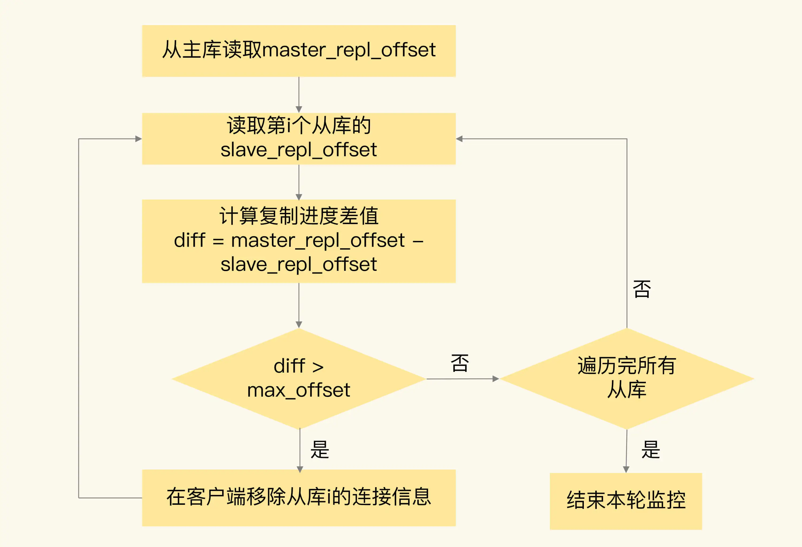

### 主从数据不一致

主从数据不一致，就是指客户端从从库中读取到的值和主库中的最新值并不一致。

因为主从库间的命令复制是异步进行的。

具体来说，在主从库命令传播阶段，主库收到新的写命令后，会发送给从库。但是，主库并不会等到从库实际执行完命令后，再把结果返回给客户端，而是主库自己在本地执行完命令后，就会向客户端返回结果了。如果从库还没有执行主库同步过来的命令，主从库间的数据就不一致了。

#### 从库会滞后执行同步命令的两个原因

- 一方面，主从库间的网络可能会有传输延迟，所以从库不能及时地收到主库发送的命令，从库上执行同步命令的时间就会被延后。
- 另一方面，即使从库及时收到了主库的命令，但是，也可能会因为正在处理其它复杂度高的命令（例如集合操作命令）而阻塞。此时，从库需要处理完当前的命令，才能执行主库发送的命令操作，这就会造成主从数据不一致。而在主库命令被滞后处理的这段时间内，主库本身可能又执行了新的写操作。这样一来，主从库间的数据不一致程度就会进一步加剧。

#### 从库滞后执行应对方法

- 首先，在硬件环境配置方面，要尽量保证主从库间的网络连接状况良好。例如，我们要避免把主从库部署在不同的机房，或者是避免把网络通信密集的应用（例如数据分析应用）和 `Redis` 主从库部署在一起。
- 开发一个外部程序来监控主从库间的复制进度。

因为 `Redis` 的 `INFO replication` 命令可以查看主库接收写命令的进度信息（`master_repl_offset`）和从库复制写命令的进度信息（`slave_repl_offset`），所以，就可以开发一个监控程序，先用 `INFO replication` 命令查到主、从库的进度，然后，我们用 `master_repl_offset` 减去 `slave_repl_offset`，这样就能得到从库和主库间的复制进度差值了。

如果某个从库的进度差值大于我们预设的阈值，可以让客户端不再和这个从库连接进行数据读取，这样就可以减少读到不一致数据的情况。不过，为了避免出现客户端和所有从库都不能连接的情况，我们需要把复制进度差值的阈值设置得大一些。




#### 总结
主从数据不一致。`Redis` 采用的是异步复制，所以无法实现强一致性保证（主从数据时时刻刻保持一致），数据不一致是难以避免的。应对方法：保证良好网络环境，以及使用程序监控从库复制进度，一旦从库复制进度超过阈值，不让客户端连接从库。

### 读取过期数据

`Redis` 同时使用了两种策略来删除过期的数据，分别是 `惰性删除策略` 和 `定期删除策略`。

先说惰性删除策略。当一个数据的过期时间到了以后，并不会立即删除数据，而是等到再有请求来读写这个数据时，对数据进行检查，如果发现数据已经过期了，再删除这个数据。

这个策略的好处是尽量减少删除操作对 `CPU` 资源的使用，对于用不到的数据，就不再浪费时间进行检查和删除了。但是，这个策略会导致大量已经过期的数据留存在内存中，占用较多的内存资源。所以，`Redis` 在使用这个策略的同时，还使用了第二种策略：定期删除策略。

定期删除策略是指，`Redis` 每隔一段时间（默认 `100ms`），就会随机选出一定数量的数据，检查它们是否过期，并把其中过期的数据删除，这样就可以及时释放一些内存。

惰性删除策略实现后，数据只有被再次访问时，才会被实际删除。如果客户端从主库上读取留存的过期数据，主库会触发删除操作，此时，客户端并不会读到过期数据。但是，从库本身不会执行删除操作，如果客户端在从库中访问留存的过期数据，从库并不会触发数据删除。

设置数据过期时间的命令一共有 `4` 个，我们可以把它们分成两类：
- `EXPIRE` 和 `PEXPIRE`：它们给数据设置的是从命令执行时开始计算的存活时间；
- `EXPIREAT` 和 `PEXPIREAT`：它们会直接把数据的过期时间设置为具体的一个时间点。


当主从库全量同步时，如果主库接收到了一条 `EXPIRE` 命令，那么，主库会直接执行这条命令。这条命令会在全量同步完成后，发给从库执行。而从库在执行时，就会在当前时间的基础上加上数据的存活时间，这样一来，从库上数据的过期时间就会比主库上延后了。

为了避免这种情况，建议是，在业务应用中使用 `EXPIREAT/PEXPIREAT` 命令，把数据的过期时间设置为具体的时间点，避免读到过期数据。


#### 总结
 对于读到过期数据，这是可以提前规避的，一个方法是，使用 `Redis 3.2` 及以上版本；另外，你也可以使用 `EXPIREAT/PEXPIREAT` 命令设置过期时间，避免从库上的数据过期时间滞后。不过，这里有个地方需要注意下，因为 `EXPIREAT/PEXPIREAT` 设置的是时间点，所以，主从节点上的时钟要保持一致，具体的做法是，让主从节点和相同的 `NTP` 服务器（时间服务器）进行时钟同步。

### 不合理配置项导致的服务挂掉

配置项：`protected-mode` 和 `cluster-node-timeout`

#### protected-mode 配置项

这个配置项的作用是限定哨兵实例能否被其他服务器访问。当这个配置项设置为 `yes` 时，哨兵实例只能在部署的服务器本地进行访问。当设置为 `no` 时，其他服务器也可以访问这个哨兵实例。

正因为这样，如果 `protected-mode` 被设置为 `yes`，而其余哨兵实例部署在其它服务器，那么，这些哨兵实例间就无法通信。当主库故障时，哨兵无法判断主库下线，也无法进行主从切换，最终 `Redis` 服务不可用。

所以，在应用主从集群时，要注意将 `protected-mode` 配置项设置为 `no`，并且将 `bind` 配置项设置为其它哨兵实例的 `IP` 地址。这样一来，只有在 `bind` 中设置了 `IP` 地址的哨兵，才可以访问当前实例，既保证了实例间能够通信进行主从切换，也保证了哨兵的安全性。

```
事例：
    部署在 192.168.10.3/4/5 这三台服务器上的哨兵实例就可以相互通信，执行主从切换。

protected-mode no
bind 192.168.10.3 192.168.10.4 192.168.10.5
```

#### cluster-node-timeout 配置项

这个配置项设置了 `Redis Cluster` 中实例响应心跳消息的超时时间。

当在 `Redis Cluster` 集群中为每个实例配置了“一主一从”模式时，如果主实例发生故障，从实例会切换为主实例，受网络延迟和切换操作执行的影响，切换时间可能较长，就会导致实例的心跳超时（超出 `cluster-node-timeout`）。实例超时后，就会被 `Redis Cluster` 判断为异常。而 `Redis Cluster` 正常运行的条件就是，有半数以上的实例都能正常运行。

所以，如果执行主从切换的实例超过半数，而主从切换时间又过长的话，就可能有半数以上的实例心跳超时，从而可能导致整个集群挂掉。所以，建议将 `cluster-node-timeout` 调大些（例如 `10 到 20 秒`）。


### 总结

`Redis` 主从库同步时可能出现的 `3` 个坑


