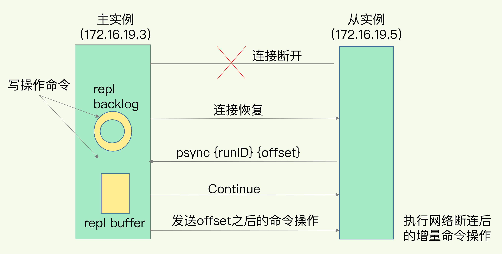

### Redis 具有高可靠性
一是数据尽量少丢失，通过 `AOF` 和 `RDB` 来保证。

二是服务尽量少中断，通过增加副本冗余量，将一份数据同时保存在多个实例上来保证。`Redis` 提供了主从库模式，以保证数据副本的一致，主从库之间采用的是读写分离的方式。
- 读操作：主库、从库都可以接收；
- 写操作：首先到主库执行，然后，主库将写操作同步给从库。

如果在上图中，不管是主库还是从库，都能接收客户端的写操作，那么，一个直接的问题就是：如果客户端对同一个数据（例如 `k1`）前后修改了三次，每一次的修改请求都发送到不同的实例上，在不同的实例上执行，那么，这个数据在这三个实例上的副本就不一致了（分别是 `v1`、`v2` 和 `v3`）。在读取这个数据的时候，就可能读取到旧的值。

主从库模式一旦采用了读写分离，所有数据的修改只会在主库上进行，不用协调三个实例。主库有了最新的数据后，会同步给从库，这样，主从库的数据就是一致的。

### 主从库间如何进行第一次同步？

当我们启动多个 `Redis` 实例的时候，它们相互之间就可以通过` replicaof（Redis 5.0 之前使用 slaveof）` 命令形成主库和从库的关系，之后会按照三个阶段完成数据的第一次同步。

例如，现在有`实例 1（ip：172.16.19.3）`和 `实例 2（ip：172.16.19.5）`，我们在 `实例 2` 上执行以下这个命令后，`实例 2` 就变成了 `实例 1` 的从库，并从 `实例 1` 上复制数据：

    replicaof  172.16.19.3  6379

主从库第一次同步的流程

### 主从级联模式分担全量复制时的主库压力

级联的 `主-从-从` 模式

通过 `主 - 从 - 从` 模式将主库生成 `RDB` 和传输 `RDB` 的压力，以级联的方式分散到从库上。

一旦主从库完成了全量复制，它们之间就会一直维护一个网络连接，主库会通过这个连接将后续陆续收到的命令操作再同步给从库，这个过程也称为基于长连接的命令传播，可以避免频繁建立连接的开销。

### 主从库间网络断了怎么办？

从 `Redis 2.8` 开始，网络断了之后，主从库会采用增量复制的方式继续同步。

全量复制是同步所有数据，而增量复制只会把主从库网络断连期间主库收到的命令，同步给从库。

当主从库断连后，主库会把断连期间收到的写操作命令，写入 `replication buffer`，同时也会把这些操作命令也写入 `repl_backlog_buffer` 这个缓冲区。

`repl_backlog_buffer` 是一个环形缓冲区，主库会记录自己写到的位置，从库则会记录自己已经读到的位置。

Redis增量复制流程

主库只用把环形缓冲区内 `master_repl_offset` 和 `slave_repl_offset` 之间的命令操作同步给从库就行。

因为 `repl_backlog_buffer` 是一个环形缓冲区，所以在缓冲区写满后，主库会继续写入，此时，就会覆盖掉之前写入的操作。如果从库的读取速度比较慢，就有可能导致从库还未读取的操作被主库新写的操作覆盖了，这会导致主从库间的数据不一致。

可以通过设置 `repl_backlog_size` 设置缓冲空间大小。

缓冲空间的计算公式是：缓冲空间大小 = `主库写入命令速度 * 操作大小 - 主从库间网络传输命令速度 * 操作大小`。在实际应用中，考虑到可能存在一些突发的请求压力，我们通常需要把这个缓冲空间扩大一倍，即 `repl_backlog_size = 缓冲空间大小 * 2`，这也就是 `repl_backlog_size` 的最终值。

### 主从库同步的基本原理三种模式用途总结
#### 全量复制
全量复制虽然耗时，但是对于从库来说，如果是第一次同步，全量复制是无法避免的。
建议：一个 `Redis` 实例的数据库不要太大，一个实例大小在几 `GB` 级别比较合适，这样可以减少 `RDB` 文件生成、传输和重新加载的开销。
为了避免多个从库同时和主库进行全量复制，给主库过大的同步压力，我们也可以采用 `主 - 从 - 从` 这一级联模式，来缓解主库的压力。

#### 基于长连接的命令传播
长连接复制是主从库正常运行后的常规同步阶段。在这个阶段中，主从库之间通过命令传播实现同步。

#### 增量复制
长连接复制阶段，如果发生网络链接断开，就需要用到增量复制。