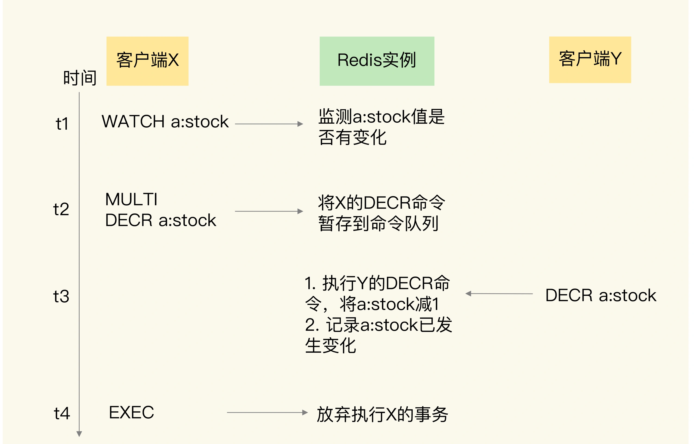

### 数据库事务机制

事务是数据库的一个重要功能。所谓的事务，就是指对数据进行读写的一系列操作。事务在执行时，会提供专门的属性保证，包括原子性（`Atomicity`）、一致性（`Consistency`）、隔离性（`Isolation`）和持久性（`Durability`），也就是 `ACID` 属性。这些属性既包括了对事务执行结果的要求，也有对数据库在事务执行前后的数据状态变化的要求。

### Redis 实现事务

事务的执行过程包含三个步骤，`Redis` 提供了 `MULTI`、`EXEC` 两个命令来完成这三个步骤。
- 第一步，客户端要使用一个命令显式地表示一个事务的开启。在 `Redis` 中，这个命令就是 `MULTI`。
- 第二步，客户端把事务中本身要执行的具体操作（例如增删改数据）发送给服务器端。这些操作就是 `Redis` 本身提供的数据读写命令，例如 `GET`、`SET`等。不过，这些命令虽然被客户端发送到了服务器端，但 `Redis` 实例只是把这些命令暂存到一个命令队列中，并不会立即执行。
- 第三步，客户端向服务器端发送提交事务的命令，让数据库实际执行第二步中发送的具体操作。`Redis` 提供的 `EXEC` 命令就是执行事务提交的。当服务器端收到 `EXEC` 命令后，才会实际执行命令队列中的所有命令。

#### 原子性

事务执行发生错误了，会有三种情况如下：

```
#开启事务
127.0.0.1:6379> MULTI
OK
#发送事务中的第一个操作，但是Redis不支持该命令，返回报错信息
127.0.0.1:6379> PUT a:stock 5
(error) ERR unknown command `PUT`, with args beginning with: `a:stock`, `5`, 
#发送事务中的第二个操作，这个操作是正确的命令，Redis把该命令入队
127.0.0.1:6379> DECR b:stock
QUEUED
#实际执行事务，但是之前命令有错误，所以Redis拒绝执行
127.0.0.1:6379> EXEC
(error) EXECABORT Transaction discarded because of previous errors.
```

```
#开启事务
127.0.0.1:6379> MULTI
OK
#发送事务中的第一个操作，LPOP命令操作的数据类型不匹配，此时并不报错
127.0.0.1:6379> LPOP a:stock
QUEUED
#发送事务中的第二个操作
127.0.0.1:6379> DECR b:stock
QUEUED
#实际执行事务，事务第一个操作执行报错
127.0.0.1:6379> EXEC
1) (error) WRONGTYPE Operation against a key holding the wrong kind of value
2) (integer) 8
```

`Redis` 不像其它数据库提供了回滚机制，但提供了 `DISCARD` 命令，这个命令只能用来主动放弃事务执行，把暂存的命令队列清空，起不到回滚的效果。
```
#读取a:stock的值4
127.0.0.1:6379> GET a:stock
"4"
#开启事务
127.0.0.1:6379> MULTI 
OK
#发送事务的第一个操作，对a:stock减1
127.0.0.1:6379> DECR a:stock
QUEUED
#执行DISCARD命令，主动放弃事务
127.0.0.1:6379> DISCARD
OK
#再次读取a:stock的值，值没有被修改
127.0.0.1:6379> GET a:stock
"4"
```

三种情况原子性汇总：
- 命令入队时就报错，会放弃事务执行，保证原子性；
- 命令入队时没报错，实际执行时报错，不保证原子性；
- `EXEC` 命令执行时实例故障，如果开启了 `AOF` 日志，可以保证原子性。


#### 一致性

事务的一致性保证会受到错误命令、实例故障的影响。

##### 情况一：命令入队时就报错

在这种情况下，事务本身就会被放弃执行，所以可以保证数据库的一致性。

##### 情况二：命令入队时没报错，实际执行时报错

在这种情况下，有错误的命令不会被执行，正确的命令可以正常执行，也不会改变数据库的一致性。

##### 情况三：EXEC 命令执行时实例发生故障

如果没有开启 `RDB` 或 `AOF`，那么，实例故障重启后，数据都没有了，数据库是一致的。

如果使用了 `RDB` 快照，因为 `RDB` 快照不会在事务执行时执行，所以，事务命令操作的结果不会被保存到 `RDB` 快照中，使用 `RDB` 快照进行恢复时，数据库里的数据也是一致的。

如果使用了 `AOF` 日志，而事务操作还没有被记录到 `AOF` 日志时，实例就发生了故障，那么，使用 `AOF` 日志恢复的数据库数据是一致的。如果只有部分操作被记录到了 `AOF` 日志，我们可以使用 `redis-check-aof` 清除事务中已经完成的操作，数据库恢复后也是一致的。

总结来说，在命令执行错误或 `Redis` 发生故障的情况下，`Redis` 事务机制对一致性属性是有保证的。

#### 隔离性

事务的隔离性保证，会受到和事务一起执行的并发操作的影响。

##### EXEC 命令执行前

并发操作在 `EXEC` 命令前执行，此时，隔离性的保证要使用 `WATCH` 机制来实现，否则隔离性无法保证。

一个事务的 `EXEC` 命令还没有执行时，事务的命令操作是暂存在命令队列中的。此时，如果有其它的并发操作，就需要看事务是否使用了 `WATCH` 机制。

`WATCH` 机制的作用是，在事务执行前，监控一个或多个键的值变化情况，当事务调用 `EXEC` 命令执行时，`WATCH` 机制会先检查监控的键是否被其它客户端修改了。如果修改了，就放弃事务执行，避免事务的隔离性被破坏。然后，客户端可以再次执行事务，此时，如果没有并发修改事务数据的操作了，事务就能正常执行，隔离性也得到了保证。



总结：
- 使用 `WATCH` 机制可以保持隔离性。
- `EXEC` 命令执行前，不使用 `WATCH` 无法保证隔离性，可能在执行中间被其它客户端修改。

##### EXEC 命令执行后

并发操作在 `EXEC` 命令之后被服务器端接收并执行。

因为 `Redis` 是用单线程执行命令，而且 `EXEC` 命令执行后，`Redis` 会保证先把命令队列中的所有命令执行完。所以，在这种情况下，并发操作也不会破坏事务的隔离性。


#### 持久性

因为 `Redis` 是内存数据库，所以，数据是否持久化保存完全取决于 `Redis` 的持久化配置模式。

- 如果 `Redis` 没有使用 `RDB` 或 `AOF`，那么事务的持久化属性肯定得不到保证。
- 如果 `Redis` 使用了 `RDB` 模式，那么，在一个事务执行后，而下一次的 `RDB` 快照还未执行前，如果发生了实例宕机，这种情况下，事务修改的数据也是不能保证持久化的。
- 如果 `Redis` 采用了 `AOF` 模式，因为 `AOF` 模式的三种配置选项 `no`、`everysec` 和 `always` 都会存在数据丢失的情况，所以，事务的持久性属性也还是得不到保证。

不管 `Redis` 采用什么持久化模式，事务的持久性属性是得不到保证的。

### 总结


`Redis` 的事务机制可以保证一致性和隔离性，但是无法保证持久性。不过，因为 `Redis` 本身是内存数据库，持久性并不是一个必须的属性，我们更加关注的还是原子性、一致性和隔离性这三个属性。

原子性的情况比较复杂，只有当事务中使用的命令语法有误时，原子性得不到保证，在其它情况下，事务都可以原子性执行。

建议：严格按照 `Redis` 的命令规范进行程序开发，并且通过 `code review` 确保命令的正确性。

#### 扩展：在使用事务时，建议配合 `Pipeline` 使用。

使用 `Pipeline` 是一次性把所有命令打包好全部发送到服务端，服务端全部处理完成后返回。这么做好的好处，一是减少了来回网络 `IO` 次数，提高操作性能。二是一次性发送所有命令到服务端，服务端在处理过程中，是不会被别的请求打断的（`Redis` 单线程特性，此时别的请求进不来），这本身就保证了隔离性。平时使用的 `Redis SDK` 在使用开启事务时，一般都会默认开启 `Pipeline` 的。

`Pipeline` 是由服务器一次性传输多条命令，不需要使用 `WATCH` 就能保证隔离性。但 `Pipeline` 不是原子性操作，在使用时加上 `WATCH` 监控保证了判断执行前后数据的一致性，从而保证了原子性。
