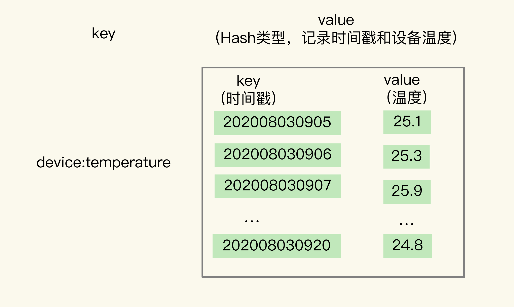
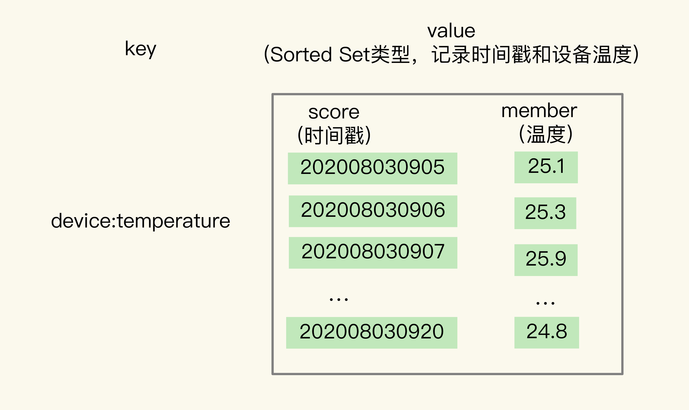

### 时间序列数据的读写特点
在实际应用中，时间序列数据通常是持续高并发写入的，例如，需要连续记录数万个设备的实时状态值。同时，时间序列数据的写入主要就是插入新数据，而不是更新一个已存在的数据，也就是说，一个时间序列数据被记录后通常就不会变了，因为它就代表了一个设备在某个时刻的状态值（例如，一个设备在某个时刻的温度测量值，一旦记录下来，这个值本身就不会再变了）。

所以，这种数据的写入特点很简单，就是插入数据快，这就要求我们选择的数据类型，在进行数据插入时，复杂度要低，尽量不要阻塞。

序列数据更复杂的查询，比如对某个时间范围内的数据做聚合计算。这里的聚合计算，就是对符合查询条件的所有数据做计算，包括计算均值、最大 / 最小值、求和等。

针对时间序列数据的“写要快”，`Redis` 的高性能写特性直接就可以满足了；而针对“查询模式多”，也就是要支持单点查询、范围查询和聚合计算，`Redis` 提供了保存时间序列数据的两种方案，分别可以基于 `Hash` 和 `Sorted Set` 实现，以及基于 `RedisTimeSeries` 模块实现。

### 基于 Hash 和 Sorted Set 保存时间序列数据

#### Hash 集合记录设备的温度值的示意图：

```

HGET device:temperature 202008030905
"25.1"

HMGET device:temperature 202008030905 202008030907 202008030908
1) "25.1"
2) "25.9"
3) "24.9"
```
用 `Hash` 类型来实现单键的查询很简单。但是，`Hash` 类型有个短板：它并不支持对数据进行范围查询。

为了能同时支持按时间戳范围的查询，可以用 `Sorted Set` 来保存时间序列数据，因为它能够根据元素的权重分数来排序。我们可以把时间戳作为 `Sorted Set` 集合的元素分数，把时间点上记录的数据作为元素本身。

#### Sorted Set 集合记录设备的温度值的示意图：

```
ZRANGEBYSCORE device:temperature 202008030907 202008030910
1) "25.9"
2) "24.9"
3) "25.3"
4) "25.2"
```
使用 `Sorted Set` 保存数据后，可以使用 `ZRANGEBYSCORE` 命令，按照输入的最大时间戳和最小时间戳来查询这个时间范围内的温度值了。

#### 如何保证 Hash 和 Sort Set 是一个原子性操作