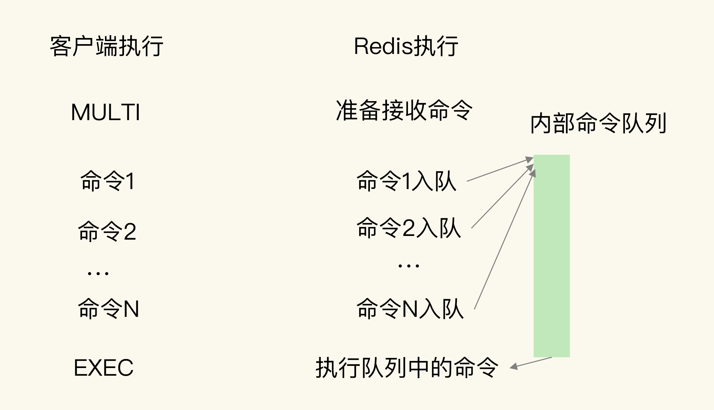

### 时间序列数据的读写特点
#### 读特点

在实际应用中，时间序列数据通常是持续高并发写入的。

写入特点很简单，就是插入数据快，这就要求我们选择的数据类型，在进行数据插入时，复杂度要低，尽量不要阻塞。

Redis 的高性能写特性足以应对。

#### 写特点
- 点查询，根据一个时间戳，查询相应时间的数据；
- 范围查询，查询起始和截止时间戳范围内的数据；
- 聚合计算，针对起始和截止时间戳范围内的所有数据进行计算，例如求最大 / 最小值，求均值等。

### 基于 Hash 和 Sorted Set 保存时间序列数据

#### Hash 集合记录设备的温度值的示意图：

```

HGET device:temperature 202008030905
"25.1"

HMGET device:temperature 202008030905 202008030907 202008030908
1) "25.1"
2) "25.9"
3) "24.9"
```
用 `Hash` 类型来实现单键的查询很简单。但是，`Hash` 类型有个短板：它并不支持对数据进行范围查询。

为了能同时支持按时间戳范围的查询，可以用 `Sorted Set` 来保存时间序列数据，因为它能够根据元素的权重分数来排序。我们可以把时间戳作为 `Sorted Set` 集合的元素分数，把时间点上记录的数据作为元素本身。

#### Sorted Set 集合记录设备的温度值的示意图：

```
ZRANGEBYSCORE device:temperature 202008030907 202008030910
1) "25.9"
2) "24.9"
3) "25.3"
4) "25.2"
```
使用 `Sorted Set` 保存数据后，可以使用 `ZRANGEBYSCORE` 命令，按照输入的最大时间戳和最小时间戳来查询这个时间范围内的温度值了。

#### 如何保证 Hash 和 Sort Set 是一个原子性操作
`Redis` 用来实现简单的事务的 `MULTI` 和 `EXEC` 命令
- `MULTI` 命令：表示一系列原子性操作的开始。收到这个命令后，`Redis` 就知道，接下来再收到的命令需要放到一个内部队列中，后续一起执行，保证原子性。
- `EXEC` 命令：表示一系列原子性操作的结束。一旦 `Redis` 收到了这个命令，就表示所有要保证原子性的命令操作都已经发送完成了。此时，`Redis` 开始执行刚才放到内部队列中的所有命令操作。

Redis事务命令执行流程


```

127.0.0.1:6379> MULTI
OK

127.0.0.1:6379> HSET device:temperature 202008030911 26.8
QUEUED

127.0.0.1:6379> ZADD device:temperature 202008030911 26.8
QUEUED

127.0.0.1:6379> EXEC
1) (integer) 1
2) (integer) 1
```
注意：`redis` 的事务不是完整的事务，当有一个命令失败时还是会继续往下执行
#### 使用 RedisTimeSeries 来保存时间序列数据

`Hash` 可以实现点查询，`Sorted Set` 可以实现范围查询，聚合查询就要用到 `RedisTimeSeries`。

`RedisTimeSeries` 是 `Redis` 的一个扩展模块。它专门面向时间序列数据提供了数据类型和访问接口，并且支持在 `Redis` 实例上直接对数据进行按时间范围的聚合计算。

因为 `RedisTimeSeries` 不属于 `Redis` 的内建功能模块，在使用时，我们需要先把它的源码单独编译成动态链接库 `redistimeseries.so`，再使用 `loadmodule` 命令进行加载，如下所示：
```
loadmodule redistimeseries.so
```

当用于时间序列数据存取时，`RedisTimeSeries` 的操作主要有 `5` 个：
- 用 `TS.CREATE` 命令创建时间序列的标签属性数据集合；
- 用 `TS.ADD` 命令插入数据；
- 用 `TS.GET` 命令读取最新数据；
- 用 `TS.MGET` 命令按标签过滤查询数据集合；
- 用 `TS.RANGE` 支持聚合计算的范围查询。


与使用 `Hash` 和 `Sorted Set` 来保存时间序列数据相比，`RedisTimeSeries` 是专门为时间序列数据访问设计的扩展模块，能支持在 `Redis` 实例上直接进行聚合计算，以及按标签属性过滤查询数据集合，当需要频繁进行聚合计算，以及从大量集合中筛选出特定设备或用户的数据集合时，`RedisTimeSeries` 就可以发挥优势了。

`RedisTimeSeries` 的底层数据结构使用了链表，它的范围查询的复杂度是 `O(N)` 级别的，同时，它的 `TS.GET` 查询只能返回最新的数据，没有办法像第一种方案的 `Hash` 类型一样，可以返回任一时间点的数据。

组合使用 `Hash` 和 `Sorted Set`，或者使用 `RedisTimeSeries`，在支持时间序列数据存取上各有优劣势。
- 如果部署环境中网络带宽高、`Redis` 实例内存大，可以优先考虑第一种方案；
- 如果部署环境中网络、内存资源有限，而且数据量大，聚合计算频繁，需要按数据集合属性查询，可以优先考虑第二种方案。