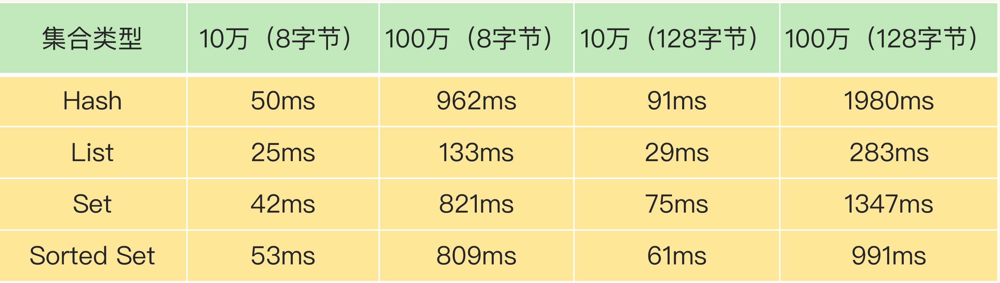

### Redis 实例有哪些阻塞点？
Redis 实例在运行时，要和许多对象进行交互，这些不同的交互就会涉及不同的操作。
- 客户端：网络 `IO`，键值对增删改查操作，数据库操作；
- 磁盘：生成 `RDB` 快照，记录 `AOF` 日志，`AOF` 日志重写；
- 主从节点：主库生成、传输 `RDB` 文件，从库接收 `RDB` 文件、清空数据库、加载 `RDB` 文件；
- 切片集群实例：向其他实例传输哈希槽信息，数据迁移。

#### 客户端阻塞点

##### 第一个阻塞点：集合全量查询和聚合操作
`Redis` 使用了 `IO` 多路复用机制，避免了主线程一直处在等待网络连接或请求到来的状态，所以，网络 `IO` 不是导致 `Redis` 阻塞的因素。

键值对的增删改查操作是 `Redis` 和客户端交互的主要部分，也是 `Redis` 主线程执行的主要任务。所以，复杂度高的增删改查操作肯定会阻塞 `Redis`。

看操作的复杂度是否为 `O(N)`，是判断操作复杂度的最基本标准。

`Redis` 中涉及集合的操作复杂度通常为 `O(N)`，例如集合元素全量查询操作 `HGETALL`、`SMEMBERS`，以及集合的聚合统计操作，例如求交、并和差集。这些操作可以作为 `Redis` 的 第一个阻塞点。

##### 第二个阻塞点：bigkey 删除操作
删除操作的本质是要释放键值对占用的内存空间。

释放内存只是第一步，为了更加高效地管理内存空间，在应用程序释放内存时，操作系统需要把释放掉的内存块插入一个空闲内存块的链表，以便后续进行管理和再分配。这个过程本身需要一定时间，而且会阻塞当前释放内存的应用程序，所以，如果一下子释放了大量内存，空闲内存块链表操作时间就会增加，相应地就会造成 `Redis` 主线程的阻塞。

在删除大量键值对数据的时候，最典型的就是删除包含了大量元素的集合，也称为 `bigkey` 删除。

如图显而易见，删除操作对 `Redis` 实例性能的负面影响很大，业务开发一定要重视。

##### 第三个阻塞点：清空数据库

频繁删除键值对都是潜在的阻塞点了，那么，在 `Redis` 的数据库级别操作中，清空数据库（例如 `FLUSHDB` 和 `FLUSHALL` 操作）必然也是一个潜在的阻塞风险，因为它涉及到删除和释放所有的键值对。

扩展：
`Redis Flushall` 命令用于清空整个 `Redis` 服务器的数据(删除所有数据库的所有 `key` )。

`Redis Flushdb` 命令用于清空当前数据库中的所有 `key`。

#### 和磁盘交互时的阻塞点
##### 第四个阻塞点：AOF 日志同步写

`Redis` 与磁盘 `IO` 操作时会带来阻塞，`Redis` 设计为采用子进程的方式生成 `RDB` 快照文件，以及执行 `AOF` 日志重写操作。这样一来，这两个操作由子进程负责执行，慢速的磁盘 `IO` 就不会阻塞主线程了。

`Redis` 直接记录 `AOF` 日志时，会根据不同的写回策略对数据做落盘保存。一个同步写磁盘的操作的耗时大约是 `1～2ms`，如果有大量的写操作需要记录在 `AOF` 日志中，并同步写回的话，就会阻塞主线程了。

#### 主从节点交互时的阻塞点

##### 第五个阻塞点：从库加载 RDB 文件
在主从集群中，主库需要生成 `RDB` 文件，并传输给从库。主库在复制的过程中，创建和传输 `RDB` 文件都是由子进程来完成的，不会阻塞主线程。但是，对于从库来说，它在接收了 `RDB` 文件后，需要使用 `FLUSHDB` 命令清空当前数据库，这里是第三阻塞点。

从库在清空当前数据库后，还需要把 `RDB` 文件加载到内存，这个过程的快慢和 `RDB` 文件的大小密切相关，`RDB` 文件越大，加载过程越慢，所以，加载 `RDB` 文件就成为了 `Redis` 的第五个阻塞点。

#### 切片集群实例交互时的阻塞点

当部署 `Redis` 切片集群时，每个 `Redis` 实例上分配的哈希槽信息需要在不同实例间进行传递，同时，当需要进行负载均衡或者有实例增删时，数据会在不同的实例间进行迁移。不过，哈希槽的信息量不大，而数据迁移是渐进式执行的，所以，一般来说，这两类操作对 `Redis` 主线程的阻塞风险不大。

不过，如果使用了 `Redis Cluster` 方案，而且同时正好迁移的是 `bigkey` 的话，就会造成主线程的阻塞，因为 `Redis Cluster` 使用了同步迁移。

当没有 `bigkey` 时，切片集群的各实例在进行交互时不会阻塞主线程。

### 哪些阻塞点可以异步执行？

如果一个操作能被异步执行，就意味着，它并不是 `Redis` 主线程的关键路径上的操作。

主线程接收到操作 `1` 后，因为操作 `1` 并不用给客户端返回具体的数据，所以，主线程可以把它交给后台子线程来完成，同时只要给客户端返回一个“`OK`”结果就行。在子线程执行操作 `1` 的时候，客户端又向 `Redis` 实例发送了操作 `2`，而此时，客户端是需要使用操作 `2` 返回的数据结果的，如果操作 `2` 不返回结果，那么，客户端将一直处于等待状态。

在这个例子中，操作 `1` 就不算关键路径上的操作，因为它不用给客户端返回具体数据，所以可以由后台子线程异步执行。而操作 `2` 需要把结果返回给客户端，它就是关键路径上的操作，所以主线程必须立即把这个操作执行完。

对于 `Redis` 的五大阻塞点来说，除了“集合全量查询和聚合操作”和“从库加载 `RDB` 文件”，其他三个阻塞点涉及的操作都不在关键路径上，所以，我们可以使用 `Redis` 的异步子线程机制来实现 `bigkey` 删除，清空数据库，以及 `AOF` 日志同步写。

### 异步的子线程机制

`Redis` 主线程启动后，会使用操作系统提供的 `pthread_create` 函数创建 `3` 个子线程，分别由它们负责 `AOF` 日志写操作、键值对删除以及文件关闭的异步执行。

主线程通过一个链表形式的任务队列和子线程进行交互。当收到键值对删除和清空数据库的操作时，主线程会把这个操作封装成一个任务，放入到任务队列中，然后给客户端返回一个完成信息，表明删除已经完成。

但实际上，这个时候删除还没有执行，等到后台子线程从任务队列中读取任务后，才开始实际删除键值对，并释放相应的内存空间。因此，我们把这种异步删除也称为惰性删除（`lazy free`）。此时，删除或清空操作不会阻塞主线程，这就避免了对主线程的性能影响。

和惰性删除类似，当 `AOF` 日志配置成 `everysec` 选项后，主线程会把 `AOF` 写日志操作封装成一个任务，也放到任务队列中。后台子线程读取任务后，开始自行写入 `AOF` 日志，这样主线程就不用一直等待 `AOF` 日志写完了。

Redis中的异步子线程执行机制

异步的键值对删除和数据库清空操作是 `Redis 4.0` 后提供的功能，`Redis` 也提供了新的命令来执行这两个操作。
- 键值对删除：当集合类型中有大量元素（例如有百万级别或千万级别元素）需要删除时，我建议你使用 `UNLINK` 命令。
- 清空数据库：可以在 `FLUSHDB` 和 `FLUSHALL` 命令后加上 `ASYNC` 选项，这样就可以让后台子线程异步地清空数据库

集合全量查询和聚合操作、从库加载 `RDB` 文件是在关键路径上，无法使用异步操作来完成。对于这两个阻塞点，建议：
- 集合全量查询和聚合操作：可以使用 `SCAN` 命令，分批读取数据，再在客户端进行聚合计算；
- 从库加载 `RDB` 文件：把主库的数据量大小控制在 `2~4GB` 左右，以保证 `RDB` 文件能以较快的速度加载。

#### 关于惰性删除

- `lazy-free` 是 `4.0` 新增的功能，但是默认是关闭的，需要手动开启。
- 即使开启了 `lazy-free`，如果直接使用 `DEL` 命令还是会同步删除 `key`，只有使用 `UNLINK` 命令才会可能异步删除 `key`。

##### 什么情况才会真正异步释放内存？
-  当 `Hash/Set` 底层采用哈希表存储（非 `ziplist/int` 编码存储）时，并且元素数量超过 `64` 个
-  当 `ZSet` 底层采用跳表存储（非 `ziplist` 编码存储）时，并且元素数量超过 `64` 个
-  当 `List` 链表节点数量超过 `64` 个（注意，不是元素数量，而是链表节点的数量，`List` 的实现是在每个节点包含了若干个元素的数据，这些元素采用 `ziplist` 存储）

只有以上这些情况，在删除key释放内存时，才会真正放到异步线程中执行，其他情况一律还是在主线程操作。

也就是说 `String`（不管内存占用多大）、`List`（少量元素）、`Set`（int编码存储）、`Hash/ZSet`（`ziplist`编码存储）这些情况下的 `key` 在释放内存时，依旧在主线程中操作。

可见，即使开启了 `lazy-free`，`String` 类型的 `bigkey`，在删除时依旧有阻塞主线程的风险。所以，即便 `Redis` 提供了 `lazy-free`，我建议还是尽量不要在 `Redis`中存储 `bigkey`。

从上面分析基本能看出，如果需要释放的内存是连续的，`Redis` 作者认为释放内存的代价比较低，就放在主线程做。如果释放的内存不连续（大量指针类型的数据），这个代价就比较高，所以才会放在异步线程中去执行。
