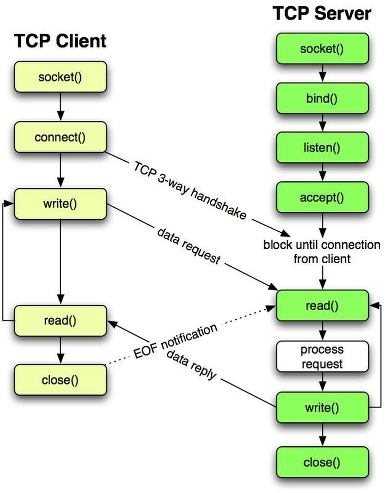

### Redis 单线程？

 `Redis` 是单线程，主要是指 `Redis` 的网络 `IO` 和键值对读写是由一个线程来完成的，这也是 `Redis` 对外提供键值存储服务的主要流程。但 `Redis` 的其他功能，比如持久化、异步删除、集群数据同步等，其实是由额外的线程执行的。
 严格来说，`Redis` 不是单线程。

 ### Redis 为什么用单线程？

主要是因为多线程的开销，避免多线程开发的并发控制问题：

- 增加线程数时，系统吞吐率会增加，但是，再进一步增加线程时，系统吞吐率就增长迟缓了，有时甚至还会出现下降的情况。

- 一个关键的瓶颈在于，系统中通常会存在被多线程同时访问的共享资源，比如一个共享的数据结构。当有多个线程要修改这个共享资源时，为了保证共享资源的正确性，就需要有额外的机制(互斥锁、同步原语)进行保证，而这个额外的机制，就会带来额外的开销。

- 多线程编程模式会面临共享资源的并发访问控制问题。

### 单线程 Redis 为什么那么快？

- 内存数据库，所有操作都在内存上完成，内存的访问速度本身就很快
- 数据结构，键值对是按一定的数据结构来组织的，操作键值对最终就是对数据结构进行增删改查操作，所以高效的数据结构是 `Redis` 快速处理数据的基础
- 采用了多路复用机制，使其在网络 `IO` 操作中能并发处理大量的客户端请求，实现高吞吐率

#### 基本 IO 模型与阻塞点

`bind/listen`、`accept`、`recv`、`parse` 和 `send` 属于网络 `IO` 处理，而 `get` 属于键值数据操作

当 `Redis` 监听到一个客户端有连接请求，但一直未能成功建立起连接时，会阻塞在 `accept()` 函数这里，导致其他客户端无法和 `Redis` 建立连接。类似的，当 `Redis` 通过 `recv()` 从一个客户端读取数据时，如果数据一直没有到达，`Redis` 也会一直阻塞在 `recv()`。

这就导致 `Redis` 整个线程阻塞，无法处理其他客户端请求，效率很低。不过，`socket` 网络模型本身支持非阻塞模式。

#### 非阻塞模式

#### 基于多路复用的高性能 I/O 模型

`Linux` 中的 `IO` 多路复用机制是指一个线程处理多个 `IO` 流，就是 `select/epoll` 机制。在 `Redis` 只运行单线程的情况下，该机制允许内核中，同时存在多个监听套接字和已连接套接字。内核会一直监听这些套接字上的连接请求或数据请求。一旦有请求到达，就会交给 `Redis` 线程处理，这就实现了一个 `Redis` 线程处理多个 `IO` 流的效果。

`Redis` 网络框架调用 `epoll` 机制，让内核监听这些套接字。

`Redis` 线程不会阻塞在某一个特定的监听或已连接套接字上，也就是说，不会阻塞在某一个特定的客户端请求处理上。正因为此，`Redis` 可以同时和多个客户端连接并处理请求，从而提升并发性。

图中的多个 `FD` 就是刚才所说的多个套接字。

为了在请求到达时能通知到 `Redis` 线程，`select/epoll` 提供了基于事件的回调机制，即针对不同事件的发生，调用相应的处理函数。`select/epoll` 一旦监测到 `FD` 上有请求到达时，就会触发相应的事件。

这些事件会被放进一个事件队列，`Redis` 单线程对该事件队列不断进行处理。这样一来，`Redis` 无需一直轮询是否有请求实际发生，这就可以避免造成 `CPU` 资源浪费。同时，`Redis` 在对事件队列中的事件进行处理时，会调用相应的处理函数，这就实现了基于事件的回调。因为 `Redis` 一直在对事件队列进行处理，所以能及时响应客户端请求，提升 `Redis` 的响应性能。

`Redis` 的高性能主要是多路复用的 `IO` 模型 避免了 `accept()` 和 `send()/recv()` 潜在的网络 `IO` 操作阻塞点。