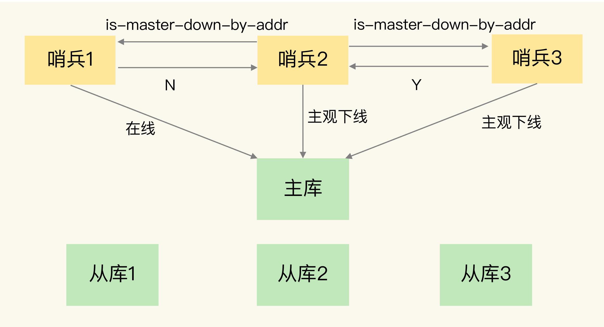
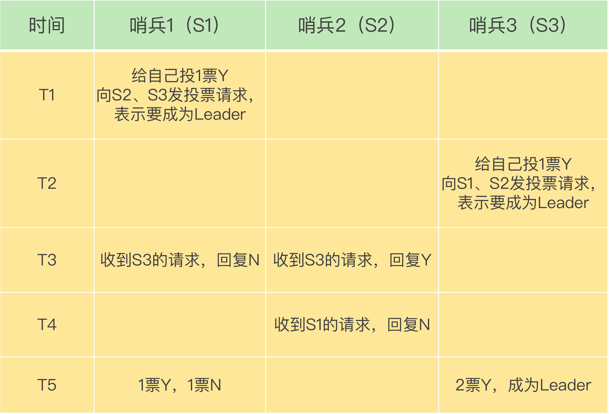

### 哨兵机制：Redis 不间断服务的重要保证

在 `Redis` 主从集群中，哨兵机制是实现主从库自动切换的关键机制，它有效地解决了主从复制模式下故障转移的这三个问题。
- 主库真的挂了吗？
- 该选择哪个从库作为主库？
- 怎么把新主库的相关信息通知给从库和客户端呢？

主库故障后从库无法服务写操作示例图

### 哨兵机制的基本流程

哨兵其实就是一个运行在特殊模式下的 `Redis` 进程，主从库实例运行的同时，它也在运行。哨兵主要负责的就是三个任务：`监控`、`选主（选择主库）`和`通知`。

#### 监控：监控主库运行状态，并判断主库是否客观下线
监控是指哨兵进程在运行时，周期性地给所有的主从库发送 `PING` 命令，检测它们是否仍然在线运行。如果从库没有在规定时间内响应哨兵的 `PING` 命令，哨兵就会把它标记为“下线状态”；同样，如果主库也没有在规定时间内响应哨兵的 `PING` 命令，哨兵就会判定主库下线，然后开始自动切换主库的流程。

#### 选主：在主库客观下线后，选取新主库
主库挂了以后，哨兵就需要从很多个从库里，按照一定的规则选择一个从库实例，把它作为新的主库。这一步完成后，现在的集群里就有了新主库。

#### 通知：选出新主库后，通知从库和客户端
在执行通知任务时，哨兵会把新主库的连接信息发给其他从库，让它们执行 `replicaof` 命令，和新主库建立连接，并进行数据复制。同时，哨兵会把新主库的连接信息通知给客户端，让它们把请求操作发到新主库上。

### 主观下线和客观下线

哨兵进程会使用 `PING` 命令检测它自己和主、从库的网络连接情况，用来判断实例的状态。如果哨兵发现主库或从库对 `PING` 命令的响应超时了，那么，哨兵就会先把它标记为“主观下线”。

如果检测的是从库，那么，哨兵简单地把它标记为“主观下线”就行了，因为从库的下线影响一般不太大，集群的对外服务不会间断。

如果检测的是主库，那么，哨兵还不能简单地把它标记为“主观下线”，开启主从切换。因为很有可能存在这么一个情况：那就是哨兵误判了，其实主库并没有故障。可是，一旦启动了主从切换，后续的选主和通知操作都会带来额外的计算和通信开销。

误判一般会发生在集群网络压力较大、网络拥塞，或者是主库本身压力较大的情况下。

为了避免这些不必要的开销，哨兵机制通常会采用多实例组成的集群模式进行部署，这也被称为哨兵集群。判断原则就是：少数服从多数。

客观下线的判断

简单来说，“客观下线”的标准就是，当有 `N` 个哨兵实例时，最好要有 `N/2 + 1` 个实例判断主库为“主观下线”，才能最终判定主库为“客观下线”。这样一来，就可以减少误判的概率，也能避免误判带来的无谓的主从库切换。(具体几个判断下线可自行配置)

### 如何选定新主库？
一般来说，我把哨兵选择新主库的过程称为“筛选 + 打分”。简单来说，我们在多个从库中，先按照 `一定的筛选条件`，把不符合条件的从库去掉。然后，我们再按照 `一定的规则`，给剩下的从库逐个打分，将得分最高的从库选为新主库，如下图所示

首先，通过检查从库的当前在线状态，判断它之前的网络连接状态，筛选出一部分。
其次，三个规则分别是从库优先级、从库复制进度以及从库 ID 号，进行打分。
- 第一轮：优先级最高的从库得分高。
- 第二轮：和旧主库同步程度最接近的从库得分高。
- 第三轮：ID 号小的从库得分高。

### 哨兵集群

单个哨兵挂掉，哨兵集群依旧可以完成主从切换。

#### 哨兵集群的关键机制
- 基于 `pub/sub` 机制的哨兵集群组成过程；
- 基于 `INFO` 命令的从库列表，这可以帮助哨兵和从库建立连接；
- 基于哨兵自身的 `pub/sub` 功能，这实现了客户端和哨兵之间的事件通知。

#### 基于 pub/sub 机制的哨兵集群组成

哨兵实例之间可以相互发现，要归功于 `Redis` 提供的 `pub/sub` 机制，也就是发布 / 订阅机制。

哨兵只要和主库建立起了连接，就可以在主库上发布消息了，比如说发布它自己的连接信息（`IP` 和端口）。同时，它也可以从主库上订阅消息，获得其他哨兵发布的连接信息。当多个哨兵实例都在主库上做了发布和订阅操作后，它们之间就能知道彼此的 `IP` 地址和端口。

只有订阅了同一个频道的应用，才能通过发布的消息进行信息交换。

在主从集群中，主库上有一个名为 `__sentinel__:hello` 的频道，不同哨兵就是通过它来相互发现，实现互相通信的。

哨兵通过向主库发送 `INFO` 命令来获取 `从库的 IP 地址和端口`。然后哨兵就可以根据从库列表中的连接信息，和每个从库建立连接，并在这个连接上持续地对从库进行监控。

#### 基于 pub/sub 机制的客户端事件通知

从本质上说，哨兵就是一个运行在特定模式下的 `Redis` 实例，只不过它并不服务请求操作，只是完成监控、选主和通知的任务。所以，每个哨兵实例也提供 `pub/sub` 机制，客户端可以从哨兵订阅消息。

哨兵提供的消息订阅频道有很多，不同频道包含了主从库切换过程中的不同关键事件。

具体的操作步骤是，客户端读取哨兵的配置文件后，可以获得哨兵的地址和端口，和哨兵建立网络连接。

当哨兵把新主库选择出来后，客户端就会看到下面的 `switch-master` 事件。这个事件表示主库已经切换了，新主库的 `IP` 地址和端口信息已经有了。这个时候，客户端就可以用这里面的新主库地址和端口进行通信了。

#### 哨兵集群通过投票选举 Leader 哨兵执行主从切换

任何一个实例只要自身判断主库“主观下线”后，就会给其他实例发送 `is-master-down-by-addr` 命令。接着，其他实例会根据自己和主库的连接情况，做出 `Y 或 N` 的响应，`Y` 相当于赞成票，`N` 相当于反对票。

一个哨兵获得了仲裁所需的赞成票数后，就可以标记主库为“客观下线”。这个所需的赞成票数是通过哨兵配置文件中的 `quorum` 配置项设定的。

此时，这个哨兵就可以再给其他哨兵发送命令，表明希望由自己来执行主从切换，并让所有其他哨兵进行投票。这个投票过程称为`“Leader 选举”`。因为最终执行主从切换的哨兵称为 `Leader`，投票过程就是确定 `Leader`。

在投票过程中，任何一个想成为 `Leader` 的哨兵，要满足两个条件：第一，拿到半数以上的赞成票；第二，拿到的票数同时还需要大于等于哨兵配置文件中的 `quorum` 值。

以 `3` 个哨兵为例，假设此时的 `quorum` 设置为 `2`，那么，任何一个想成为 `Leader` 的哨兵只要拿到 `2` 张赞成票，就可以了。

通常，在解决一个系统问题的时候，会引入一个新机制，或者设计一层新功能。
为了实现主从切换，引入了哨兵；为了避免单个哨兵故障后无法进行主从切换，以及为了减少误判率，又引入了哨兵集群；哨兵集群又需要有一些机制来支撑它的正常运行。

#### 哨兵集群配置注意项

使用配置项 `down-after-milliseconds * 10`。其 `down-after-milliseconds` 是我们认定主从库断连的最大连接超时时间。如果在 `down-after-milliseconds` 毫秒内，主从节点都没有通过网络联系上，我们就可以认为主从节点断连了。如果发生断连的次数超过了 `10` 次，就说明这个从库的网络状况不好，不适合作为新主库。

要保证所有哨兵实例的配置是一致的，尤其是主观下线的判断值 `down-after-milliseconds`。

因为这个值在不同的哨兵实例上配置不一致，导致哨兵集群一直没有对有故障的主库形成共识，也就没有及时切换主库，最终的结果就是集群服务不稳定。