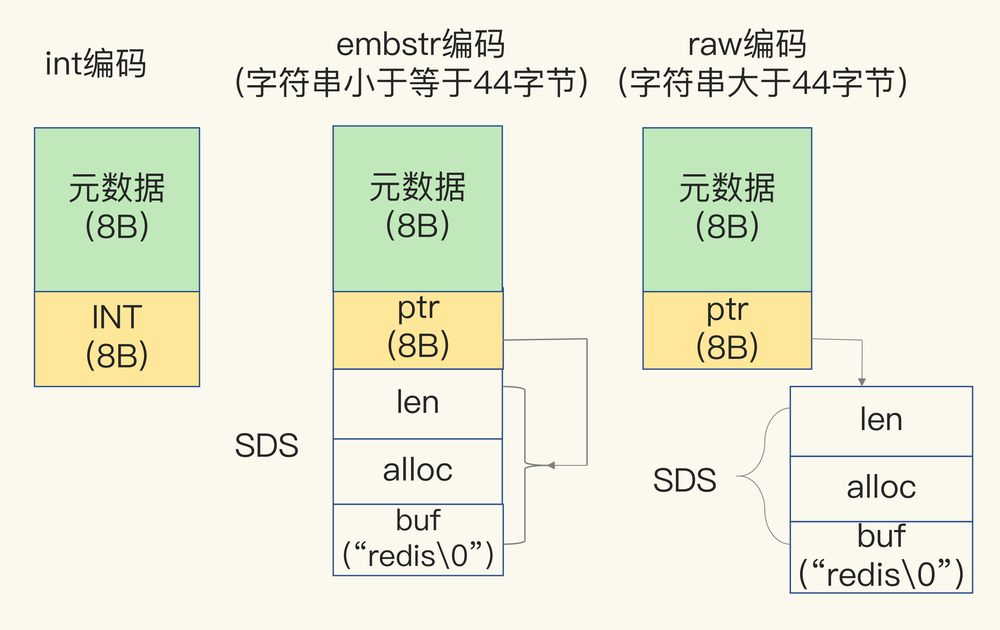

### String 类型如何保存数据
- 当保存 `64` 位有符号整数时，`String` 类型会把它保存为一个 `8` 字节的 `Long` 类型整数，这种保存方式通常也叫作 `int` 编码方式。
- 当保存的数据中包含字符时，`String` 类型就会用简单动态字符串（`Simple Dynamic String，SDS`）结构体来保存，如下图：


- `buf`：字节数组，保存实际数据。为了表示字节数组的结束，`Redis` 会自动在数组最后加一个“`\0`”，这就会额外占用 `1` 个字节的开销。
- `len`：占 `4` 个字节，表示 `buf` 的已用长度。
- `alloc`：也占个 `4` 字节，表示 `buf` 的实际分配长度，一般大于 `len`。

在 `SDS` 中，`buf` 保存实际数据，而 `len` 和 `alloc` 本身其实是 SDS 结构体的额外开销。对于 `String` 类型来说，除了 `SDS` 的额外开销，还有一个来自于 `RedisObject` 结构体的开销。

### RedisObject 结构

因为 `Redis` 的数据类型有很多，而且，不同数据类型都有些相同的元数据要记录（比如最后一次访问的时间、被引用的次数等），所以，`Redis` 会用一个 `RedisObject` 结构体来统一记录这些元数据，同时指向实际数据。

一个 `RedisObject` 包含了 `8` 字节的元数据和一个 `8` 字节指针，这个指针再进一步指向具体数据类型的实际数据所在。


为了节省内存空间，`Redis` 还对 `Long` 类型整数和 `SDS` 的内存布局做了专门的设计。

- 一方面，当保存的是 `Long` 类型整数时，`RedisObject` 中的指针就直接赋值为整数数据了，这样就不用额外的指针再指向整数了，节省了指针的空间开销。
- 另一方面，当保存的是字符串数据，并且字符串小于等于 `44` 字节时，`RedisObject` 中的元数据、指针和 `SDS` 是一块连续的内存区域，这样就可以避免内存碎片。这种布局方式也被称为 `embstr` 编码方式。
- 当字符串大于 `44` 字节时，`SDS` 的数据量就开始变多了，`Redis` 就不再把 `SDS` 和 `RedisObject` 布局在一起了，而是会给 `SDS` 分配独立的空间，并用指针指向 `SDS` 结构。这种布局方式被称为 `raw` 编码模式。

### Redis 的三种编码模式：int、embstr、raw 


### Redis 的 dictEntry 结构体
`Redis` 会使用一个全局哈希表保存所有键值对，哈希表的每一项是一个 `dictEntry` 的结构体，用来指向一个键值对。`dictEntry` 结构中有三个 8 字节的指针，分别指向 `key`、`value` 以及下一个 `dictEntry`，三个指针共 `24` 字节，如下图所示：


三个指针只有 `24` 字节，为什么会占用了 `32` 字节呢？这就要提到 `Redis` 使用的内存分配库 `jemalloc` 了。

### Redis 使用的内存分配库 jemalloc
`jemalloc` 在分配内存时，会根据我们申请的字节数 `N`，找一个比 `N` 大，但是最接近 `N` 的 `2` 的幂次数作为分配的空间，这样可以减少频繁分配的次数。

```
photo_id: 1101000051
photo_obj_id: 3301000051

命令：set 1101000051 3301000051 
保存这对键值对需要 64 字节的内存空间，有效信息只有 16 字节，
```

### 压缩列表如何节省空间

`Redis` 有一种底层数据结构，叫压缩列表（`ziplist`），这是一种非常节省内存的结构。

表头有三个字段 `zlbytes`、`zltail` 和 `zllen`，分别表示`列表长度`、`列表尾的偏移量`，以及列表中的 `entry` 个数。压缩列表尾还有一个 `zlend`，表示列表结束。


压缩列表之所以能节省内存，就在于它是用一系列连续的 `entry` 保存数据。每个 `entry` 的元数据包括下面几部分。
- `prev_len`，表示前一个 `entry` 的长度。`prev_len` 有两种取值情况：`1` 字节或 `5` 字节。取值 `1` 字节时，表示上一个 `entry` 的长度小于 `254` 字节。虽然 `1` 字节的值能表示的数值范围是 `0` 到 `255`，但是压缩列表中 `zlend` 的取值默认是 `255`，因此，就默认用 `255` 表示整个压缩列表的结束，其他表示长度的地方就不能再用 `255` 这个值了。所以，当上一个 `entry` 长度小于 `254` 字节时，`prev_len` 取值为 `1` 字节，否则，就取值为 `5` 字节。
- `len`：表示自身长度，`4` 字节；
- `encoding`：表示编码方式，`1` 字节；
- `content`：保存实际数据。


`Redis` 基于压缩列表实现了 `List`、`Hash` 和 `Sorted Set` 这样的集合类型，这样做的最大好处就是节省了 `dictEntry` 的开销。当用 `String` 类型时，一个键值对就有一个 `dictEntry`，要用 `32` 字节空间。但采用集合类型时，一个 `key` 就对应一个集合的数据，能保存的数据多了很多，但也只用了一个 `dictEntry`，这样就节省了内存。


### 如何使用集合类型保存键值对？

`Redis Hash` 类型的两种底层实现结构，分别是压缩列表和哈希表。

`Hash` 类型设置了用压缩列表保存数据时的两个阀值，一旦超过就会将压缩列表转为哈希表，且不可回退。

- `hash-max-ziplist-entries`：表示用压缩列表保存哈希集合中的最大元素个数
- `hash-max-ziplist-value`：表示用压缩列表保存时，哈希集合中单个元素的最大长度

如果我们往 `Hash` 集合中写入的元素个数超过了 `hash-max-ziplist-entries`，或者写入的单个元素大小超过了 `hash-max-ziplist-value`，`Redis` 就会自动把 `Hash` 类型的实现结构由压缩列表转为哈希表。

一旦从压缩列表转为了哈希表，`Hash` 类型就会一直用哈希表进行保存，而不会再转回压缩列表了。在节省内存空间方面，哈希表就没有压缩列表那么高效了。

为了能充分使用压缩列表的精简内存布局，我们一般要控制保存在 `Hash` 集合中的元素个数。