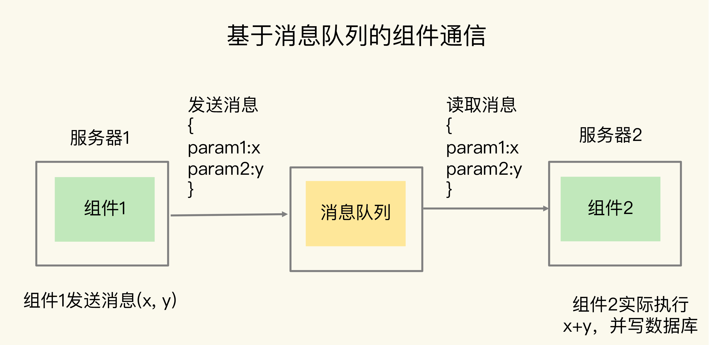
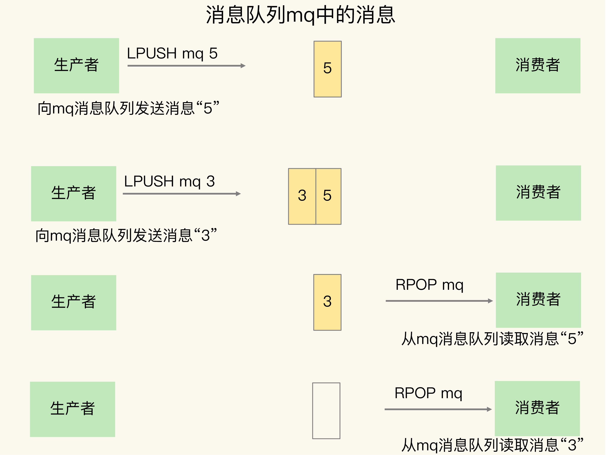

### 关于消息队列
分布式系统必备的一个基础软件就是消息队列。

消息队列要能支持组件通信消息的快速读写，而 `Redis` 本身支持数据的高速访问，正好可以满足消息队列的读写性能需求。

基于消息队列的组件示意图：


一般把消息队列中发送消息的组件称为生产者，把接收消息的组件称为消费者，如图：
消息队列的架构模型


在使用消息队列时，消费者可以异步读取生产者消息，然后再进行处理。这样一来，即使生产者发送消息的速度远远超过了消费者处理消息的速度，生产者已经发送的消息也可以缓存在消息队列中，避免阻塞生产者，这是消息队列作为分布式组件通信的一大优势。

消息队列在存取消息时必须满足三个需求
- 消息保序
- 处理重复的消息
- 保证消息可靠性

对消息队列的三大要求：
- 消息数据有序存取 
- 消息数据具有全局唯一编号
- 消息数据在消费完成后被删除
  
### 基于 List 的消息队列解决方案
`List` 本身就是按先进先出的顺序对数据进行存取的，所以，如果使用 `List` 作为消息队列保存消息的话，就已经能满足消息保序的需求了。

#### List 如何保证消息顺序
生产者可以使用 `LPUSH` 命令把要发送的消息依次写入 `List`，而消费者则可以使用 `RPOP` 命令，从 `List` 的另一端按照消息的写入顺序，依次读取消息并进行处理。



在消费者读取数据时，有一个潜在的性能风险点。在没有新消息写入 `List`，消费者也要不停地调用 `RPOP` 命令，这就会导致消费者程序的 `CPU` 一直消耗在执行 `RPOP` 命令上，带来不必要的性能损失。

`Redis` 提供了 `BRPOP` 命令。`BRPOP` 命令也称为阻塞式读取，客户端在没有读到队列数据时，自动阻塞，直到有新的数据写入队列，再开始读取新数据。和消费者程序自己不停地调用 `RPOP` 命令相比，这种方式能节省 `CPU` 开销。

#### List 如何保证不处理重复的消息

一方面，消息队列要能给每一个消息提供全局唯一的 `ID` 号；另一方面，消费者程序要把已经处理过的消息的 `ID` 号记录下来。

当收到一条消息后，消费者程序就可以对比收到的消息 `ID` 和记录的已处理过的消息 `ID`，来判断当前收到的消息有没有经过处理。如果已经处理过，那么，消费者程序就不再进行处理了。这种处理特性也称为幂等性，幂等性就是指，对于同一条消息，消费者收到一次的处理结果和收到多次的处理结果是一致的。

`List` 本身是不会为每个消息生成 `ID` 号的，所以，消息的全局唯一 `ID` 号就需要生产者程序在发送消息前自行生成。生成之后，我们在用 `LPUSH` 命令把消息插入 `List` 时，需要在消息中包含这个全局唯一 `ID`。

#### List 如何保证消息可靠性

当消费者程序从 `List` 中读取一条消息后，`List` 就不会再留存这条消息了。所以，如果消费者程序在处理消息的过程出现了故障或宕机，就会导致消息没有处理完成，那么，消费者程序再次启动后，就没法再次从 `List` 中读取消息了。

为了留存消息，`List` 类型提供了 `BRPOPLPUSH `命令，这个命令的作用是让消费者程序从一个 `List` 中读取消息，同时，`Redis` 会把这个消息再插入到另一个 `List`（可以叫作备份 `List`）留存。这样一来，如果消费者程序读了消息但没能正常处理，等它重启后，就可以从备份 `List` 中重新读取消息并进行处理了。


基于 `List` 类型，可以满足分布式组件对消息队列的三大需求。但是，生产者消息发送很快，而消费者处理消息的速度比较慢，这就导致 `List` 中的消息越积越多，给 `Redis` 的内存带来很大压力。

`List` 类型并不支持消费组的实现。`Redis` 从 `5.0` 版本开始提供的 `Streams` 数据类型，`Streams` 同样能够满足消息队列的三大需求，还支持消费组形式的消息读取。

### 基于 Streams 的消息队列解决方案

`Streams` 是 `Redis` 专门为消息队列设计的数据类型，它提供了丰富的消息队列操作命令。
- `XADD`：插入消息，保证有序，可以自动生成全局唯一 `ID`；
- `XREAD`：用于读取消息，可以按 ID 读取数据；
- `XREADGROUP`：按消费组形式读取消息；
- `XPENDING` 和 `XACK`：`XPENDING` 命令可以用来查询每个消费组内所有消费者已读取但尚未确认的消息，而 `XACK` 命令用于向消息队列确认消息处理已完成。

`XADD` 命令可以往消息队列中插入新消息，消息的格式是 `键 - 值对` 形式。对于插入的每一条消息，`Streams` 可以自动为其生成一个全局唯一的 `ID`。

```
消息队列名称后面的*，表示让 Redis 为插入的数据自动生成一个全局唯一的 ID，例如“1599203861727-0”。当然，我们也可以不用*，直接在消息队列名称后自行设定一个 ID 号，只要保证这个 ID 号是全局唯一的就行。不过，相比自行设定 ID 号，使用*会更加方便高效。

XADD mqstream * repo 5
"1599203861727-0"

消息的全局唯一 ID 由两部分组成，第一部分“1599203861727”是数据插入时，以毫秒为单位计算的当前服务器时间，第二部分表示插入消息在当前毫秒内的消息序号，这是从 0 开始编号的。例如，“1599203861727-0”就表示在“1599203861727”毫秒内的第 1 条消息。
```

当消费者需要读取消息时，可以直接使用 `XREAD` 命令从消息队列中读取。
`XREAD` 在读取消息时，可以指定一个消息 `ID`，并从这个消息 `ID` 的下一条消息开始进行读取。

```
从 ID 号为 1599203861727-0 的消息开始，读取后续的所有消息（示例中一共 3 条）。
XREAD BLOCK 100 STREAMS  mqstream 1599203861727-0
1) 1) "mqstream"
   2) 1) 1) "1599274912765-0"
         2) 1) "repo"
            2) "3"
      2) 1) "1599274925823-0"
         2) 1) "repo"
            2) "2"
      3) 1) "1599274927910-0"
         2) 1) "repo"
            2) "1"

消费者也可以在调用 XRAED 时设定 block 配置项，实现类似于 BRPOP 的阻塞读取操作。当消息队列中没有消息时，一旦设置了 block 配置项，XREAD 就会阻塞，阻塞的时长可以在 block 配置项进行设置。


XREAD block 10000 streams mqstream $
(nil)
(10.00s)
命令最后的“$”符号表示读取最新的消息，同时，设置了 block 10000 的配置项，10000 的单位是毫秒，表明 XREAD 在读取最新消息时，如果没有消息到来，XREAD 将阻塞 10000 毫秒（即 10 秒），然后再返回。下面命令中的 XREAD 执行后，消息队列 mqstream 中一直没有消息，所以，XREAD 在 10 秒后返回空值（nil）。
```

`Streams` 特有的功能：`Streams` 本身可以使用 `XGROUP` 创建消费组，创建消费组之后，`Streams` 可以使用 `XREADGROUP` 命令让消费组内的消费者读取消息。

```
创建一个名为 group1 的消费组，这个消费组消费的消息队列是 mqstream。
XGROUP create mqstream group1 0
OK

group1 消费组里的消费者 consumer1 从 mqstream 中读取所有消息，其中，命令最后的参数“>”，表示从第一条尚未被消费的消息开始读取。因为在 consumer1 读取消息前，group1 中没有其他消费者读取过消息，所以，consumer1 就得到 mqstream 消息队列中的所有消息了（一共 4 条）。
XREADGROUP group group1 consumer1 streams mqstream >
1) 1) "mqstream"
   2) 1) 1) "1599203861727-0"
         2) 1) "repo"
            2) "5"
      2) 1) "1599274912765-0"
         2) 1) "repo"
            2) "3"
      3) 1) "1599274925823-0"
         2) 1) "repo"
            2) "2"
      4) 1) "1599274927910-0"
         2) 1) "repo"
            2) "1"

消息队列中的消息一旦被消费组里的一个消费者读取了，就不能再被该消费组内的其他消费者读取了。比如说，执行完刚才的 XREADGROUP 命令后，再执行下面的命令，让 group1 内的 consumer2 读取消息时，consumer2 读到的就是空值，因为消息已经被 consumer1 读取完了，如下所示：
XREADGROUP group group1 consumer2  streams mqstream 0
1) 1) "mqstream"
   2) (empty list or set)

使用消费组的目的是让组内的多个消费者共同分担读取消息，所以，我们通常会让每个消费者读取部分消息，从而实现消息读取负载在多个消费者间是均衡分布的。例如，我们执行下列命令，让 group2 中的 consumer1、2、3 各自读取一条消息。
XREADGROUP group group2 consumer1 count 1 streams mqstream >
1) 1) "mqstream"
   2) 1) 1) "1599203861727-0"
         2) 1) "repo"
            2) "5"

XREADGROUP group group2 consumer2 count 1 streams mqstream >
1) 1) "mqstream"
   2) 1) 1) "1599274912765-0"
         2) 1) "repo"
            2) "3"

XREADGROUP group group2 consumer3 count 1 streams mqstream >
1) 1) "mqstream"
   2) 1) 1) "1599274925823-0"
         2) 1) "repo"
            2) "2"

```

为了保证消费者在发生故障或宕机再次重启后，仍然可以读取未处理完的消息，`Streams` 会自动使用内部队列（也称为 `PENDING List`）留存消费组里每个消费者读取的消息，直到消费者使用 `XACK` 命令通知 `Streams`“消息已经处理完成”。如果消费者没有成功处理消息，它就不会给 `Streams` 发送 `XACK` 命令，消息仍然会留存。此时，消费者可以在重启后，用 `XPENDING` 命令查看已读取、但尚未确认处理完成的消息。

```
查看一下 group2 中各个消费者已读取、但尚未确认的消息个数。其中，XPENDING 返回结果的第二、三行分别表示 group2 中所有消费者读取的消息最小 ID 和最大 ID。

XPENDING mqstream group2
1) (integer) 3
2) "1599203861727-0"
3) "1599274925823-0"
4) 1) 1) "consumer1"
      2) "1"
   2) 1) "consumer2"
      2) "1"
   3) 1) "consumer3"
      2) "1"

查看某个消费者具体读取了哪些数据，可以执行下面的命令：
XPENDING mqstream group2 - + 10 consumer2
1) 1) "1599274912765-0"
   2) "consumer2"
   3) (integer) 513336
   4) (integer) 1

一旦消息 1599274912765-0 被 consumer2 处理了，consumer2 就可以使用 XACK 命令通知 Streams，然后这条消息就会被删除。当我们再使用 XPENDING 命令查看时，就可以看到，consumer2 已经没有已读取、但尚未确认处理的消息了。
XACK mqstream group2 1599274912765-0
(integer) 1
XPENDING mqstream group2 - + 10 consumer2
(empty list or set)

```
Redis用List和Streams实现消息队列的特点和区别


`Redis` 是一个非常轻量级的键值数据库，部署一个 `Redis` 实例就是启动一个进程，部署 `Redis` 集群，也就是部署多个 `Redis` 实例。而 `Kafka`、`RabbitMQ` 部署时，涉及额外的组件，例如 `Kafka` 的运行就需要再部署 `ZooKeeper`。相比 `Redis` 来说，`Kafka` 和 `RabbitMQ` 一般被认为是重量级的消息队列。

`Redis` 可以用作队列，而且性能很高，部署维护也很轻量，但缺点是无法严格保数据的完整性（个人认为这就是业界有争议要不要使用 `Redis` 当作队列的地方）。而使用专业的队列中间件，可以严格保证数据的完整性，但缺点是，部署维护成本高，用起来比较重。

所以需要根据具体情况进行选择，如果对于丢数据不敏感的业务，例如发短信、发通知的场景，可以采用 `Redis` 作队列。如果是金融相关的业务场景，例如交易、支付这类，还是使用专业的队列中间件。