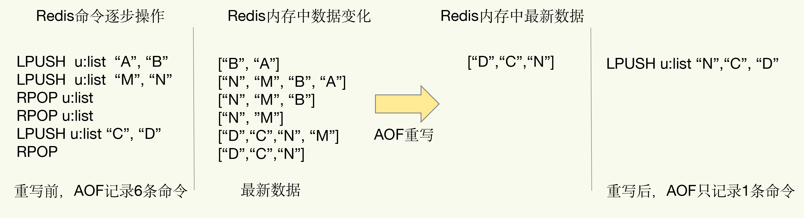

`Redis` 的持久化主要有两大机制，即 `AOF(Append Only File)`日志和 `RDB(Redis Database)` 快照。

## AOF 日志

### 数据库日志 vs AOF 日志
- 数据库的写前日志（`Write Ahead Log, WAL`），也就是说，在实际写数据前，先把修改的数据记到日志文件中，以便故障时进行恢复。

- `AOF` 日志与数据库日志正好相反，它是写后日志，`“写后”`的意思是 `Redis` 是先执行命令，把数据写入内存，然后才记录日志。

传统数据库的日志，例如 `redo log（重做日志）`，记录的是修改后的数据，而 `AOF` 里记录的是 `Redis` 收到的每一条命令，这些命令是以文本形式保存的。

### Redis 收到命令后记录日志流程

例：Redis 收到“set testkey testvalue”命令后记录的日志，如图

`*3` 表示当前命令有三个部分，每部分都是由 `$+数字` 开头，后面紧跟着具体的命令、键或值。这里，`数字` 表示这部分中的命令、键或值一共有多少字节。例如，`$3 set` 表示这部分有 `3` 个字节，也就是 `set` 命令。

为了避免额外的检查开销，`Redis` 在向 `AOF` 里面记录日志的时候，并不会先去对这些命令进行语法检查。

只有命令能执行成功，才会被记录到日志中，`Redis` 使用写后日志这一方式的一大好处是，可以避免出现记录错误命令的情况。

在命令执行后才记录日志，所以不会阻塞当前的写操作。

### AOF 潜在风险

- 如果刚执行完一个命令，还没有来得及记日志就宕机了，那么这个命令和相应的数据就有丢失的风险。如果把 `Redis` 当作数据库使用，因为命令没有记入日志，所以就无法用日志进行恢复了。
- `AOF` 虽然避免了对当前命令的阻塞，但可能会给下一个操作带来阻塞风险。`AOF` 日志是在主线程中执行的，如果在把日志文件写入磁盘时，磁盘写压力大，就会导致写盘很慢，进而导致后续的操作也无法执行了。

### AOF 为避免潜在风险，提供三种写回策略

`AOF` 配置项 `appendfsync` 的三个可选值：
- `Always`，同步写回：每个写命令执行完，立马同步地将日志写回磁盘；
- `Everysec`，每秒写回：每个写命令执行完，只是先把日志写到 `AOF` 文件的内存缓冲区，每隔一秒把缓冲区中的内容写入磁盘；
- `No`，操作系统控制的写回：每个写命令执行完，只是先把日志写到 AOF 文件的内存缓冲区，由操作系统决定何时将缓冲区内容写回磁盘。

针对避免主线程阻塞和减少数据丢失问题，这三种写回策略都无法做到两全其美。
- `同步写回` 可以做到 `基本不丢数据`，但是它在每一个写命令后都有一个慢速的落盘操作，不可避免地会影响主线程性能；
- 虽然 `操作系统控制的写回` 在写完缓冲区后，就可以继续执行后续的命令，但是落盘的时机已经不在 `Redis` 手中了，只要 `AOF` 记录没有写回磁盘，一旦宕机对应的数据就丢失了；
- `每秒写回` 采用一秒写回一次的频率，避免了 `同步写回` 的性能开销，虽然减少了对系统性能的影响，但是如果发生宕机，上一秒内未落盘的命令操作仍然会丢失。所以，这只能算是，在避免影响主线程性能和避免数据丢失两者间取了个折中。
  

总结一下就是：想要获得高性能，就选择 `No` 策略；如果想要得到高可靠性保证，就选择 `Always` 策略；如果允许数据有一点丢失，又希望性能别受太大影响的话，那么就选择 `Everysec` 策略。

### AOF 重写机制

#### 重写机制的必要性
- 文件系统本身对文件大小有限制，无法保存过大的文件；
- 如果文件太大，之后再往里面追加命令记录的话，效率也会变低；
- 果发生宕机，`AOF` 中记录的命令要一个个被重新执行，用于故障恢复，如果日志文件太大，整个恢复过程就会非常缓慢，这就会影响到 `Redis` 的正常使用。

#### 重写机制实现流程

 `AOF` 重写并不需要对原有的 `AOF` 文件进行任何写入和读取， 它针对的是数据库中键的当前值。

`AOF` 重写机制就是在重写时，`Redis` 根据数据库的现状创建一个新的 `AOF` 文件，也就是说，读取数据库中的所有键值对，然后对每一个键值对用一条命令记录它的写入。

重写机制具有 `多变一` 功能，旧日志文件中的多条命令，在重写后的新日志中变成了一条命令。也就是直接根据数据库里数据的最新状态，生成这些数据的插入命令，作为新日志。这个过程通过后台线程完成，避免了对主线程的阻塞。

#### 重写时如何避免阻塞

和 `AOF` 日志由主线程写回不同，重写过程是由后台子进程 `bgrewriteaof` 来完成的，这也是为了避免阻塞主线程，导致数据库性能下降。

##### 一个拷贝，两处日志

`一个拷贝` 是指，每次执行重写时，主线程 `fork` 出后台的 `bgrewriteaof` 子进程。此时，`fork` 会把主线程的内存拷贝一份给 `bgrewriteaof` 子进程，这里面就包含了数据库的最新数据。然后，`bgrewriteaof` 子进程就可以在不影响主线程的情况下，逐一把拷贝的数据写成操作，记入重写日志。

因为主线程未阻塞，仍然可以处理新来的操作。此时，如果有写操作，第一处日志就是指正在使用的 `AOF` 日志，`Redis` 会把这个操作写到它的缓冲区。这样一来，即使宕机了，这个 `AOF` 日志的操作仍然是齐全的（齐全指的是不会因为子进程额外丢失数据，缓冲区还是会丢失的），可以用于恢复。

第二处日志，就是指新的 `AOF` 重写日志。这个操作也会被写到重写日志的缓冲区。这样，重写日志也不会丢失最新的操作。等到拷贝数据的所有操作记录重写完成后，重写日志记录的这些最新操作也会写入新的 `AOF` 文件，以保证数据库最新状态的记录。此时，我们就可以用新的 `AOF` 文件替代旧文件了。

总结来说，每次 `AOF` 重写时，`Redis` 会先执行一个内存拷贝，用于重写；然后，使用两个日志保证在重写过程中，新写入的数据不会丢失。而且，因为 `Redis` 采用额外的线程进行数据重写，所以，这个过程并不会阻塞主线程。

