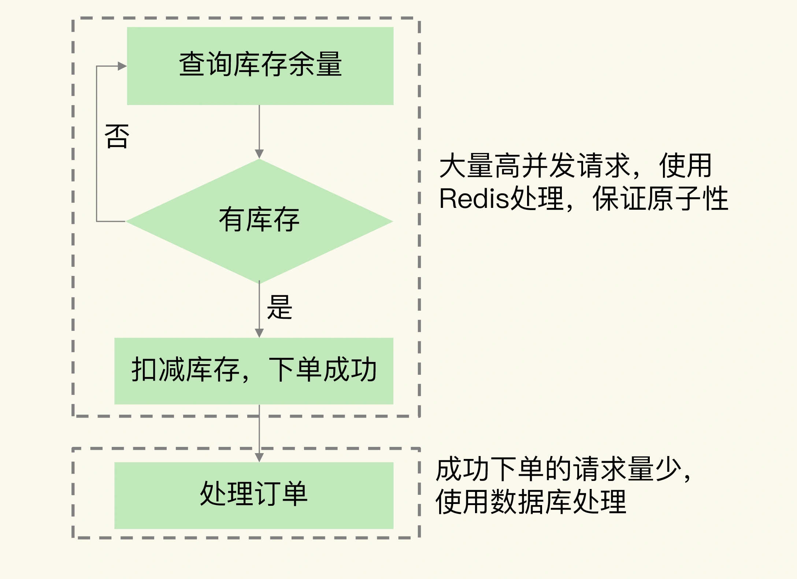

### 秒杀介绍

秒杀场景的业务特点是限时限量，业务系统要处理瞬时的大量高并发请求，而 `Redis` 就经常被用来支撑秒杀活动。

秒杀场景包含了多个环节，可以分成秒杀前、秒杀中和秒杀后三个阶段，每个阶段的请求处理需求并不相同，`Redis` 并不能支撑秒杀场景的每一个环节。

### 秒杀场景的负载特征对支撑系统的要求

#### 第一个特征是瞬时并发访问量非常高

一般数据库每秒只能支撑千级别的并发请求，而 `Redis` 的并发处理能力（每秒处理请求数）能达到万级别，甚至更高。所以，当有大量并发请求涌入秒杀系统时，我们就需要使用 `Redis` 先拦截大部分请求，避免大量请求直接发送给数据库，把数据库压垮。

#### 第二个特征是读多写少，而且读操作是简单的查询操作

在秒杀场景下，用户需要先查验商品是否还有库存（也就是根据商品 `ID` 查询该商品的库存还有多少），只有库存有余量时，秒杀系统才能进行库存扣减和下单操作。

库存查验操作是典型的键值对查询，而 `Redis` 对键值对查询的高效支持，正好和这个操作的要求相匹配。

### Redis 可以发挥作用的秒杀环节

#### 第一阶段是秒杀活动前

在这个阶段，用户会不断刷新商品详情页，这会导致详情页的瞬时请求量剧增。这个阶段的应对方案，一般是尽量把商品详情页的页面元素静态化，然后使用 `CDN` 或是浏览器把这些静态化的元素缓存起来。这样一来，秒杀前的大量请求可以直接由 `CDN` 或是浏览器缓存服务，不会到达服务器端了，这就减轻了服务器端的压力。

在这个阶段，有 `CDN` 和浏览器缓存服务请求就足够了，还不需要使用 `Redis`。

#### 第二阶段是秒杀活动开始

具体的操作是，当库存查验完成后，一旦库存有余量，立即在 `Redis` 中扣减库存。而且，为了避免请求查询到旧的库存值，库存查验和库存扣减这两个操作需要保证原子性。

#### 第三阶段就是秒杀活动结束后

在这个阶段，可能还会有部分用户刷新商品详情页，尝试等待有其他用户退单。而已经成功下单的用户会刷新订单详情，跟踪订单的进展。不过，这个阶段中的用户请求量已经下降很多了，服务器端一般都能支撑。





### Redis 支撑秒杀场景的方法

秒杀场景对 `Redis` 操作的根本要求有两个：
- 支持高并发
- 保证库存查验和库存扣减原子性执行


#### 基于原子操作支撑秒杀场景

`Lua` 脚本写的伪代码
```
#获取商品库存信息            
local counts = redis.call("HMGET", KEYS[1], "total", "ordered");
#将总库存转换为数值
local total = tonumber(counts[1])
#将已被秒杀的库存转换为数值
local ordered = tonumber(counts[2])  
#如果当前请求的库存量加上已被秒杀的库存量仍然小于总库存量，就可以更新库存         
if ordered + k <= total then
    #更新已秒杀的库存量
    redis.call("HINCRBY",KEYS[1],"ordered",k)                              return k;  
end               
return 0
```

#### 基于分布式锁来支撑秒杀场景

使用分布式锁来支撑秒杀场景的具体做法是，先让客户端向 `Redis` 申请分布式锁，只有拿到锁的客户端才能执行库存查验和库存扣减。

这样一来，大量的秒杀请求就会在争夺分布式锁时被过滤掉。而且，库存查验和扣减也不用使用原子操作了，因为多个并发客户端只有一个客户端能够拿到锁，已经保证了客户端并发访问的互斥性。

使用分布式锁来执行库存查验和扣减的过程
```

//使用商品ID作为key
key = itemID
//使用客户端唯一标识作为value
val = clientUniqueID
//申请分布式锁，Timeout是超时时间
lock =acquireLock(key, val, Timeout)
//当拿到锁后，才能进行库存查验和扣减
if(lock == True) {
   //库存查验和扣减
   availStock = DECR(key, k)
   //库存已经扣减完了，释放锁，返回秒杀失败
   if (availStock < 0) {
      releaseLock(key, val)
      return error
   }
   //库存扣减成功，释放锁
   else{
     releaseLock(key, val)
     //订单处理
   }
}
//没有拿到锁，直接返回
else
   return
```

建议，可以使用切片集群中的不同实例来分别保存分布式锁和商品库存信息。使用这种保存方式后，秒杀请求会首先访问保存分布式锁的实例。如果客户端没有拿到锁，这些客户端就不会查询商品库存，这就可以减轻保存库存信息的实例的压力了。

### 总结

在秒杀场景中，可以通过前端 `CDN` 和浏览器缓存拦截大量秒杀前的请求。在实际秒杀活动进行时，库存查验和库存扣减是承受巨大并发请求压力的两个操作，同时，这两个操作的执行需要保证原子性。`Redis` 的原子操作、分布式锁这两个功能特性可以有效地来支撑秒杀场景的需求。

秒杀系统是一个系统性工程，`Redis` 实现了对库存查验和扣减这个环节的支撑，除此之外，还有 `4` 个环节需要处理好。
- 前端静态页面的设计。秒杀页面上能静态化处理的页面元素，都要尽量静态化，这样可以充分利用 `CDN` 或浏览器缓存服务秒杀开始前的请求。
- 请求拦截和流控。在秒杀系统的接入层，对恶意请求进行拦截，避免对系统的恶意攻击，例如使用黑名单禁止恶意 `IP` 进行访问。如果 `Redis` 实例的访问压力过大，为了避免实例崩溃，也需要在接入层进行限流，控制进入秒杀系统的请求数量。
- 库存信息过期时间处理。`Redis` 中保存的库存信息其实是数据库的缓存，为了避免缓存击穿问题，不要给库存信息设置过期时间。
- 数据库订单异常处理。如果数据库没能成功处理订单，可以增加订单重试功能，保证订单最终能被成功处理。

建议：秒杀活动带来的请求流量巨大，需要把秒杀商品的库存信息用单独的实例保存，而不要和日常业务系统的数据保存在同一个实例上，这样可以避免干扰业务系统的正常运行。