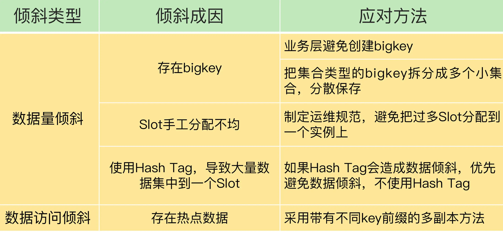

### 数据倾斜
- 数据量倾斜：在某些情况下，实例上的数据分布不均衡，某个实例上的数据特别多。
- 数据访问倾斜：虽然每个集群实例上的数据量相差不大，但是某个实例上的数据是热点数据，被访问得非常频繁。

如果发生了数据倾斜，那么保存了大量数据，或者是保存了热点数据的实例的处理压力就会增大，速度变慢，甚至还可能会引起这个实例的内存资源耗尽，从而崩溃。这在应用切片集群时要避免的。

### 数据量倾斜的成因和应对方法

#### bigKey 导致倾斜

第一个原因是，某个实例上正好保存了 `bigkey`。`bigkey` 的 `value` 值很大（`String` 类型），或者是 `bigkey` 保存了大量集合元素（集合类型），会导致这个实例的数据量增加，内存资源消耗也相应增加。

而且，`bigkey` 的操作一般都会造成实例 `IO` 线程阻塞，如果 `bigkey` 的访问量比较大，就会影响到这个实例上的其它请求被处理的速度。

为了避免 `bigkey` 造成的数据倾斜，一个根本的应对方法是，在业务层生成数据时，要尽量避免把过多的数据保存在同一个键值对中。

如果 `bigkey` 正好是集合类型，还有一个方法，就是把 `bigkey` 拆分成很多个小的集合类型数据，分散保存在不同的实例上。例如：按用户 `ID` 范围区分多到多个集合 `Key`。

#### Slot 分配不均衡导致倾斜

`Redis Cluster` 一共有 `16384` 个 `Slot`，假设集群一共有 `5` 个实例，其中，实例 `1` 的硬件配置较高，运维人员在给实例分配 `Slot` 时，就可能会给实例 `1` 多分配些 `Slot`，把实例 `1` 的资源充分利用起来。

但是，我们其实并不知道数据和 `Slot` 的对应关系，这种做法就可能会导致大量数据正好被映射到实例 `1` 上的 `Slot`，造成数据倾斜，给实例 `1` 带来访问压力。

为了应对这个问题，我们可以通过运维规范，在分配之前，我们就要避免把过多的 `Slot` 分配到同一个实例。如果是已经分配好 `Slot` 的集群，我们可以先查看 `Slot` 和实例的具体分配关系，从而判断是否有过多的 `Slot` 集中到了同一个实例。如果有的话，就将部分 `Slot` 迁移到其它实例，从而避免数据倾斜。

`Redis Cluster`，用 `CLUSTER SLOTS` 命令查看 `Slot` 分配情况。还可以使用 `3` 个命令完成 `Slot` 迁移，`CLUSTER SETSLOT`，`CLUSTER GETKEYSINSLOT`，`MIGRATE`。

#### Hash Tag 导致倾斜

`Hash Tag` 是指加在键值对 `key` 中的一对花括号 `{}`。这对括号会把 `key` 的一部分括起来，客户端在计算 `key` 的 `CRC16` 值时，只对 `Hash Tag` 花括号中的 `key` 内容进行计算。如果没用 `Hash Tag` 的话，客户端计算整个 `key` 的 `CRC16` 的值。

举个例子，假设 `key` 是 `user:profile:3231`，我们把其中的 `3231` 作为 `Hash Tag`，此时，`key` 就变成了 `user:profile:{3231}`。当客户端计算这个 `key` 的 `CRC16` 值时，就只会计算 `3231` 的 `CRC16` 值。否则，客户端会计算整个“`user:profile:3231`”的 `CRC16` 值。

使用 `Hash Tag` 的好处是，如果不同 `key` 的 `Hash Tag` 内容都是一样的，那么，这些 `key` 对应的数据会被映射到同一个 `Slot` 中，同时会被分配到同一个实例上。

使用 `Hash Tag` 把要执行事务操作或是范围查询的数据映射到同一个实例上，这样就能很轻松地实现事务或范围查询了。使用 `Hash Tag` 的潜在问题，就是大量的数据可能被集中到一个实例上，导致数据倾斜，集群中的负载不均衡。

建议，如果使用 `Hash Tag` 进行切片的数据会带来较大的访问压力，就优先考虑避免数据倾斜，最好不要使用 `Hash Tag` 进行数据切片。因为事务和范围查询都还可以放在客户端来执行，而数据倾斜会导致实例不稳定，造成服务不可用。

### 数据访问倾斜的成因和应对方法

发生数据访问倾斜的根本原因，就是实例上存在热点数据（比如新闻应用中的热点新闻内容、电商促销活动中的热门商品信息，等等）。

一旦热点数据被存在了某个实例中，那么，这个实例的请求访问量就会远高于其它实例，面临巨大的访问压力。

和数据量倾斜不同，热点数据通常是一个或几个数据，所以，直接重新分配 `Slot` 并不能解决热点数据的问题。

通常来说，热点数据以服务读操作为主，在这种情况下，可以采用`热点数据多副本`的方法来应对。

这个方法的具体做法是，我们把热点数据复制多份，在每一个数据副本的 `key` 中增加一个随机前缀，让它和其它副本数据不会被映射到同一个 `Slot` 中。这样一来，热点数据既有多个副本可以同时服务请求，同时，这些副本数据的 `key` 又不一样，会被映射到不同的 `Slot` 中。在给这些 `Slot` 分配实例时，我们也要注意把它们分配到不同的实例上，那么，热点数据的访问压力就被分散到不同的实例上了。

这里，有个地方需要注意下，热点数据多副本方法只能针对只读的热点数据。如果热点数据是有读有写的话，就不适合采用多副本方法了，因为要保证多副本间的数据一致性，会带来额外的开销。

对于有读有写的热点数据，我们就要给实例本身增加资源了，例如使用配置更高的机器，来应对大量的访问压力。

### 总结

造成数据量倾斜的原因主要有三个：
- 数据中有 `bigkey`，导致某个实例的数据量增加；
- `Slot` 手工分配不均，导致某个或某些实例上有大量数据；
- 使用了 `Hash Tag`，导致数据集中到某些实例上。

数据访问倾斜的主要原因就是有热点数据存在，导致大量访问请求集中到了热点数据所在的实例上。

为了应对数据倾斜问题的四个方法：

关于集群的实例资源配置，建议：在构建切片集群时，尽量使用大小配置相同的实例（例如实例内存配置保持相同），这样可以避免因实例资源不均衡而在不同实例上分配不同数量的 `Slot`。