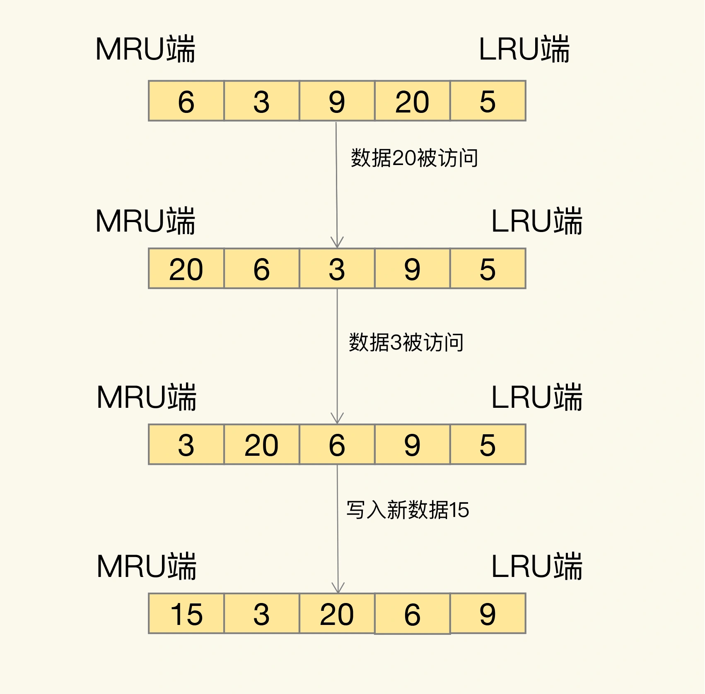

### 缓存的特征

计算机三层存储结构的容量及存储性能

从图上可以看到，`CPU`、内存和磁盘这三层的访问速度从几十 `ns` 到 `100ns`，再到几 `ms`，性能的差异很大。

计算机系统中，默认有两种缓存：
- `CPU` 里面的末级缓存，即 `LLC`，用来缓存内存中的数据，避免每次从内存中存取数据；
- 内存中的高速页缓存，即 `page cache`，用来缓存磁盘中的数据，避免每次从磁盘中存取数据。

跟内存相比，`LLC` 的访问速度更快，而跟磁盘相比，内存的访问是更快的。所以，我们可以看出来缓存的第一个特征：在一个层次化的系统中，缓存一定是一个快速子系统，数据存在缓存中时，能避免每次从慢速子系统中存取数据。对应到互联网应用来说，`Redis` 就是快速子系统，而数据库就是慢速子系统了。

`LLC` 的大小是 `MB` 级别，`page cache` 的大小是 `GB` 级别，而磁盘的大小是 `TB` 级别。

### Redis 缓存处理请求的两种情况
- 缓存命中
- 缓存缺失

### Redis 作为旁路缓存的使用操作

使用 `Redis` 缓存时，具体来说，需要在应用程序中增加三方面的代码：
- 当应用程序需要读取数据时，需要在代码中显式调用 `Redis` 的 `GET` 操作接口，进行查询；
- 如果缓存缺失了，应用程序需要再和数据库连接，从数据库中读取数据；
- 当缓存中的数据需要更新时，我们也需要在应用程序中显式地调用 `SET` 操作接口，把更新的数据写入缓存。

### 缓存的类型

按照 `Redis` 缓存是否接受写请求，可以把它分成只读缓存和读写缓存。

#### 只读缓存

只读缓存直接在数据库中更新数据的好处是，所有最新的数据都在数据库中，而数据库是提供数据可靠性保障的，这些数据不会有丢失的风险。

#### 读写缓存

关于是选择只读缓存，还是读写缓存，主要看我们对写请求是否有加速的需求。
- 如果需要对写请求进行加速，选择读写缓存；
- 如果写请求很少，或者是只需要提升读请求的响应速度的话，选择只读缓存。

### Redis 缓存淘汰策略

`Redis 4.0` 之前一共实现了 `6` 种内存淘汰策略，在 `4.0` 之后，又增加了 `2` 种策略。

按数据淘汰可以把它们分成两类：
- 不进行数据淘汰的策略，只有 `noeviction` 这一种。
- 会进行淘汰的 `7` 种其他策略。

会进行淘汰的 `7` 种策略，可以分成两类：
- 在设置了过期时间的数据中进行淘汰，包括 `volatile-random`、`volatile-ttl`、`volatile-lru`、`volatile-lfu` 四种。
- 在所有数据范围内进行淘汰，包括 `allkeys-lru`、`allkeys-random`、`allkeys-lfu` 三种。

- `volatile-ttl` 在筛选时，会针对设置了过期时间的键值对，根据过期时间的先后进行删除，越早过期的越先被删除。
- `volatile-random` 就像它的名称一样，在设置了过期时间的键值对中，进行随机删除。
- `volatile-lru` 会使用 `LRU` 算法筛选设置了过期时间的键值对。
- `volatile-lfu` 会使用 `LFU` 算法选择设置了过期时间的键值对。
- `allkeys-random` 策略，从所有键值对中随机选择并删除数据；
- `allkeys-lru` 策略，使用 `LRU` 算法在所有数据中进行筛选。
- `allkeys-lfu` 策略，使用 `LFU` 算法在所有数据中进行筛选。

在 `redis3.0` 之前，默认是 `volatile-lru`；在 `redis3.0` 之后（包括 `3.0`），默认淘汰策略则是 `noeviction`。

`LRU` 算法的全称是 `Least Recently Used`，从名字上就可以看出，这是按照最近最少使用的原则来筛选数据，最不常用的数据会被筛选出来，而最近频繁使用的数据会留在缓存中。

`LRU` 会把所有的数据组织成一个链表，链表的头和尾分别表示 `MRU` 端和 `LRU` 端，分别代表最近最常使用的数据和最近最不常用的数据。

现在有数据 `6、3、9、20、5`。如果数据 `20` 和 `3` 被先后访问，它们都会从现有的链表位置移到 `MRU` 端，而链表中在它们之前的数据则相应地往后移一位。因为，`LRU` 算法选择删除数据时，都是从 `LRU` 端开始，所以把刚刚被访问的数据移到 `MRU` 端，就可以让它们尽可能地留在缓存中。

`LRU` 算法背后的想法非常朴素：它认为刚刚被访问的数据，肯定还会被再次访问，所以就把它放在 `MRU` 端；长久不访问的数据，肯定就不会再被访问了，所以就让它逐渐后移到 `LRU` 端，在缓存满时，就优先删除它。

`LRU` 算法在实际实现时，需要用链表管理所有的缓存数据，这会带来额外的空间开销。在 `Redis` 中，`LRU` 算法被做了简化，以减轻数据淘汰对缓存性能的影响。具体来说，`Redis` 默认会记录每个数据的最近一次访问的时间戳（由键值对数据结构 `RedisObject` 中的 `lru` 字段记录）。然后，`Redis` 在决定淘汰的数据时，第一次会随机选出 `N` 个数据，把它们作为一个候选集合。接下来，`Redis` 会比较这 `N` 个数据的 `lru` 字段，把 `lru` 字段值最小的数据从缓存中淘汰出去。

`Redis` 提供了一个配置参数 `maxmemory-samples`，这个参数就是 `Redis` 选出的数据个数 `N`。 例：`
CONFIG SET maxmemory-samples 100`

这样一来，`Redis` 缓存不用为所有的数据维护一个大链表，也不用在每次数据访问时都移动链表项，提升了缓存的性能。

#### 淘汰策略使用建议
- 优先使用 `allkeys-lru` 策略。这样，可以充分利用 `LRU` 这一经典缓存算法的优势，把最近最常访问的数据留在缓存中，提升应用的访问性能。如果业务数据中有明显的冷热数据区分，建议使用 `allkeys-lru` 策略。
- 如果业务应用中的数据访问频率相差不大，没有明显的冷热数据区分，建议使用 `allkeys-random` 策略，随机选择淘汰的数据就行。
- 如果业务中有置顶的需求，比如置顶新闻、置顶视频，那么，可以使用 `volatile-lru` 策略，同时不给这些置顶数据设置过期时间。这样一来，这些需要置顶的数据一直不会被删除，而其他数据会在过期时根据 `LRU` 规则进行筛选。