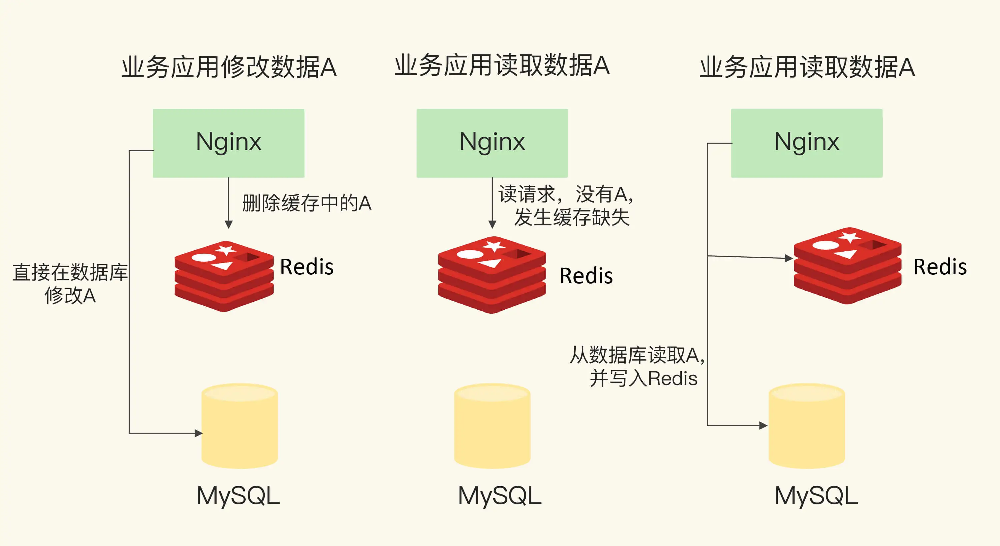

### 缓存的特征

计算机三层存储结构的容量及存储性能

从图上可以看到，`CPU`、内存和磁盘这三层的访问速度从几十 `ns` 到 `100ns`，再到几 `ms`，性能的差异很大。

计算机系统中，默认有两种缓存：
- `CPU` 里面的末级缓存，即 `LLC`，用来缓存内存中的数据，避免每次从内存中存取数据；
- 内存中的高速页缓存，即 `page cache`，用来缓存磁盘中的数据，避免每次从磁盘中存取数据。

跟内存相比，`LLC` 的访问速度更快，而跟磁盘相比，内存的访问是更快的。所以，我们可以看出来缓存的第一个特征：在一个层次化的系统中，缓存一定是一个快速子系统，数据存在缓存中时，能避免每次从慢速子系统中存取数据。对应到互联网应用来说，`Redis` 就是快速子系统，而数据库就是慢速子系统了。

`LLC` 的大小是 `MB` 级别，`page cache` 的大小是 `GB` 级别，而磁盘的大小是 `TB` 级别。

### Redis 缓存处理请求的两种情况
- 缓存命中
- 缓存缺失

### Redis 作为旁路缓存的使用操作

使用 `Redis` 缓存时，具体来说，需要在应用程序中增加三方面的代码：
- 当应用程序需要读取数据时，需要在代码中显式调用 `Redis` 的 `GET` 操作接口，进行查询；
- 如果缓存缺失了，应用程序需要再和数据库连接，从数据库中读取数据；
- 当缓存中的数据需要更新时，我们也需要在应用程序中显式地调用 `SET` 操作接口，把更新的数据写入缓存。

### 缓存的类型

按照 `Redis` 缓存是否接受写请求，可以把它分成只读缓存和读写缓存。

#### 只读缓存

只读缓存直接在数据库中更新数据的好处是，所有最新的数据都在数据库中，而数据库是提供数据可靠性保障的，这些数据不会有丢失的风险。

#### 读写缓存

关于是选择只读缓存，还是读写缓存，主要看我们对写请求是否有加速的需求。
- 如果需要对写请求进行加速，选择读写缓存；
- 如果写请求很少，或者是只需要提升读请求的响应速度的话，选择只读缓存。

### Redis 缓存淘汰策略

`Redis 4.0` 之前一共实现了 `6` 种内存淘汰策略，在 `4.0` 之后，又增加了 `2` 种策略。

按数据淘汰可以把它们分成两类：
- 不进行数据淘汰的策略，只有 `noeviction` 这一种。
- 会进行淘汰的 `7` 种其他策略。

会进行淘汰的 `7` 种策略，可以分成两类：
- 在设置了过期时间的数据中进行淘汰，包括 `volatile-random`、`volatile-ttl`、`volatile-lru`、`volatile-lfu` 四种。
- 在所有数据范围内进行淘汰，包括 `allkeys-lru`、`allkeys-random`、`allkeys-lfu` 三种。

