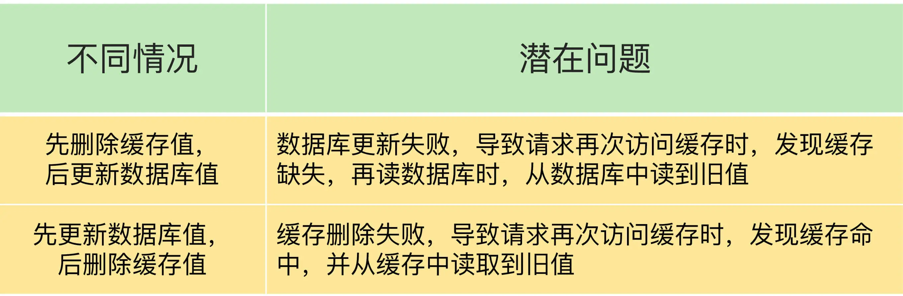

### Redis 数据不一致问题

#### 如何解决数据不一致问题？

重试机制。

具体来说，可以把要删除的缓存值或者是要更新的数据库值暂存到消息队列中（例如使用 `Kafka` 消息队列）。当应用没有能够成功地删除缓存值或者是更新数据库值时，可以从消息队列中重新读取这些值，然后再次进行删除或更新。

如果能够成功地删除或更新，我们就要把这些值从消息队列中去除，以免重复操作，此时，我们也可以保证数据库和缓存的数据一致了。否则的话，我们还需要再次进行重试。如果重试超过的一定次数，还是没有成功，我们就需要向业务层发送报错信息了。

#### 缓存不一致两个解决方案

- 删除缓存值或更新数据库失败而导致数据不一致，你可以使用重试机制确保删除或更新操作成功。

- 在删除缓存值、更新数据库的这两步操作中，有其他线程的并发读操作，导致其他线程读取到旧值，应对方案是延迟双删。

针对只读缓存来说，我们既可以先删除缓存值再更新数据库，也可以先更新数据库再删除缓存。建议是，优先使用先更新数据库再删除缓存的方法，原因主要有两个：

- 先删除缓存值再更新数据库，有可能导致请求因缓存缺失而访问数据库，给数据库带来压力；
- 如果业务应用中读取数据库和写缓存的时间不好估算，那么，延迟双删中的等待时间就不好设置。

不过，当使用先更新数据库再删除缓存时，也有个地方需要注意，如果业务层要求必须读取一致的数据，那么，我们就需要在更新数据库时，先在 `Redis` 缓存客户端暂存并发读请求，等数据库更新完、缓存值删除后，再读取数据，从而保证数据一致性。

### 缓存雪崩、击穿、穿透

#### 缓存雪崩

缓存雪崩是指大量的应用请求无法在 `Redis` 缓存中进行处理，紧接着，应用将大量请求发送到数据库层，导致数据库层的压力激增。

##### 缓存雪崩一般是由两个原因导致
第一个原因：缓存中有大量数据同时过期，导致大量请求无法得到处理，应用就会把请求发送给数据库，从数据库中读取数据，造成数据库压力增大，影响其它正常业务处理。

针对大量数据同时失效带来的缓存雪崩问题，提供两种解决方案。

- 避免给大量的数据设置相同的过期时间，给这些数据的过期时间增加一个较小的随机数。
- 服务降级，指发生缓存雪崩时，针对不同的数据采取不同的处理方式。
  - 当业务应用访问的是非核心数据（例如电商商品属性）时，暂时停止从缓存中查询这些数据，而是直接返回预定义信息、空值或是错误信息；
  - 当业务应用访问的是核心数据（例如电商商品库存）时，仍然允许查询缓存，如果缓存缺失，也可以继续通过数据库读取。

第二个原因：`Redis` 缓存实例发生故障宕机了，无法处理请求，这就会导致大量请求一下子积压到数据库层，从而发生缓存雪崩。

针对 `Redis` 实例宕机的缓存雪崩问题，提供两种建议。

- 第一个建议，在业务系统中实现服务熔断或请求限流机制。
  - 所谓的服务熔断，是指在发生缓存雪崩时，为了防止引发连锁的数据库雪崩，甚至是整个系统的崩溃，我们暂停业务应用对缓存系统的接口访问。再具体点说，就是业务应用调用缓存接口时，缓存客户端并不把请求发给 `Redis` 缓存实例，而是直接返回，等到 `Redis` 缓存实例重新恢复服务后，再允许应用请求发送到缓存系统。避免了大量请求因缓存缺失，而积压到数据库系统，保证了数据库系统的正常运行。

  - 服务熔断虽然可以保证数据库的正常运行，但是暂停了整个缓存系统的访问，对业务应用的影响范围大。为了尽可能减少这种影响，我们也可以进行请求限流。这里说的请求限流，就是指，我们在业务系统的请求入口前端控制每秒进入系统的请求数，避免过多的请求被发送到数据库。

  - 使用服务熔断或是请求限流机制，是在雪崩后，来降低雪崩对数据库和整个业务系统的影响。

- 第二个建议，事前预防。
  - 通过主从节点的方式构建 `Redis` 缓存高可靠集群。如果 `Redis` 缓存的主节点故障宕机了，从节点还可以切换成为主节点，继续提供缓存服务，避免了由于缓存实例宕机而导致的缓存雪崩问题。

#### 缓存击穿

缓存击穿是指，针对某个访问非常频繁的热点数据的请求，无法在缓存中进行处理，紧接着，访问该数据的大量请求，一下子都发送到了后端数据库，导致了数据库压力激增，会影响数据库处理其他请求。

为了避免缓存击穿给数据库带来的激增压力，解决方法也比较直接，对于访问特别频繁的热点数据，就不设置过期时间了。

#### 缓存穿透

缓存穿透是指要访问的数据既不在 `Redis` 缓存中，也不在数据库中，导致请求在访问缓存时，发生缓存缺失，再去访问数据库时，发现数据库中也没有要访问的数据。

##### 缓存穿透发生的两种情况
- 业务层误操作：缓存中的数据和数据库中的数据被误删除了，所以缓存和数据库中都没有数据；
- 恶意攻击：专门访问数据库中没有的数据。

##### 缓存穿透三种应对方案

第一种方案是，缓存空值或缺省值。业务从 `Redis` 读取空值或缺省值，避免了把大量请求发送给数据库处理，保持了数据库的正常运行。

第二种方案是，使用布隆过滤器快速判断数据是否存在，避免从数据库中查询数据是否存在，减轻数据库压力。

第三种方案，在请求入口的前端进行请求检测。一个有效的应对方案是在请求入口前端，对业务系统接收到的请求进行合法性检测，把恶意的请直接过滤掉，不让它们访问后端缓存和数据库。这样一来，也就不会出现缓存穿透问题了。

#### 三种异常汇总

针对异常情况，三种预防式方案：
- 针对缓存雪崩，合理地设置数据过期时间，以及搭建高可靠缓存集群；
- 针对缓存击穿，在缓存访问非常频繁的热点数据时，不要设置过期时间；
- 针对缓存穿透，提前在入口前端实现恶意请求检测，或者规范数据库的数据删除操作，避免误删除。