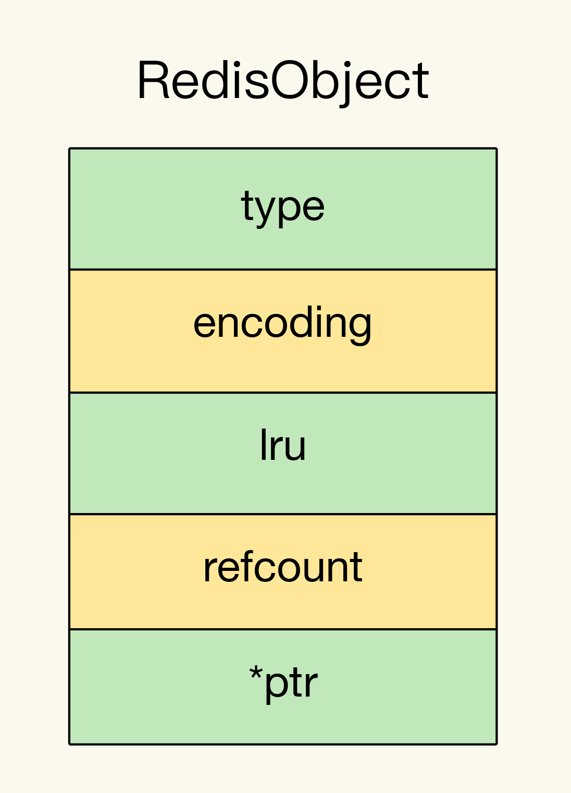

`Redis` 的基本对象结构 `RedisObject`，因为 `Redis` 键值对中的每一个值都是用 `RedisObject` 保存的。

`RedisObject` 包括元数据和指针。其中，元数据的一个功能就是用来区分不同的数据类型，指针用来指向具体的数据类型的值。所以，要想开发新数据类型，要先来了解下 `RedisObject` 的元数据和指针。

### Redis 的基本对象结构

`RedisObject` 的内部组成包括了 `type`、`encoding`、`lru` 和 `refcount` `4` 个元数据，以及 `1` 个 `*ptr` 指针。

- `type`：表示值的类型，涵盖了五大基本类型；
- `encoding`：是值的编码方式，用来表示 `Redis` 中实现各个基本类型的底层数据结构，例如 `SDS`、`压缩列表`、`哈希表`、`跳表`等；
- `lru`：记录了这个对象最后一次被访问的时间，用于淘汰过期的键值对；
- `refcount`：记录了对象的引用计数；
- `*ptr`：是指向数据的指针。

`RedisObject` 结构借助 `*ptr` 指针，就可以指向不同的数据类型，例如，`*ptr` 指向一个 `SDS` 或一个跳表，就表示键值对中的值是 `String` 类型或 `Sorted Set` 类型。所以，在定义了新的数据类型后，也只要在 `RedisObject` 中设置好新类型的 `type` 和 `encoding`，再用 `*ptr` 指向新类型的实现，就行了。

### 开发一个新的数据类型

首先，我们需要为新数据类型定义好它的底层结构、type 和 encoding 属性值，然后再实现新数据类型的创建、释放函数和基本命令。

开发一个名字叫作 `NewTypeObject` 的新数据类型为例，来解释下具体的 `4` 个操作步骤。

TODO
阅读源码后再来。