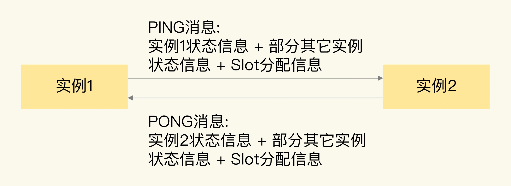

### 通信开销：限制Redis Cluster规模的关键因素

`Redis Cluster` 能保存的数据量以及支撑的吞吐量，跟集群的实例规模密切相关。`Redis` 官方给出了 `Redis Cluster` 的规模上限，就是一个集群运行 `1000` 个实例。

为什么要限定集群规模呢？其实，这里的一个关键因素就是，实例间的通信开销会随着实例规模增加而增大，在集群超过一定规模时（比如 `800` 节点），集群吞吐量反而会下降。所以，集群的实际规模会受到限制。

#### 实例通信方法和对集群规模的影响

`Redis Cluster` 在运行时，每个实例上都会保存 `Slot` 和实例的对应关系（也就是 `Slot` 映射表），以及自身的状态信息。

为了让集群中的每个实例都知道其它所有实例的状态信息，实例之间会按照一定的规则进行通信。这个规则就是 `Gossip` 协议。

`Gossip` 协议的工作原理可以概括成两点:
- 一是，每个实例之间会按照一定的频率，从集群中随机挑选一些实例，把 `PING` 消息发送给挑选出来的实例，用来检测这些实例是否在线，并交换彼此的状态信息。`PING` 消息中封装了发送消息的实例自身的状态信息、部分其它实例的状态信息，以及 `Slot` 映射表。
- 二是，一个实例在接收到 `PING` 消息后，会给发送 `PING` 消息的实例，发送一个 `PONG` 消息。`PONG` 消息包含的内容和 `PING` 消息一样。



`Gossip` 协议可以保证在一段时间后，集群中的每一个实例都能获得其它所有实例的状态信息。

这样一来，即使有新节点加入、节点故障、`Slot` 变更等事件发生，实例间也可以通过 `PING`、`PONG` 消息的传递，完成集群状态在每个实例上的同步。

实例间使用 `Gossip` 协议进行通信时，通信开销受到`通信消息大小`和`通信频率`这两方面的影响，消息越大、频率越高，相应的通信开销也就越大。

### Gossip 消息大小

`Redis` 实例发送的 `PING` 消息的消息体是由 `clusterMsgDataGossip` 结构体组成的，这个结构体的定义如下所示：
```
typedef struct {
    char nodename[CLUSTER_NAMELEN];  //40字节
    uint32_t ping_sent; //4字节
    uint32_t pong_received; //4字节
    char ip[NET_IP_STR_LEN]; //46字节
    uint16_t port;  //2字节
    uint16_t cport;  //2字节
    uint16_t flags;  //2字节
    uint32_t notused1; //4字节
} clusterMsgDataGossip;

其中，CLUSTER_NAMELEN 和 NET_IP_STR_LEN 的值分别是 40 和 46，分别表示，nodename 和 ip 这两个字节数组的长度是 40 字节和 46 字节，我们再把结构体中其它信息的大小加起来，就可以得到一个 Gossip 消息的大小了，即 104 字节。

每个实例在发送一个 Gossip 消息时，除了会传递自身的状态信息，默认还会传递集群十分之一实例的状态信息。

所以，对于一个包含了 1000 个实例的集群来说，每个实例发送一个 PING 消息时，会包含 100 个实例的状态信息，总的数据量是 10400 字节，再加上发送实例自身的信息，一个 Gossip 消息大约是 10KB。

此外，为了让 Slot 映射表能够在不同实例间传播，PING 消息中还带有一个长度为 16,384 bit 的 Bitmap，这个 Bitmap 的每一位对应了一个 Slot，如果某一位为 1，就表示这个 Slot 属于当前实例。这个 Bitmap 大小换算成字节后，是 2KB。我们把实例状态信息和 Slot 分配信息相加，就可以得到一个 PING 消息的大小了，大约是 12KB。

PONG 消息和 PING 消息的内容一样，所以，它的大小大约是 12KB。每个实例发送了 PING 消息后，还会收到返回的 PONG 消息，两个消息加起来有 24KB。

虽然从绝对值上来看，24KB 并不算很大，但是，如果实例正常处理的单个请求只有几 KB 的话，那么，实例为了维护集群状态一致传输的 PING/PONG 消息，就要比单个业务请求大了。而且，每个实例都会给其它实例发送 PING/PONG 消息。随着集群规模增加，这些心跳消息的数量也会越多，会占据一部分集群的网络通信带宽，进而会降低集群服务正常客户端请求的吞吐量。

除了心跳消息大小会影响到通信开销，如果实例间通信非常频繁，也会导致集群网络带宽被频繁占用。
```

#### 实例间通信频率

`Redis Cluster` 的实例启动后，默认会每秒从本地的实例列表中随机选出 `5` 个实例，再从这 `5` 个实例中找出一个最久没有通信的实例，把 `PING` 消息发送给该实例。这是实例周期性发送 `PING` 消息的基本做法。

但是，这里有一个问题：实例选出来的这个最久没有通信的实例，毕竟是从随机选出的 `5` 个实例中挑选的，这并不能保证这个实例就一定是整个集群中最久没有通信的实例。

所以，这有可能会出现，有些实例一直没有被发送 `PING` 消息，导致它们维护的集群状态已经过期了。为了避免这种情况，`Redis Cluster` 的实例会按照每 `100ms` 一次的频率，扫描本地的实例列表，如果发现有实例最近一次接收 `PONG` 消息的时间，已经大于配置项 `cluster-node-timeout` 的一半了（`cluster-node-timeout/2`），就会立刻给该实例发送 PING 消息，更新这个实例上的集群状态信息。

当集群规模扩大之后，因为网络拥塞或是不同服务器间的流量竞争，会导致实例间的网络通信延迟增加。如果有部分实例无法收到其它实例发送的 `PONG` 消息，就会引起实例之间频繁地发送 PING 消息，这又会对集群网络通信带来额外的开销了。

单实例每秒会发送的 `PING` 消息数量，如下所示：

`PING 消息发送数量 = 1 + 10 * 实例数（最近一次接收 PONG 消息的时间超出 cluster-node-timeout/2）`

其中，`1` 是指单实例常规按照每 `1` 秒发送一个 `PING` 消息，`10` 是指每 `1` 秒内实例会执行 `10` 次检查，每次检查后会给 `PONG` 消息超时的实例发送消息。


#### 如何降低实例间的通信开销

为了降低实例间的通信开销，从原理上说，我们可以减小实例传输的消息大小（`PING/PONG` 消息、`Slot` 分配信息），但是，因为集群实例依赖 `PING`、`PONG` 消息和 `Slot` 分配信息，来维持集群状态的统一，一旦减小了传递的消息大小，就会导致实例间的通信信息减少，不利于集群维护，所以，我们不能采用这种方式。

方法只有一个，更改 `cluster-node-timeout` 配置。

配置项 `cluster-node-timeout` 定义了集群实例被判断为故障的心跳超时时间，默认是 15 秒。如果 `cluster-node-timeout `值比较小，那么，在大规模集群中，就会比较频繁地出现 `PONG` 消息接收超时的情况，从而导致实例每秒要执行 `10` 次“给 `PONG` 消息超时的实例发送 `PING` 消息”这个操作。

所以，为了避免过多的心跳消息挤占集群带宽，我们可以调大 `cluster-node-timeout` 值，比如说调大到 `20` 秒或 `25` 秒。这样一来， `PONG` 消息接收超时的情况就会有所缓解，单实例也不用频繁地每秒执行 `10` 次心跳发送操作了。

当然，我们也不要把 `cluster-node-timeout` 调得太大，否则，如果实例真的发生了故障，我们就需要等待 `cluster-node-timeout` 时长后，才能检测出这个故障，这又会导致实际的故障恢复时间被延长，会影响到集群服务的正常使用。

建议，虽然我们可以通过调整 `cluster-node-timeout` 配置项减少心跳消息的占用带宽情况，但是，在实际应用中，如果不是特别需要大容量集群，我建议你把 `Redis Cluster` 的规模控制在 `400~500` 个实例。