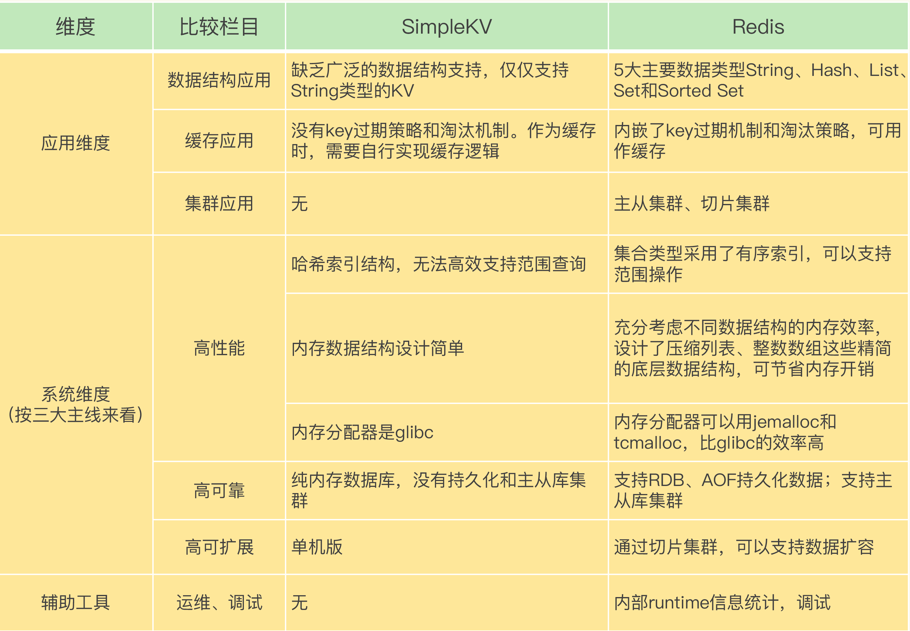
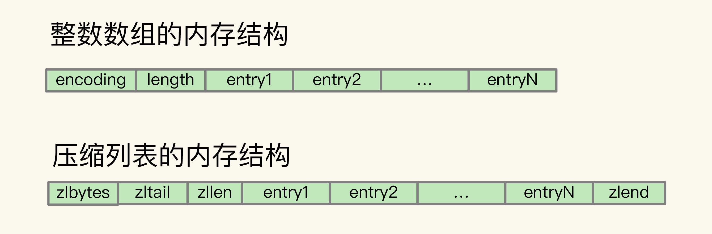

#### 1. 和跟 Redis 相比，SimpleKV 还缺少什么？

#### 2. Memcached 相比 Redis 唯一还能算优势的地方
- 支持多线程，可扩展
- 可通过增加 `CPU` 数量，提升 `Memcached` 性能
- 在 `key` 的 `value` 较大的场景中，性能优势较明显。

#### 3. Redis 为什么快？
- 内存数据库，所有操作都在内存上完成，内存的访问速度本身就很快
- 数据结构，键值对是按一定的数据结构来组织的，操作键值对最终就是对数据结构进行增删改查操作，所以高效的数据结构是 `Redis` 快速处理数据的基础
- 采用了多路复用机制，使其在网络 `IO` 操作中能并发处理大量的客户端请求，实现高吞吐率

#### 4. 整数数组和压缩列表作为底层数据结构的优势是什么？

整数数组和压缩列表的设计，充分体现了 `Redis` “又快又省”特点中的“省”，也就是节省内存空间。整数数组和压缩列表都是在内存中分配一块地址连续的空间，然后把集合中的元素一个接一个地放在这块空间内，非常紧凑。因为元素是挨个连续放置的，我们不用再通过额外的指针把元素串接起来，这就避免了额外指针带来的空间开销

`Redis` 之所以采用不同的数据结构，其实是在性能和内存使用效率之间进行的平衡。

#### 5. Redis 基本 IO 模型中除了使用多路复用机制外还有哪些潜在的性能瓶颈？

在 `Redis` 基本 `IO` 模型中，主要是主线程在执行操作，任何耗时的操作，例如 `bigkey`、全量返回等操作，都是潜在的性能瓶颈。

#### 6. AOF 重写过程中有没有其他潜在的阻塞风险？

风险一：`Redis` 主线程 `fork` 创建 `bgrewriteaof` 子进程时，内核需要创建用于管理子进程的相关数据结构，这些数据结构在操作系统中通常叫作进程控制块（`Process Control Block，简称为 PCB`）。内核要把主线程的 `PCB` 内容拷贝给子进程。这个创建和拷贝过程由内核执行，是会阻塞主线程的。而且，在拷贝过程中，子进程要拷贝父进程的页表，这个过程的耗时和 `Redis` 实例的内存大小有关。如果 `Redis` 实例内存大，页表就会大，`fork` 执行时间就会长，这就会给主线程带来阻塞风险。

风险二：`bgrewriteaof` 子进程会和主线程共享内存。当主线程收到新写或修改的操作时，主线程会申请新的内存空间，用来保存新写或修改的数据，如果操作的是 `bigkey`，也就是数据量大的集合类型数据，那么，主线程会因为申请大空间而面临阻塞风险。因为操作系统在分配内存空间时，有查找和锁的开销，这就会导致阻塞。

#### AOF 重写为什么不共享使用 AOF 本身的日志？

如果都用 `AOF` 日志的话，主线程要写，`bgrewriteaof` 子进程也要写，这两者会竞争文件系统的锁，这就会对 `Redis` 主线程的性能造成影响。

#### 为什么主从库间的复制不使用 AOF？

- `RDB` 文件是二进制文件，无论是要把 `RDB` 写入磁盘，还是要通过网络传输 `RDB`，`IO` 效率都比记录和传输 `AOF` 的高。
- 在从库端进行恢复时，用 `RDB` 的恢复效率要高于用 `AOF`