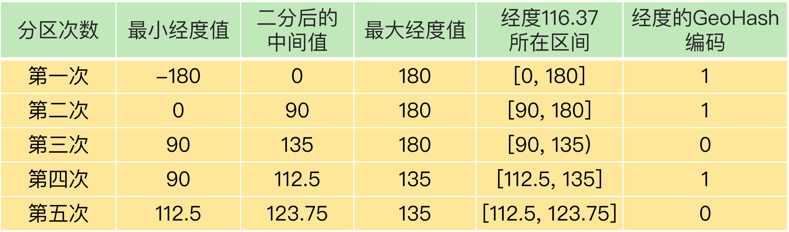

### Redis 常见的四种统计模式
- 聚合统计
- 排序统计
- 二值状态统计
- 基数统计

#### 聚合统计

场景：统计新增用户数和留存用户数

所谓的聚合统计，就是指统计多个集合元素的聚合结果，包括：统计多个集合的共有元素（交集统计）；把两个集合相比，统计其中一个集合独有的元素（差集统计）；统计多个集合的所有元素（并集统计）。

```
SET 并集
SUNIONSTORE  user:id  user:id  user:id:20200803 

SET 差集
SDIFFSTORE  user:new  user:id:20200804 user:id  

SET 交集
SINTERSTORE user:id:rem user:id:20200803 user:id:20200804

Set 的差集、并集和交集的计算复杂度较高，在数据量较大的情况下，如果直接执行这些计算，会导致 Redis 实例阻塞。
小建议：可以从主从集群中选择一个从库，让它专门负责聚合计算，或者是把数据读取到客户端，在客户端来完成聚合统计，这样就可以规避阻塞主库实例和其他从库实例的风险了。
```

#### 排序统计

场景：最新评论列表

集合中的元素可以按序排列，这种对元素保序的集合类型叫作有序集合。

在 `Redis` 常用的 `4` 个集合类型中（`List、Hash、Set、Sorted Set`），`List` 和 `Sorted Set` 就属于有序集合。

`List` 是按照元素进入 `List` 的顺序进行排序的，而 `Sorted Set` 可以根据元素的权重来排序。

`List` 使用的插入的位置来获取排序，`Sorted Set` 根据元素的实际权重来排序和获取数据的。在面对需要展示最新列表、排行榜等场景时，如果数据更新频繁或者需要分页显示，建议你优先考虑使用 `Sorted Set`。

```
// 获取 product1 这个列表 3 到 5 位置的数据，如果此时发生插入或减少新数据，一旦分页获取数据就会有问题
LRANGE product1 3 5

// 假设有序集合 comments，越新的评论权重越大，目前最新评论的权重是 N，我们执行下面的命令时，就可以获得最新的 10 条评论：
ZRANGEBYSCORE comments N-9 N
```

#### 二值状态统计

场景：用户签到数

二值状态统计：这里的二值状态就是指集合元素的取值就只有 `0` 和 `1` 两种。在签到打卡的场景中，只用记录 `签到（1）或未签到（0）`，所以它就是非常典型的二值状态。

在签到统计时，每个用户一天的签到用 `1` 个 `bit` 位就能表示，一个月（假设是 `31` 天）的签到情况用 `31` 个 `bit` 位就可以，而一年的签到也只需要用 `365` 个 `bit` 位，根本不用太复杂的集合类型。这个时候，就可以选择 `Redis` 提供的扩展数据类型 `Bitmap`。

`Bitmap` 本身是用 `String` 类型作为底层数据结构实现的一种统计二值状态的数据类型。`String` 类型是会保存为二进制的字节数组，所以，`Redis` 就把字节数组的每个 `bit` 位利用起来，用来表示一个元素的二值状态。可以把 `Bitmap` 看作是一个 `bit` 数组。

`Bitmap` 提供了 `GETBIT/SETBIT` 操作，使用一个偏移值 `offset` 对 `bit` 数组的某一个 `bit` 位进行读和写。不过，需要注意的是，`Bitmap` 的偏移量是从 `0` 开始算的，也就是说 `offset` 的最小值是 `0`。当使用 `SETBIT` 对一个 `bit` 位进行写操作时，这个 `bit` 位会被设置为 `1`。`Bitmap` 还提供了 `BITCOUNT` 操作，用来统计这个 `bit` 数组中所有 `1` 的个数。

```
假设要统计 ID 3000 的用户在 2020 年 8 月份的签到情况，就可以按照下面的步骤进行操作。

// 第一步，执行下面的命令，记录该用户 8 月 3 号已签到。
SETBIT uid:sign:3000:202008 2 1 

// 第二步，检查该用户 8 月 3 日是否签到。
GETBIT uid:sign:3000:202008 2 

// 第三步，统计该用户在 8 月份的签到次数。
BITCOUNT uid:sign:3000:202008

// Bitmap 支持用 BITOP 命令对多个 Bitmap 按位做“与”“或”“异或”的操作，操作的结果会保存到一个新的 Bitmap 中。
// 三个 key 与操作，结果保存到一个 bitmap key 中
BITOP AND newANDkeyName key1 key2 key3

计算一下记录了 10 天签到情况后的内存开销。
每天使用 1 个 1 亿位的 Bitmap，大约占 12MB 的内存（10^8/8/1024/1024），10 天的 Bitmap 的内存开销约为 120MB，内存压力不算太大。不过，在实际应用时，最好对 Bitmap 设置过期时间，让 Redis 自动删除不再需要的签到记录，以节省内存开销。
```

#### 基数统计

场景：网页独立访客量

基数统计就是指统计一个集合中不重复的元素个数。对应到我们刚才介绍的场景中，就是统计网页的 `UV`。

网页 `UV` 的统计有个独特的地方，就是需要去重，一个用户一天内的多次访问只能算作一次。在 `Redis` 的集合类型中，`Set` 类型默认支持去重，当看到有去重需求时，我们可能第一时间就会想到用 `Set` 类型。当然，`Hash` 类型也可以记录 `UV`。

当页面很多时，`Set` 和 `Hash` 类型会消耗很大的内存空间。

`HyperLogLog` 是一种用于统计基数的数据集合类型，它的最大优势就在于，当集合元素数量非常多时，它计算基数所需的空间总是固定的，而且还很小。

在 `Redis` 中，每个 `HyperLogLog` 只需要花费 `12 KB` 内存，就可以计算接近 `2^64` 个元素的基数。和元素越多就越耗费内存的 `Set` 和 `Hash` 类型相比，`HyperLogLog` 就非常节省空间。

```
在统计 UV 时，你可以用 PFADD 命令（用于向 HyperLogLog 中添加新元素）把访问页面的每个用户都添加到 HyperLogLog 中。
PFADD page1:uv user1 user2 user3 user4 user5

接下来，就可以用 PFCOUNT 命令直接获得 page1 的 UV 值了，这个命令的作用就是返回 HyperLogLog 的统计结果。
PFCOUNT page1:uv

```
需要注意一下，`HyperLogLog` 的统计规则是基于概率完成的，所以它给出的统计结果是有一定误差的，标准误算率是 `0.81%`。这也就意味着，你使用 `HyperLogLog` 统计的 `UV` 是 `100` 万，但实际的 `UV` 可能是 `101` 万。虽然误差率不算大，但是，如果需要精确统计结果的话，最好还是继续用 `Set` 或 `Hash` 类型。

对于基数统计来说，如果集合元素量达到亿级别而且不需要精确统计时，建议使用 `HyperLogLog`。

HyperLogLog 如何实现： https://en.wikipedia.org/wiki/HyperLogLog 

#### 统计模式差异对比


### Redis 扩展数据类型 GEO
`Redis` 不仅提供了 `5` 大基本数据类型：`String`、`List`、`Hash`、`Set` 和 `Sorted Set`，还提供了 `3` 种扩展数据类型，分别是 `Bitmap`、`HyperLogLog` 和 `GEO`。
#### GEO 的底层结构
位置信息服务（`Location-Based Service，LBS`），`LBS` 应用访问的数据是和人或物关联的一组经纬度信息，而且要能查询相邻的经纬度范围，`GEO` 就非常适合应用在 `LBS` 服务的场景中。

`GEO` 类型的底层数据结构就是用 `Sorted Set` 来实现的。

用 `Sorted Set` 来保存车辆的经纬度信息时，`Sorted Set` 的元素是车辆 `ID`，元素的权重分数是经纬度信息，如下图所示：


`Sorted Set` 元素的权重分数是一个浮点数（`float` 类型），而一组经纬度包含的是经度和纬度两个值，是没法直接保存为一个浮点数的，这就要用到 `GEO` 类型中的 `GeoHash` 编码了。

#### GeoHash 的编码方法

为了能高效地对经纬度进行比较，`Redis` 采用了业界广泛使用的 `GeoHash` 编码方法，这个方法的基本原理就是“二分区间，区间编码”。

当我们要对一组经纬度进行 `GeoHash` 编码时，我们要先对经度和纬度分别编码，然后再把经纬度各自的编码组合成一个最终编码。

对于一个地理位置信息来说，它的经度范围是`[-180,180]`。`GeoHash` 编码会把一个经度值编码成一个 `N` 位的二进制值，我们来对经度范围`[-180,180]`做 `N` 次的二分区操作，其中 `N` 可以自定义。

在进行第一次二分区时，经度范围`[-180,180]`会被分成两个子区间：`[-180,0) 和[0,180]`（我称之为左、右分区）。此时，我们可以查看一下要编码的经度值落在了左分区还是右分区。如果是落在左分区，我们就用 `0` 表示；如果落在右分区，就用 `1` 表示。这样一来，每做完一次二分区，我们就可以得到 `1` 位编码值。

具体流程如图：

GEO经度编码分区流程 


GEO纬度编码分区流程


当一组经纬度值都编完码后，再把它们的各自编码值组合在一起，组合的规则是：最终编码值的偶数位上依次是经度的编码值，奇数位上依次是纬度的编码值，其中，偶数位从 `0` 开始，奇数位从 `1` 开始。

GEO编码值组合图


用了 `GeoHash` 编码后，原来无法用一个权重分数表示的一组经纬度（`116.37，39.86`）就可以用 `1110011101` 这一个值来表示，就可以保存为 `Sorted Set` 的权重分数了。

当然，使用 `GeoHash` 编码后，相当于把整个地理空间划分成了一个个方格，每个方格对应了 `GeoHash` 中的一个分区。

GEO编码方格


#### 如何操作 GEO 类型

在使用 `GEO` 类型时，我们经常会用到两个命令，分别是 `GEOADD` 和 `GEORADIUS`。

- `GEOADD` 命令：用于把一组经纬度信息和相对应的一个 `ID` 记录到 `GEO` 类型集合中；
- `GEORADIUS` 命令：会根据输入的经纬度位置，查找以这个经纬度为中心的一定范围内的其他元素。当然，也可以自己定义这个范围。

```
假设车辆 ID 是 33，经纬度位置是（116.034579，39.030452），我们可以用一个 GEO 集合保存所有车辆的经纬度，集合 key 是 cars:locations。执行下面的这个命令，就可以把 ID 号为 33 的车辆的当前经纬度位置存入 GEO 集合中：
GEOADD cars:locations 116.034579 39.030452 33

当用户想要寻找自己附近的网约车时，LBS 应用就可以使用 GEORADIUS 命令。
例如，LBS 应用执行下面的命令时，Redis 会根据输入的用户的经纬度信息（116.054579，39.030452 ），查找以这个经纬度为中心的 5 公里内的车辆信息，并返回给 LBS 应用。当然， 你可以修改“5”这个参数，来返回更大或更小范围内的车辆信息。
GEORADIUS cars:locations 116.054579 39.030452 5 km ASC COUNT 10

使用 ASC 选项，让返回的车辆信息按照距离这个中心位置从近到远的方式来排序，以方便选择最近的车辆。
使用 COUNT 选项，指定返回的车辆信息的数量。
```


