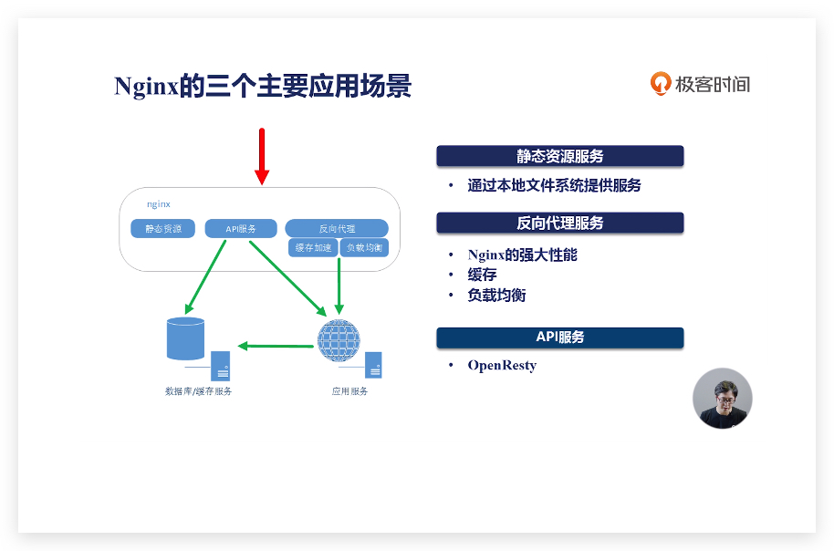

### 优点
- 高并发，高性能
- 可扩展性好
- 高可靠性
- 热部署
- `BSD` 许可证

### 三个主要应用场景
- 静态资源服务
  - 通过本地文件系统提供服务
- 反向代理服务
  - 性能强
  - 缓存
  - 负载均衡
- `API` 服务
  - `OpenRestry`

### 为什么会出现
- 互联网的数据量快速增长
  - 互联网的快速普及
  - 全球化
  - 物联网
- 摩尔定律：性能提升
- 低效的 `Apache`
  - 一个连接对应一个进程

### 四个主要组成部分
- `Nginx` 二进制可执行文件
  - 由各模块源码变异出的一个文件
- `Nginx.conf` 配置文件
  - `控制 Nginx` 的行为
- `access.log` 访问日志
  - 记录每一条 `http` 请求信息
- `error.log` 错误日志
  - 定位问题

### 如何选择版本
- 开源版：nginx.org
- 商业版：nginx.com
- 阿里巴巴的 `Tengine`
- 开源版 `OpenRestry`：openresty.org
- 商业版 `OpenResty`：openresty.com

主要是这五个版本，如果需求不大，使用开源版 nginx 就可以。如果开发 `web` 防火墙、`Api` 服务器，`Openresty` 是很好的选择。

### 安装 Nginx

`yum、apt-get` 的方式安装，但是不会默认开启所有配置模块。
编译安装，可以将三方插件一起编译生成二进制文件。